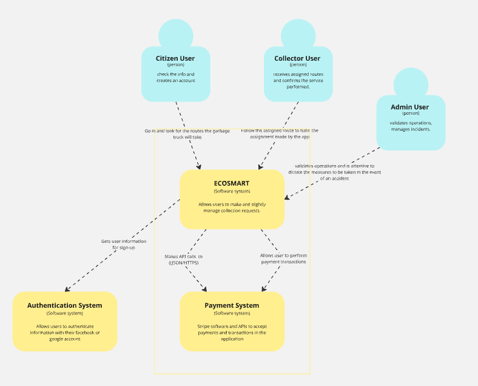
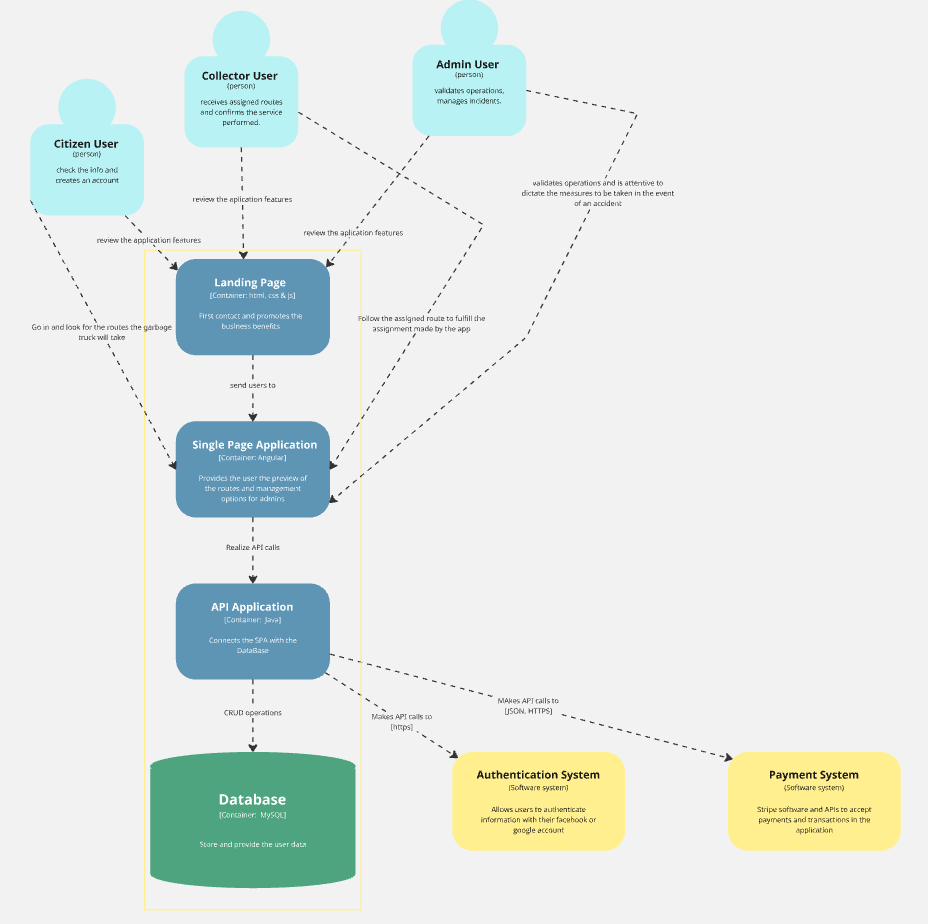
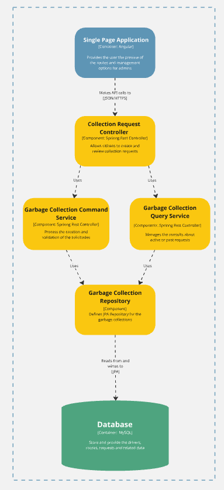
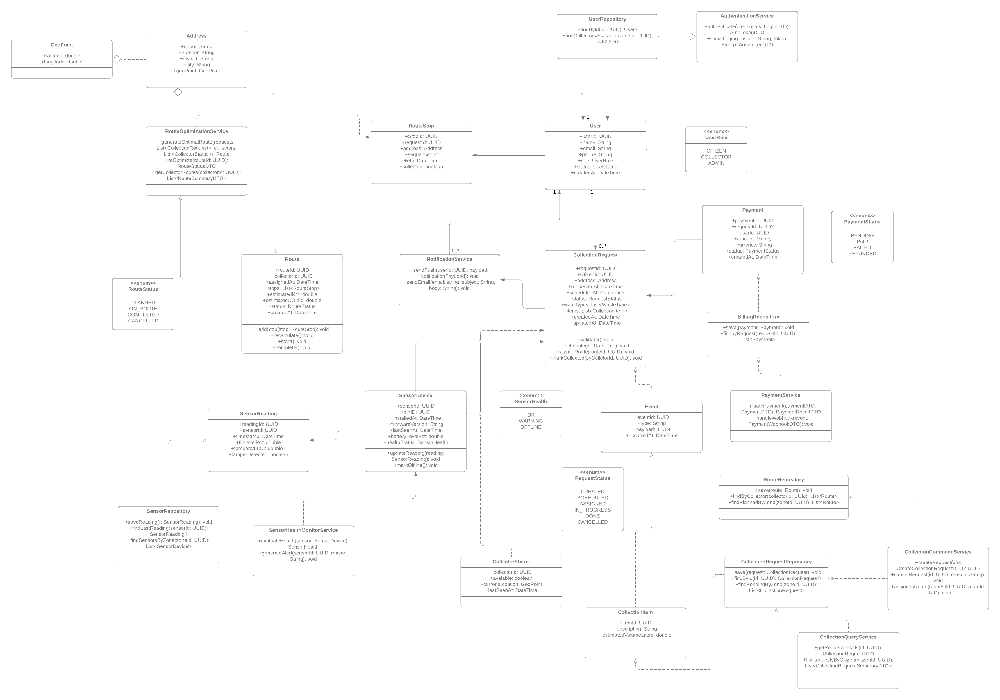
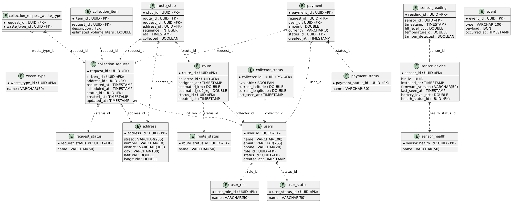

<h3 align="center"> Universidad Peruana de Ciencias Aplicadas </h3>

<h3 align="center"> Ingeniería de Software </h3>
<h3 align="center"> Ciclo 2025 - 2 </h3>

 

  

 

<h1 align="center"> TB1 Report </h1>

<h3 align="center"> Desarrollo de Aplicaciones Open Source - 7391 </h3>

<h3 align="center"> Docente: Mori Paiva, Hugo Allan </h3>

<h3> Startup:  </h3>

<h3> Product:  </h3>

<h3> Team Members: </h3>

| Member                           |    Code    |
| :------------------------------- | :--------: |
|  |  |
|  |  |
|  |  |
|  |  |
|  |  |

<h3 align="center">Septiembre, 2025</h3>

  

# Registro de Versiones del Informe

| Versión | Fecha | Autor | Descripción de modificación |
| :-----: | :---: | :---: | :-------------------------- |

  

# Project Report Collaboration Insights

  

# Contenido

## Tabla de Contenidos

### [Registro de versiones del informe](#registro-de-versiones-del-informe)

### [Project Report Collaboration Insights](#project-report-collaboration-insights)

### [Contenido](#contenido)

### [Student Outcome](#student-outcome-1)

### [Capítulo I: Introducción](#capítulo-i-introducción-1)

- [1.1. Startup Profile](#11-startup-profile)
  - [1.1.1. Descripción de la Startup](#111-description-de-la-startup)
  - [1.1.2. Perfiles de integrantes del equipo](#112-perfiles-de-integrantes-del-equipo)
- [1.2. Solution Profile](#12-solution-profile)
  - [1.2.1 Antecedentes y problemática](#121-antecedentes-y-problemática)
  - [1.2.2 Lean UX Process](#122-lean-ux-process)
    - [1.2.2.1. Lean UX Problem Statements](#1221-lean-ux-problem-statements)
    - [1.2.2.2. Lean UX Assumptions](#1222-lean-ux-assumptions)
    - [1.2.2.3. Lean UX Hypothesis Statements](#1223-lean-ux-hypothesis-statements)
    - [1.2.2.4. Lean UX Canvas](#1224-lean-ux-canvas)
- [1.3. Segmentos objetivo](#13-segmentos-objetivo)

### [Capítulo II: Requirements Elicitation & Analysis](#capítulo-ii-requirements-elicitation--analysis-1)

- [2.1. Competidores](#21-competidores)
  - [2.1.1. Análisis competitivo](#211-análisis-competitivo)
  - [2.1.2. Estrategias y tácticas frente a competidores](#212-estrategias-y-tácticas-frente-a-competidores)
- [2.2. Entrevistas](#22-entrevistas)
  - [2.2.1. Diseño de entrevistas](#221-diseño-de-entrevistas)
  - [2.2.2. Registro de entrevistas](#222-registro-de-entrevistas)
  - [2.2.3. Análisis de entrevistas](#223-análisis-de-entrevistas)
- [2.3. Needfinding](#23-needfinding)
  - [2.3.1. User Personas](#231-user-personas)
  - [2.3.2. User Task Matrix](#232-user-task-matrix)
  - [2.3.3. User Journey Mapping](#233-user-journey-mapping)
  - [2.3.4. Empathy Mapping](#234-empathy-mapping)
- [2.4. Big Picture Event Storming.](#24-big-picture-event-storming)
- [2.5. Ubiquitous Language](#25-ubiquitous-language)
  
### [Capítulo III: Requirements Specification](#capítulo-iii-requirements-specification-1)

- [3.1. User Stories](#31-user-stories)
- [3.2. Impact Mapping](#32-impact-mapping)
- [3.3. Product Backlog](#33-product-backlog)

### [Capítulo IV: Product Design](#capítulo-iv-product-design-1)

- [4.1. Style Guidelines](#41-style-guidelines)
  - [4.1.1. General Style Guidelines](#411-general-style-guidelines)
  - [4.1.2. Web Style Guidelines](#412-web-style-guidelines)
- [4.2. Information Architecture](#42-information-architecture)
  - [4.2.1. Organization Systems](#421-organization-systems)
  - [4.2.2. Labeling Systems](#422-labeling-systems)
  - [4.2.3. SEO Tags and Meta Tags](#423-seo-tags-and-meta-tags)
  - [4.2.4. Searching Systems](#424-searching-systems)
  - [4.2.5. Navigation Systems](#425-navigation-systems)
- [4.3. Landing Page UI Design](#43-landing-page-ui-design)
  - [4.3.1. Landing Page Wireframe](#431-landing-page-wireframe)
  - [4.3.2. Landing Page Mock-up](#432-landing-page-mock-up)
- [4.4. Web Applications UX/UI Design](#44-web-applications-uxui-design)
  - [4.4.1. Web Applications Wireframes](#441-web-applications-wireframes)
  - [4.4.2. Web Applications Wireflow Diagrams](#442-web-applications-wireflow-diagrams)
  - [4.4.3. Web Applications Mock-ups](#443-web-applications-mock-ups)
  - [4.4.4. Web Applications User Flow Diagrams](#444-web-applications-user-flow-diagrams)
- [4.5. Web Applications Prototyping](#45-web-applications-prototyping)
- [4.6. Domain-Driven Software Architecture](#46-domain-driven-software-architecture)
  - [4.6.1. Design-Level Event Storming](#461-design-level-event-storming)
  - [4.6.2. Software Architecture Context Diagram](#462-software-architecture-context-diagram)
  - [4.6.3. Software Architecture Container Diagrams](#463-software-architecture-container-diagrams)
  - [4.6.4. Software Architecture Components Diagrams](#464-software-architecture-components-diagrams)
- [4.7. Software Object-Oriented Design](#47-software-object-oriented-design)
  - [4.7.1. Class Diagrams](#471-class-diagrams)
- [4.8. Database Design](#48-database-design)
  - [4.8.1. Database Diagram](#481-database-diagram)

### [Capítulo V: Product Implementation, Validation & Deployment](#capítulo-v-product-implementation-validation--deployment-1)

- [5.1. Software Configuration Management](#51-software-configuration-management)
  - [5.1.1. Software Development Environment Configuration](#511-software-development-environment-configuration)
  - [5.1.2. Source Code Management](#512-source-code-management)
  - [5.1.3. Source Code Style Guide & Conventions](#513-source-code-style-guide--conventions)
  - [5.1.4. Software Deployment Configuration](#514-software-deployment-configuration)
- [5.2. Landing Page, Services & Applications Implementation](#52-landing-page-services--applications-implementation)
  - [5.2.1. Sprint 1](#521-sprint-1)
    - [5.2.1.1. Sprint Planning 1](#5211-sprint-planning-1)
    - [5.2.1.2. Aspect Leaders and Collaborators.](#5212-aspect-leaders-and-collaborators)
    - [5.2.1.3. Sprint Backlog 1](#5213-sprint-backlog-1)
    - [5.2.1.4. Development Evidence for Sprint Review](#5214-development-evidence-for-sprint-review)
    - [5.2.1.5. Execution Evidence for Sprint Review](#5215-execution-evidence-for-sprint-review)
    - [5.2.1.6. Services Documentation Evidence for Sprint Review](#5216-services-documentation-evidence-for-sprint-review)
    - [5.2.1.7. Software Deployment Evidence for Sprint Review](#5217-software-deployment-evidence-for-sprint-review)
    - [5.2.1.8. Team Collaboration Insights during Sprint](#5218-team-collaboration-insights-during-sprint)
- [5.3. Validation Interviews](#53-validation-interviews)
  - [5.3.1. Diseño de entrevistas](#531-diseño-de-entrevistas)
  - [5.3.2. Registro de entrevistas](#532-registro-de-entrevistas)
  - [5.3.3. Evaluaciones según heurísticas](#533-evaluaciones-según-heurísticas)
- [5.4. Video About-The-Product](#54-video-about-the-product)

### [Conclusiones](#conclusiones-1)

- [Conclusiones y recomendaciones](#conclusiones-y-recomendaciones)

### [Bibliografía](#bibliografía-1)

### [Anexos](#anexos-1)

  

# Student Outcome

| Criterio específico                                                                                                                                 | Acciones realizadas | Conclusiones |
| :-------------------------------------------------------------------------------------------------------------------------------------------------- | :------------------ | :----------- |
|  |                     |              |
|  |                     |              |

  

## Capítulo I: Introducción

## 1.1. StartUp Profile

### 1.1.1. Description de la StartUp

### 1.1.2. Perfiles de integrantes del equipo

## 1.2. Solution Profile

### 1.2.1. Antecedentes y problemática

### 1.2.2. Lean UX Process

#### 1.2.2.1. Lean UX Problem Statements

#### 1.2.2.2. Lean UX Assumptions

#### 1.2.2.3. Lean UX Hypothesis Statements

#### 1.2.2.4. Lean UX Canvas

# 1.3. Segmentos Objetivo

  

# Capítulo II: Requirements Elicitation & Analysis

## 2.1. Competidores

### 2.1.1. Análisis competitivo

### 2.1.2. Estrategias y tácticas frente a competidores

## 2.2. Entrevistas

### 2.2.1. Diseño de entrevistas

### 2.2.2. Registro de entrevistas

### 2.2.3. Análisis de entrevistas

## 2.3. Needfinding

### 2.3.1. User Personas

### 2.3.2. User Task Matrix

### 2.3.3. User Journey Mapping

### 2.3.4. Empathy Mapping

### 2.3.5. As-is Scenario Mapping

## 2.4. Ubiquitous Language

  

# Capítulo III: Requirements Specification

## 3.1. To-Be Scenario Mapping

## 3.2. User Stories

## 3.3. Impact Mapping

## 3.4. Product Backlog

  

# Capítulo IV: Product Design

## 4.1. Style Guidelines.

### 4.1.1. General Style Guidelines

#### Overview: 
La identidad visual de **EcoSmart** busca transmitir confianza, sostenibilidad y profesionalismo. Queremos que nuestra marca refleje innovación en la gestión de residuos, pero al mismo tiempo sea cercana y clara para quienes la usan.  

  
#### Brand Name: 
- **EcoSmart Waste Solutions**  

#### Typography: 
Decidimos usar Open Sans en todo el sitio porque ofrece una lectura sencilla y moderna, adaptándose muy bien a cualquier pantalla.  
Su diseño equilibrado y agradable genera una experiencia fluida, accesible y coherente con la identidad de EcoSmart, que busca transmitir confianza y cercanía en cada interacción.  

#### Buttons:  
- Bordes redondeados para mantener un estilo amigable.  
- Colores principales de la paleta (verde para acciones primarias, negro o gris oscuro para secundarias).  
- Texto siempre en **mayúsculas**, con un tamaño legible y contraste adecuado.  
- Ejemplo: Botón principal verde con texto en blanco.  

#### Paleta de Colores:  
- Verde (#2E7D32): representa sostenibilidad y acción ecológica.  
- Negro (#000000): aporta profesionalismo y seriedad.  
- Gris oscuro (#424242): ideal para fondos y textos secundarios.  
- Blanco (#FFFFFF): transmite limpieza, claridad y orden.  

### 4.1.2. Web Style Guidelines

El estilo web de EcoSmart está pensado para adaptarse a cualquier dispositivo, manteniendo una estructura en cuadrícula que facilita la navegación. Usamos la tipografía Open Sans por su claridad y buena lectura, junto con una paleta de colores basada en verde (#2E7D32), negro, gris y blanco que refuerza nuestra identidad. Los botones principales son verdes con texto blanco, mientras que los secundarios usan blanco con borde negro. En las interacciones añadimos efectos sutiles como hover con sombra para dar dinamismo sin perder simplicidad. Todo el diseño busca ser claro, accesible y coherente con la propuesta de EcoSmart.  

  
## 4.2. Information Architecture

### 4.2.1. Organization Systems

En EcoSmart decidimos organizar el contenido de forma que sea fácil de entender y que cada usuario pueda llegar rápido a lo que busca. Para la página web vamos a usar una **estructura jerárquica**, colocando primero lo más importante como la propuesta de valor y los beneficios, y luego los detalles secundarios como testimonios y contacto. En la aplicación, en cambio, optamos por una **organización secuencial**, especialmente en procesos como el registro o la creación de rutas, donde es clave seguir pasos claros y ordenados. Además, en la parte de reportes aplicaremos una **organización matricial**, que permite cruzar información según variables como fechas, zonas o tipos de residuos.  

Respecto a la categorización del contenido, usaremos distintos enfoques según el caso: de manera cronológica para reportes e historiales, por tópicos para explicar funcionalidades y beneficios en la web, y por audiencia para diferenciar entre municipios y empresas privadas dentro de la app. El orden alfabético lo reservamos solo para listados largos en los que realmente ayude a encontrar algo más rápido.  

Con estas decisiones buscamos que tanto la web como la aplicación transmitan claridad y que los usuarios puedan adaptarse sin esfuerzo a las funcionalidades de EcoSmart. 

### 4.2.2. Labeling Systems

Apostamos por un sistema de etiquetas que sea directo y fácil de entender, evitando tecnicismos innecesarios que puedan generar confusión. Usaremos palabras cortas y concretas para identificar cada sección o conjunto de datos. Por ejemplo, en la aplicación se emplearán etiquetas como “Rutas”, "Reportes”, “Alertas” y “Configuración”, mientras que en la página web priorizaremos términos como “Inicio”, “Beneficios”, “Funcionalidades”, “Planes” y “Contacto”.  

Además, las etiquetas estarán organizadas de manera coherente con la experiencia de cada usuario: los municipios verán opciones relacionadas con gestión de residuos y eficiencia operativa, mientras que las empresas privadas tendrán accesos más claros a costos, métricas y optimización de rutas.  

La idea es mantener siempre un lenguaje sencillo y consistente, de modo que el usuario pueda asociar rápidamente cada palabra con la acción o información que representa, sin necesidad de explicaciones adicionales.  

### 4.2.3. SEO Tags and Meta Tags

Los SEO y meta tags se definieron pensando en dos segmentos principales: las **municipalidades**, que buscan optimizar la gestión de residuos, y los **ciudadanos**, que requieren información clara y herramientas accesibles para colaborar en el cuidado del entorno.  

### Landing Page  
- **Title:** EcoSmart | Tecnología para una ciudad más limpia  
- **Meta Description:** Plataforma que conecta a municipalidades y ciudadanos para mejorar la gestión de residuos, optimizar rutas de recolección y fomentar hábitos sostenibles.  
- **Meta Keywords:** EcoSmart, gestión de residuos, municipalidades, ciudadanos, rutas inteligentes, sostenibilidad urbana.  
- **Author:** Equipo EcoSmart  

### Web Application  
- **Title:** EcoSmart App | Gestión eficiente de residuos para municipalidades y ciudadanos  
- **Meta Description:** Aplicación web diseñada para municipalidades y ciudadanos que permite monitorear la recolección de residuos, reducir costos y mejorar la limpieza urbana.  
- **Meta Keywords:** EcoSmart App, gestión municipal, participación ciudadana, residuos sólidos, eficiencia operativa, limpieza pública.  
- **Author:** Equipo EcoSmart  

### 4.2.4. Searching Systems

Nuestro sistema de búsqueda está diseñado para ser sencillo, útil y adaptado a las necesidades reales de los usuarios. La idea es ofrecer herramientas básicas que permitan a los ciudadanos y a las municipalidades interactuar de forma clara y práctica.  

**Opciones principales de búsqueda y consulta**  

- **Barra de búsqueda por distrito:** En la parte superior de la página se podrá ingresar el nombre del distrito para acceder rápidamente a la información disponible.  
- **Mapa interactivo sencillo:** Un mapa mostrará los distritos y señalará los puntos donde se encuentran tachos de basura públicos. Los usuarios podrán marcar si detectan exceso de residuos en alguno de ellos.  
- **Sección de comentarios ciudadanos:** Un espacio donde las personas podrán leer experiencias de otros usuarios y compartir sus propias quejas o sugerencias.  
- **Envío de reportes a la municipalidad:** Además del mapa, los usuarios podrán enviar un mensaje directo a la municipalidad para notificar problemas o brindar recomendaciones.  

Con estas opciones, buscamos que los ciudadanos encuentren lo que necesitan sin dificultad y que las municipalidades reciban información útil para mejorar la gestión de residuos.

### 4.2.5. Navigation Systems

El sistema de navegación de EcoSmart busca que tanto los ciudadanos como las municipalidades puedan moverse por la página de forma simple e intuitiva, sin necesidad de pasos complicados. La estructura está pensada para que el usuario encuentre lo que necesita en pocos clics y pueda cumplir su objetivo con rapidez.  

**Principales elementos de navegación**  

- **Menú principal fijo:** Incluye accesos directos a las secciones más importantes como Inicio, Información del distrito, Reportes ciudadanos* y *Mapa de tachos.  
- **Mapa interactivo:** Permite recorrer visualmente los distritos, ubicar tachos de basura y marcar reportes de exceso de residuos.  
- **Acceso rápido a comentarios:** Un botón llevará directamente a la sección donde los ciudadanos pueden leer y dejar sus opiniones.  
- **Enlace directo a municipalidades:** Sección clara para que los usuarios envíen mensajes o reportes directamente a su distrito correspondiente.  
- **Navegación responsive:** Todo el sistema de menús y accesos se adapta a móviles, tablets y pantallas más grandes, garantizando facilidad de uso en cualquier dispositivo.  

La idea central es que el recorrido dentro de la web sea fluido: el usuario entra, encuentra lo que busca sin perder tiempo y puede interactuar con las funciones principales de manera natural.

## 4.3. Landing Page UI Design

### 4.3.1. Landing Page Wireframe

En esta sección mostramos los wireframes del Landing Page, diseñados tanto para Desktop Web Browser como para Mobile Web Browser.

El objetivo del wireframe es organizar el contenido de forma clara y coherente, aplicando principios de diseño inclusivo y accesibilidad, asegurando que cualquier usuario pueda navegar y entender la información sin dificultad.

### Desktop Web Browser

### Mobile Web Browser

### 4.3.2. Landing Page Mock-up

Los mock-ups del Landing Page muestran la propuesta visual final, aplicando los principios de diseño definidos en el Design System de EcoSmart.  

### Desktop Web Browser

### Mobile Web Browser

## 4.4. Web Applications UX/UI Design

### 4.4.1. Web Applications Wireframes

- Tenemos la pantalla de Bienvenida, en donde si ya tenemos una cuenta, podremos acceder con los datos que ya tenemos. 

- Si no tenemos cuenta, podemos creanos una en el apartado de "Crear una nueva" donde ingresaremos los datos que nos piden.

- tenemos el apartado de "Buscar tendencia" donde podemos ver las tendencias de cada distrito y con su cantidad de reacciones.

- Podemos entrar a cada publicación que haga un ciudadano, y dentro de ella podemos ver su información y podremos dar nuestras opiniones sobre aquella publicación.

- Tenemos el apartado de "Mapa" en este apartado tendremos el mapa de los distritos y los puntos que marcan los tachos de basura que hay en cada lugar. 

- Tenemos el apartado de "Mensaje directo" en este apartado podremos mandar mensajes directos a las municipalidades, reportando alguna queja o alguna sugerencia. 

- El apartado "Tu perfil" donde puedes crear tu perfil para que las otras personas puedan saber quien eres y de donde eres.

### 4.4.2. Web Applications Wireflow Diagrams

En esta sección presentamos la propuesta de Wireflows que describen los recorridos de los usuarios dentro de la aplicación. Cada Wireflow parte de un User Goal específico, definido a partir de nuestros User Persona (ciudadanos y municipalidades).  

El objetivo es mostrar cómo se conectan los distintos pasos dentro de la aplicación, y cómo la interacción en cada pantalla produce cambios visuales o nuevas opciones. Para construirlos, partimos primero de los Task Flows, lo que nos permitió consensuar las rutas más comunes antes de diseñar el detalle de cada flujo.

#### User Goal 1: Leer y publicar comentarios: 

El usuario entra a la web, si tiene cuenta puede acceder a la pagina, si no, entonces se tiene que crear una cuenta nueva, una vez dentro puede leer comentarios pero si quiere comentar tiene que verificar si tiene creado su perfil para poder comentar una publicacion, si tiene creado su perfil puede comentar y si no entonces debe ir al apartado de perfil, y crearse un perfil, luego volver al aparato de tendencias y comentar.  

#### User Goal 2: Mandar mensaje directo a Municipalidad: 

El usuario entra a la web, si tiene cuenta puede acceder a la pagina, si no, entonces se tiene que crear una cuenta nueva, una vez dentro puede ir al apartado de Mensaje directo, en donde podra enviar un mensaje directamente a la municipalidad de su distrito solo si tiene un perfil creado, si no entonces va al apartado mi perfi y se crea uno, luego vuelve al apartado de Mensaje directo y podra mandar un mensaje a la Municipalidad. 

### 4.4.3. Web Applications Mock-ups

### 4.4.4. Web Applications User Flow Diagrams

#### Goal: El usuario quiere enviar un reporte de un tacho lleno

#### Goal: El usuario quiere mandar un mensaje directo a la Municipalidad

## 4.5. Web Applications Prototyping

## 4.6. Domain-Driven Software Architecture

### 4.6.1. Design-Level Event Storming

### 4.6.2. Software Architecture Context Diagram

El esquema de contexto es un recurso de análisis que ayuda a visualizar cómo se relaciona ECOSMART con su entorno, lo que permite detectar oportunidades de integración y áreas de mejora.

  

### 4.6.3. Software Architecture Container Diagrams

El diagrama de contenedores es un recurso clave para entender la arquitectura de ECOSMART y reconocer posibles limitaciones o dependencias que no aportan valor.

  

### 4.6.4. Software Architecture Components Diagrams

Los diagramas de componentes proporcionan una visión precisa de la arquitectura del software, mostrando su división en módulos y la manera en que estos interactúan para conformar un sistema integrado.

*Recolection Request Manager Bounded Context*

  

*Recolection Request Manager Bounded Context*

  

*Route Management and Recolection Status Bounded Context*

  

*Recollection Request and Schedule Bounded Context*

  

## 4.7. Software Object-Oriented Design

### 4.7.1. Class Diagrams

  

## 4.8. Database Design

### 4.8.1. Database Diagram

  

  

# Capítulo V: Product Implementation, Validation & Deployment

## 5.1. Software Configuration Management

### 5.1.1. Software Development Environment Configuration

### 5.1.2. Source Code Management

### 5.1.3. Source Code Style Guide & Conventions

### 5.1.4. Software Deployment Configuration

## 5.2. Landing Page, Services & Applications Implementation

### 5.2.1. Sprint 1

#### 5.2.1.1. Sprint Planning 1

#### 5.2.1.2. Sprint Backlog 1

#### 5.2.1.3. Development Evidence for Sprint Review

#### 5.2.1.4. Testing Suite Evidence for Sprint Review

#### 5.2.1.5. Execution Evidence for Sprint Review

#### 5.2.1.6. Services Documentation Evidence for Sprint Review

#### 5.2.1.7. Software Deployment Evidence for Sprint Review

#### 5.2.1.8. Team Collaboration Insights during Sprint

## 5.3. Validation Interviews 

### 5.3.1. Diseño de entrevistas
### 5.3.2. Registro de entrevistas
### 5.3.3. Evaluaciones según heurísticas

## 5.4. Video About-The-Product

  

# Conclusiones

## Conclusiones y recomendaciones

  

# Bibliografía

  

# Anexos
