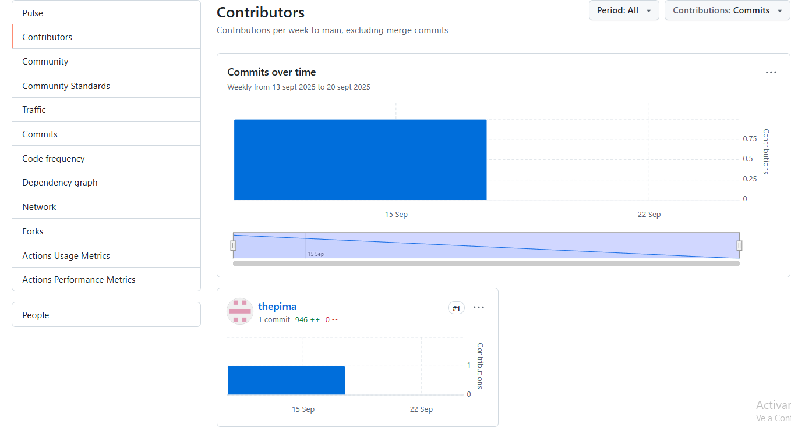
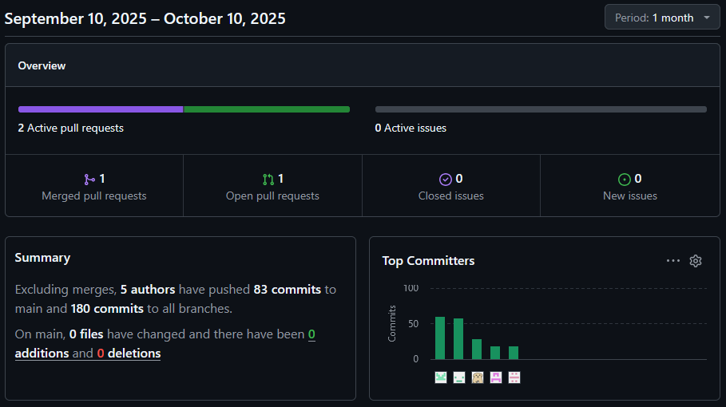

<h3 align="center"> Universidad Peruana de Ciencias Aplicadas </h3>

<h3 align="center"> Ingeniería de Software </h3>
<h3 align="center"> Ciclo 2025 - 2 </h3>

 

  

 

<h1 align="center"> TP1 Report </h1>

<h3 align="center"> Desarrollo de Aplicaciones Open Source - 7391 </h3>

<h3 align="center"> Docente: Mori Paiva, Hugo Allan </h3>

<h3> Startup: EcoClean </h3>

<h3> Product: EcoSmart</h3>

<h3> Team Members: </h3>

| Member                           |    Code    |
| :------------------------------- | :--------: |
| Mathias Andree Cardenas Huaman | U202316353 |
| Diego Andres Avalos Cordova    | U202313922 |
| Joaquin Enrique Carranza Tesén | U20191B935 |
| Piero Alberto Velarde Luyo | U20211A620 |
| Sebastian Gabriel Zuñiga Calle | U20221b479 |

<h3 align="center">Septiembre, 2025</h3>

  

# Registro de Versiones del Informe

| Versión | Fecha | Autor | Descripción de modificación |
| :-----: | :---: | :---: | :-------------------------- |
| TB1 | 11/09/25 | Andree Cardenas | CapÍtulo I y su descripción |
| TB1 | 12/09/25 | Joaquin Carranza | Entrevistas, Diagrama de base de datos y Landing Page.  |
| TB1 | 14/09/25 | Andree Cardenas | Parte final del Capítulo II |
| TB1 | 15/09/25 | Andree Cardenas | Realización completa del Capítulo III |
| TB1 | 15/09/25 | Sebastian Zuniga | Modelado C4 Capitulo IV |
| TB1 | 15/09/25 | Sebastian Zuniga | Modelado Diagrama de clases Capitulo IV |
| TB1 | 11/09/25 | Diego Avalos | Capitulo I antecedentes y problematicas |
| TB1 | 11/09/25 | Diego Avalos | Capitulo II Competidores y entrevistas |
| TB1 | 11/09/25 | Diego Avalos | Capitulo IV Landing Page Wireframe |
| TB1 | 11/09/25 | Sebastian Zuniga | Sprint Backlog Capitulo V |
| TB1 | 15/09/25 | Piero Velarde | Capitulo II Needfinding |
| TB1 | 15/09/25 | Piero Velarde | Capitulo IV Landing Page Mock-Up |
| TP1 | 05/10/25 | Diego Avalos | Capitulo V Sprint 2 |
| TP1 | 08/10/25 | Diego Avalos | Capitulo V Sprint 2 Services Documentation Evidence |
| TP1 | 10/10/25 | Diego Avalos | Capitulo V Sprint 2 Execution Evidence|
| TP1 | 10/10/25 | Joaquin Caranza | Landing Page |
| TP1 | 10/10/25 | Andree Cardenas | Desarrollo del messages del fronted |
| TP1 | 09/10/25 | Andree Cardenas | Mejora del impact mapping y Mejora del Product Backlog |
| TP1 | 10/10/25 | Piero Velarde | Mejora del Lean UX Canvas |
| TP1 | 10/10/25 | Piero Velarde | Capitulo V Services Documentation Evidence for Sprint Review |
| TP1 | 10/10/25 | Piero Velarde | Capitulo V  Software Deployment Evidence for Sprint Review |
| TB2 | 10/10/25 | Andree Cardenas |  |
| TB2 | 10/10/25 | Piero Velarde |  |
| TB2 | 10/10/25 | Joaquin Carranza | |
| TB2 | 10/10/25 | Diego Avalos |  |

  

# Project Report Collaboration Insights

| URL de la organización del proyecto |
| ----------------------------------- |
| [https://github.com/UPC-PRE-202502-1ASI0729-7391-NOMBRE](https://github.com/UPC-PRE-202502-1ASI0729-7391-NOMBRE) |

| URL del repositorio del reporte |
| ------------------------------- |
| [https://github.com/UPC-PRE-202502-1ASI0729-7391-NOMBRE/EcoClean-Report](https://github.com/UPC-PRE-202502-1ASI0729-7391-NOMBRE/EcoClean-Report) |

| URL del repositorio de la landing page |
| -------------------------------------- |
| [https://github.com/UPC-PRE-202502-1ASI0729-7391-NOMBRE/Landing-page](https://github.com/UPC-PRE-202502-1ASI0729-7391-NOMBRE/Landing-page) |

| URL del repositorio del Frontend |
| -------------------------------------- |
| [https://github.com/UPC-PRE-202502-1ASI0729-7391-NOMBRE/EcoClean-Web-Frontend](https://github.com/UPC-PRE-202502-1ASI0729-7391-NOMBRE/EcoClean-Web-Frontend) |

  

# Contenido

## Tabla de Contenidos

### [Registro de versiones del informe](#registro-de-versiones-del-informe)

### [Project Report Collaboration Insights](#project-report-collaboration-insights)

### [Contenido](#contenido)

### [Student Outcome](#student-outcome-1)

### [Capítulo V: Product Implementation, Validation & Deployment](#capítulo-v-product-implementation-validation--deployment-1)

- [5.1. Software Configuration Management](#51-software-configuration-management)
  - [5.1.1. Software Development Environment Configuration](#511-software-development-environment-configuration)
  - [5.1.2. Source Code Management](#512-source-code-management)
  - [5.1.3. Source Code Style Guide & Conventions](#513-source-code-style-guide--conventions)
  - [5.1.4. Software Deployment Configuration](#514-software-deployment-configuration)
- [5.2. Landing Page, Services & Applications Implementation](#52-landing-page-services--applications-implementation)
  - [5.2.1. Sprint 1](#521-sprint-1)
    - [5.2.1.1. Sprint Planning 1](#5211-sprint-planning-1)
    - [5.2.1.2. Aspect Leaders and Collaborators.](#5212-aspect-leaders-and-collaborators)
    - [5.2.1.3. Sprint Backlog 1](#5213-sprint-backlog-1)
    - [5.2.1.4. Development Evidence for Sprint Review](#5214-development-evidence-for-sprint-review)
    - [5.2.1.5. Execution Evidence for Sprint Review](#5215-execution-evidence-for-sprint-review)
    - [5.2.1.6. Services Documentation Evidence for Sprint Review](#5216-services-documentation-evidence-for-sprint-review)
    - [5.2.1.7. Software Deployment Evidence for Sprint Review](#5217-software-deployment-evidence-for-sprint-review)
    - [5.2.1.8. Team Collaboration Insights during Sprint](#5218-team-collaboration-insights-during-sprint)
  - [5.2.2. Sprint 2](#522-sprint-2)
    - [5.2.2.1. Sprint Planning 2](#5221-sprint-planning-2)
    - [5.2.2.2. Aspect Leaders and Collaborators.](#5222-aspect-leaders-and-collaborators)
    - [5.2.2.3. Sprint Backlog 2](#5223-sprint-backlog-2)
    - [5.2.2.4. Development Evidence for Sprint Review](#5224-development-evidence-for-sprint-review)
    - [5.2.2.5. Execution Evidence for Sprint Review](#5225-execution-evidence-for-sprint-review)
    - [5.2.2.6. Services Documentation Evidence for Sprint Review](#5226-services-documentation-evidence-for-sprint-review)
    - [5.2.2.7. Software Deployment Evidence for Sprint Review](#5227-software-deployment-evidence-for-sprint-review)
    - [5.2.2.8. Team Collaboration Insights during Sprint](#5228-team-collaboration-insights-during-sprint)
  - [5.2.3. Sprint 3](#523-sprint-3)
    - [5.2.3.1. Sprint Planning 3](#5231-sprint-planning-3)
    - [5.2.3.2. Aspect Leaders and Collaborators.](#5232-aspect-leaders-and-collaborators)
    - [5.2.3.3. Sprint Backlog 3](#5233-sprint-backlog-3)
    - [5.2.3.4. Development Evidence for Sprint Review](#5234-development-evidence-for-sprint-review)
    - [5.2.3.5. Execution Evidence for Sprint Review](#5235-execution-evidence-for-sprint-review)
    - [5.2.3.6. Services Documentation Evidence for Sprint Review](#5236-services-documentation-evidence-for-sprint-review)
    - [5.2.3.7. Software Deployment Evidence for Sprint Review](#5237-software-deployment-evidence-for-sprint-review)
    - [5.2.3.8. Team Collaboration Insights during Sprint](#5238-team-collaboration-insights-during-sprint)
- [5.3. Validation Interviews](#53-validation-interviews)
  - [5.3.1. Diseño de entrevistas](#531-diseño-de-entrevistas)
  - [5.3.2. Registro de entrevistas](#532-registro-de-entrevistas)
  - [5.3.3. Evaluaciones según heurísticas](#533-evaluaciones-según-heurísticas)
- [5.4. Video About-The-Product](#54-video-about-the-product)

### [Conclusiones](#conclusiones-1)

- [Conclusiones y recomendaciones](#conclusiones-y-recomendaciones)

### [Bibliografía](#bibliografía-1)

### [Anexos](#anexos-1)

  

# Student Outcome

*ABET – EAC - Student Outcome 3*

| Criterio específico                                                                                                                                 | Acciones realizadas | Conclusiones |
| :-------------------------------------------------------------------------------------------------------------------------------------------------- | :------------------ | :----------- |
| Comunica oralmente con efectividad a diferentes rangos de audiencia. | **Mathias Andree Cardenas Huaman** TB1:Participé en la exposición del proyecto explicando objetivos, propuesta de valor y avances técnicos de manera clara y estructurada. Adapté mi lenguaje al público: técnico para docentes y más sencillo para compañeros y posibles usuarios. Además, realicé dos entrevistas al primer segmento objetivo, lo que me permitió practicar una comunicación directa, empática y comprensible con personas externas al equipo.   TP:Durante el desarrollo de EcoSmart Waste Solutions, expuse los avances del capítulo 3 y del módulo de mensajería con los municipios ante el equipo y representantes municipales. Se adaptó el lenguaje y el nivel técnico según la audiencia, usando recursos visuales y ejemplos prácticos para explicar la arquitectura del sistema y los beneficios de la solución.   **Joaquin Enrique Carranza Tesén** TB1: Durante el proyecto demostré mi capacidad de comunicarme oralmente de manera efectiva con distintos tipos de audiencia. En las entrevistas con usuarios, adapté mi lenguaje para que fuera claro y entendible, facilitando la obtención de información relevante. Al presentar el diagrama de base de datos, utilicé un lenguaje más técnico dirigido a mis compañeros y docentes, asegurándome de explicar la lógica detrás de las relaciones y estructuras planteadas. Finalmente, en la exposición de la landing page desarrollada y desplegada, empleé una comunicación enfocada en destacar las funcionalidades, el proceso de implementación y los beneficios de la solución, ajustando el nivel de detalle según el público. Esto me permitió transmitir ideas de manera clara, ordenada y efectiva en diferentes contextos.  TP1: Durante el desarrollo de la landing page, me aseguré de comunicar oralmente con efectividad a diferentes rangos de audiencia, tanto con mis compañeros del equipo técnico como con los docentes y posibles usuarios. Adapté mi lenguaje según el público: utilicé términos técnicos cuando conversaba con el equipo de desarrollo para coordinar mejoras y resolver problemas, y una explicación más clara y accesible cuando presenté los avances a los docentes o al público no especializado. Esto permitió que todos comprendieran el propósito de las mejoras y los resultados obtenidos.   **Diego Andrés Avalos Córdova** TB1: Durante esta primera entrega participé activamente en la exposición del proyecto, explicando los fundamentos de la arquitectura de información, los sistemas de navegación y la propuesta de interacción de la aplicación. En cada intervención busqué transmitir los conceptos de forma ordenada y sencilla para que tanto docentes como compañeros comprendieran la lógica detrás de nuestras decisiones de diseño. Además, al presentar apartados como el Web Style Guide, Information Architecture, Navigation Systems y entrevistas, adapté mi lenguaje según la audiencia, manteniendo un balance entre lo técnico y lo práctico. Esto me permitió reforzar mi capacidad de comunicarme oralmente con distintos grupos y demostrar claridad en la exposición de ideas. TP1: En Sprint 2 participé explicando la implementación y despliegue de la Landing Page y la Web Application, incluyendo funcionalidades como tendencias por distrito, mapa interactivo, mensajes directos, registro e inicio de sesión. También presenté la documentación de endpoints de la API y la integración con la Web App. Mostré capturas de pantalla y videos de navegación para evidenciar la interacción del usuario. Esto reforzó mi habilidad de comunicar de manera efectiva avances complejos y decisiones de diseño ante distintos públicos.   **Sebastian Gabriel Zuñiga Calle** TB1: Durante la exposición del proyecto presenté las secciones de Software Configuration Management (entorno de desarrollo, gestión del código fuente, convenciones de estilo y despliegue) y la implementación de la Landing Page y servicios en Sprint 1. Expliqué de manera clara los apartados de Sprint Planning, Sprint Backlog, evidencias de desarrollo y despliegue, así como los resultados de la colaboración del equipo. Adapté el lenguaje técnico al nivel de los docentes para resaltar la rigurosidad del proceso seguido, mientras que con mis compañeros utilicé un enfoque más práctico para que comprendieran cómo cada fase aportaba valor al avance del proyecto. Esto me permitió comunicar ideas de forma ordenada y efectiva, tanto en el plano técnico como organizativo.   **Piero Alberto Velarde Luyo** TB1: Mi responsabilidad en esta entrega fue la de crear diversos documentos visuales y representaciones de la experiencia de usuario, como User Personas, User Task Matrix, User Journey Map, Empathy Map, y los wireframes de la landing page. Comencé diseñando los User Personas, basándome en datos y entrevistas para representar a distintos segmentos de nuestra audiencia. Con esta información, elaboré una User Task Matrix que visualizaba las tareas principales de los usuarios y su relación con las funcionalidades de la plataforma. Además, desarrollé el User Journey Map, mapeando cada paso del usuario desde su primer contacto hasta la conversión, lo cual fue clave para tomar decisiones más centradas en el usuario.   TP1: Para el desarrollo de este sprint de EcoSmart Waste Solution realicé cambios necesarios con respecto al sprint anterior, todo esto para evidenciar una mejora contínua. A su vez ayudé con el despliegue de la aplicación web junto con el desarrollo y conexión con la fakeAPI| **Mathias Andree Cardenas Huaman** TB1:Logré transmitir ideas con claridad y adaptarme a distintos tipos de audiencia, fortaleciendo mis habilidades de expresión oral y empatía en la comunicación.   TP: La exposición permitió comunicar ideas con claridad y adaptar el mensaje a distintos públicos. Se fortalecieron habilidades para explicar aspectos técnicos de forma comprensible, favoreciendo la colaboración y validación del proyecto entre desarrolladores y autoridades.  **Joaquin Enrique Carranza Tesén** TB1: En síntesis, la elaboración de entrevistas, el diseño del diagrama de base de datos y el desarrollo de la landing page reflejaron la importancia de una comunicación oral clara y adaptada al contexto. La capacidad de ajustar el lenguaje según la audiencia permitió no solo transmitir información técnica, sino también garantizar la comprensión y la participación activa de los involucrados. De este modo, se evidencia que la comunicación efectiva constituye una competencia fundamental en el ámbito académico y profesional, al favorecer el intercambio de ideas y el cumplimiento exitoso de los objetivos del proyecto.  TP1: Mi capacidad de comunicación oral fue clave para transmitir ideas de manera clara y efectiva, facilitando el trabajo en equipo y asegurando que las decisiones sobre la landing page fueran comprendidas y validadas por todos los involucrados.   **Diego Andrés Avalos Córdova** TB1: La experiencia de explicar la arquitectura de información, los sistemas de navegación y la lógica de los prototipos reforzó la importancia de expresarse con claridad frente a distintos públicos. Adaptar el lenguaje a contextos técnicos y no técnicos me permitió transmitir de forma más efectiva nuestras ideas y decisiones. Este proceso evidenció que la comunicación oral no solo es necesaria para presentar resultados, sino también para generar confianza, asegurar comprensión y fomentar la colaboración dentro y fuera del equipo. TP1: La presentación de los avances del Sprint 1 y 2, incluyendo la implementación y despliegue de la Landing Page y Web App, la integración de funcionalidades como tendencias, mapas, mensajes y registro/inicio de sesión, así como la documentación de endpoints y videos de navegación, me permitió reforzar mis habilidades de comunicación oral en contextos técnicos y prácticos, demostrando que puedo explicar decisiones de diseño y funcionalidades complejas de forma clara y comprensible.   **Sebastián Gabriel Zúñiga Calle** TB1: Mi participación fortaleció mis habilidades de comunicación oral, al presentar contenidos técnicos y de gestión de manera clara, estructurada y comprensible para diferentes tipos de audiencia.   **Piero Alberto Velarde Luyo** TB1: Mi participación me permitió demostrar la capacidad de comunicar de manera efectiva mis ideas y hallazgos al resto de mis compañeros. Aprendí a adaptar mi estilo de comunicación y logré que cada parte del equipo comprendiera la importancia de los elementos desarrollados para la experiencia de usuario.  TP1: Mi participación durante este sprint permitió que pudiese mostrar una mejora en la capacidad de comunicar de manera efectiva mis ideas con mi equipo para las mejoras de este avance. Aprendí a hacerle entender a mi equipo la importancia de realizar las mejoras debidas a elementos desarrollados.   |
| Comunica por escrito con efectividad a diferentes rangos de audiencia. | **Mathias Andree Cardenas Huaman** TB1:Contribuí en la redacción del informe, presentando información técnica (backlog, user stories) y explicaciones accesibles para audiencias no especializadas. Usé un estilo claro y apoyado en tablas y ejemplos para facilitar la comprensión. Además, registramos versiones del informe para mantener orden y trazabilidad.   TP: Se elaboró y corrigió el capítulo 3 del documento técnico, incluyendo historias de usuario y requerimientos, además del apartado de mensajería. Se usó un lenguaje claro, estructurado y adaptable tanto para personal técnico como para gestores municipales.   **Joaquin Enrique Carranza Tesén** TB1: A lo largo del proyecto demostré mi capacidad de comunicarme por escrito de manera efectiva con distintos rangos de audiencia. Durante las entrevistas elaboré cuestionarios y resúmenes claros y comprensibles para los participantes, lo que facilitó obtener información relevante. En el diagrama de base de datos, empleé una redacción técnica precisa, dirigida a mis compañeros y docentes, con el fin de sustentar la lógica de las relaciones planteadas. Finalmente, en la documentación y el despliegue de la landing page utilicé un estilo más estructurado y formal, destacando procesos, funcionalidades y beneficios, lo que permitió transmitir el trabajo realizado de forma clara y ordenada.  TP1: Durante el desarrollo de la landing page, también me comuniqué por escrito de manera efectiva con diferentes rangos de audiencia. Elaboré documentos técnicos y reportes de avances dirigidos al equipo de desarrollo, donde utilicé un lenguaje más especializado para detallar los cambios y mejoras implementadas. Además, redacté mensajes y descripciones más simples y claras al presentar los resultados a los docentes o en la documentación final del proyecto, asegurando que cualquier persona, sin importar su nivel técnico, pudiera entender el proceso y los objetivos alcanzados.   **Diego Andrés Avalos Córdova** TB1: Mi aporte principal estuvo en la elaboración de gran parte del documento de entrega, donde redacté secciones como General Style Guidelines, Web Style Guide, Information Architecture, Labeling Systems, Navigation Systems y entrevistas. Procuré usar un estilo accesible y coherente, combinando explicaciones técnicas con un lenguaje sencillo para que cualquier lector, sin importar su nivel de conocimiento, pudiera comprender el contenido. También cuidé la estructura del informe para mantener un orden lógico y claro, reforzando la trazabilidad del trabajo realizado. TP1: Durante Sprint 2 amplié la documentación incorporando el despliegue de la Landing Page y Web Application, la integración con API fake, funcionalidades de tendencias, mapas, mensajes directos, registro e inicio de sesión, capturas de pantalla y videos de navegación. Redacté de manera clara y comprensible para públicos técnicos y no técnicos, asegurando la trazabilidad de avances y la comprensión de los entregables. Esto fortaleció mi capacidad de comunicación escrita y garantizó que el trabajo fuera útil y entendible para todos los involucrados.   **Sebastian Gabriel Zuñiga Calle** TB1: Contribuí activamente en la documentación técnica del proyecto, redactando apartados sobre los diagramas de arquitectura (contexto, contenedores, componentes y clases) y la sección de planificación ágil (Sprint Planning 1 y Sprint Backlog 1). Utilicé un estilo formal y estructurado, con explicaciones precisas para docentes y un lenguaje claro y accesible para que la documentación fuera comprensible y trazable.   **Piero Alberto Velarde Luyo** TB1: Fui responsable de documentar los entregables visuales como los User Personas, User Journey Map, User Task Matrix, y Empathy Map. Me aseguré de utilizar un lenguaje accesible para todos los niveles de conocimiento. Además, me encargué de plasmar los resúmenes y conclusiones de nuestras decisiones de diseño de manera estructurada y fácil de seguir, para garantizar que los puntos clave fueran comprendidos por todas las partes involucradas. TP1: Fui responsable de aplicar las mejoras necesarias de distintos puntos en nuestro informe, al igual de documentar la evidencia del despliegue de nuestra aplicación web y landing page, a su vez, aporté con respecto al despliegue de nuestra aplicación web al igual que nuestra FakeAPI, junto con la respectiva conexión de estps.   | **Mathias Andree Cardenas Huaman** TB1:El documento refleja precisión técnica y claridad, logrando un material comprensible tanto para un público especializado como para uno general. Fortalecí mi capacidad de comunicar ideas de manera efectiva en formato escrito.  TP: La redacción permitió transmitir información técnica de manera precisa y accesible. Se logró coherencia entre el contenido y los objetivos del proyecto, fortaleciendo la comunicación escrita como herramienta clave para documentar y coordinar el desarrollo del sistema.  **Joaquin Enrique Carranza Tesén** TB1: En conclusión, la redacción aplicada en las diferentes etapas del proyecto mostró la importancia de adaptar el lenguaje escrito al público objetivo. El uso de un estilo comprensible en las entrevistas, técnico en la documentación y formal en la exposición de resultados permitió comunicar información de manera clara y pertinente. Esto confirma que la comunicación escrita es una herramienta esencial para garantizar la coherencia del trabajo y la comprensión entre audiencias diversas en el ámbito académico y profesional.  TP1: La comunicación escrita efectiva me permitió mantener una coordinación clara dentro del equipo y presentar información comprensible para audiencias con distintos niveles de conocimiento, fortaleciendo la transparencia y la comprensión del trabajo realizado en la landing page.   **Diego Andrés Avalos Córdova** TB1: Haber redactado buena parte del informe me permitió mejorar mi capacidad de comunicación escrita, no solo para explicar conceptos técnicos, sino también para transmitirlos de manera comprensible y ordenada. Adaptar el nivel de detalle según la sección y el lector demostró que la escritura es clave para estructurar ideas, documentar avances y garantizar que el trabajo sea útil tanto para audiencias técnicas como generales. TP1: Incorporar en la documentación los avances del Sprint 2, incluyendo implementación, despliegue, funcionalidades de la app web, integración de API y evidencia visual, me permitió reforzar mi capacidad de comunicar de manera escrita información técnica compleja de forma clara, comprensible y organizada, asegurando que cualquier lector pueda entender los entregables y el progreso del proyecto.   **Sebastian Gabriel Zuñiga Calle** TB1: La elaboración de documentación técnica y de planificación fortaleció mi capacidad de comunicarme por escrito con diferentes niveles de audiencia, combinando precisión conceptual y claridad expositiva. Esto evidenció la importancia de la redacción estructurada para garantizar la comprensión, la coordinación del equipo y la calidad del proyecto.   **Piero Alberto Velarde Luyo** TB1: A través de este proceso, pude mejorar mis habilidades de comunicación escrita, adaptando el nivel de complejidad según el tipo de audiencia. Esto me permitió expresar las ideas de forma que fueran comprensibles, precisas y relevantes para todos los involucrados en el proyecto, favoreciendo la toma de decisiones informada y efectiva a lo largo del ciclo de desarrollo. TP1: Este proceso me permitió perfeccionar aún más la capacidad de adecuar la comunicación escrita al momento de evidenciar el proceso de despliegue de nuestra aplicación web y landing page , a su vez aseguré que la información de la mejora contínua realizada al informe fuera siempre clara, precisa y pertinente. Al lograr que todos los involucrados entendieran el mensaje, se promovió una toma de decisiones más efectiva a lo largo de este sprint. |

  
# Capítulo V: Product Implementation, Validation & Deployment

## 5.1. Software Configuration Management
A continuación, se describe el proceso por el cual organizamos, gestionamos y controlamos los cambios de desarrollo de EcoSmart.

### 5.1.1. Software Development Environment Configuration

El equipo configuró un entorno de desarrollo colaborativo utilizando diversas herramientas:

- Project Management:
  * Canva:  Elaboración de presentaciones visuales y material de apoyo para la comunicación de avances.
  * Zoom:  Coordinación y reuniones virtules del equipo, utilizada también para realizar y grabar la exposición final.
  * Uxpressia:  Herramienta en línea que ayuda en el proceso de mapeo (user personas).
    
- Requirements Management:
  * Miro:  Desarrollo de sesiones de brainstorming, modelado de EventStorming y gestión de requerimientos funcionales.

- Product UX/UI Design:
  * Figma:  Diseño de interfaces gráficas, prototipos interactivos y mockups de la solución.

- Software Development:
  * HTML:  Sirve para definir la estructura del contenido de una página web.
  * CSS:  Se utiliza para dar estilo y diseño visual a las páginas web.
  * JavaScript:  Es un lenguaje de programación que añade interactividad y dinamismo al sitio web.

-  Software Documentation:
  * GitHub:  Almacenamiento y control de versiones de la documentación, garantizando trazabilidad y colaboración entre los miembros del equipo.

### 5.1.2. Source Code Management

Para la gestión del código fuente, se empleó GitHub como repositorio central. Se adoptaron ramas específicas para cada funcionalidad (feature branches) y se utilizó la técnica de pull requests para integrar cambios al repositorio principal. Esto permitió asegurar calidad en el código, revisiones colaborativas y trazabilidad de cada contribución.

### 5.1.3. Source Code Style Guide & Conventions

* HTML

  - Uso de indentación de 2 espacios por nivel de anidamiento.

  - Etiquetas y atributos escritos en minúsculas.

  - Cierre correcto de todas las etiquetas, incluso las opcionales.

  - Inclusión de comentarios en secciones clave (<!-- -->) para identificar bloques de contenido.

  - Uso semántico de etiquetas (header, nav, main, section, footer) para mejorar la accesibilidad y el SEO.

* CSS

  - Organización del código en bloques por componente o sección de la interfaz.

  - Uso de clases en lugar de IDs para la mayoría de estilos, siguiendo buenas prácticas de escalabilidad.

  - Nombres de clases en kebab-case (ejemplo: .main-container).

  - Inclusión de comentarios para separar secciones de estilos.

  - Aplicación de diseño responsive con media queries para compatibilidad en distintos dispositivos.

* JavaScript

  - Uso de camelCase para variables y funciones (ejemplo: getUserData).

  - Declaración de variables con const y let, evitando var.

  - Inclusión de comentarios descriptivos (//) en funciones críticas.

  - Modularización del código para separar funciones por responsabilidad.

  - Manejo de errores con bloques try...catch en operaciones sensibles.

  - Nombrado en inglés de todas las variables y funciones para mantener consistencia.

### 5.1.4. Software Deployment Configuration

En esta fase inicial, el despliegue se simuló de forma local, aprovechando las capacidades de los navegadores para ejecutar HTML, CSS y JavaScript sin necesidad de un servidor dedicado. La documentación de configuración y evidencias de ejecución fueron almacenadas en GitHub, lo que asegura que el proyecto pueda ser replicado por cualquier miembro del equipo.
 
 

## 5.2. Landing Page, Services & Applications Implementation

### 5.2.1. Sprint 1

#### 5.2.1.1. Sprint Planning 1

<table>
  <tr>
    <th> Sprint # </th>
    <th> Sprint 1 </th>
  </tr>
  <tr>
    <td style="font-weight: bold;" colspan="2"> Sprint Planning Background </td>
  </tr>
  <tr>
    <td style="font-weight: bold;"> Date </td>
    <td> 05/09/2025 </td>
  </tr>
  <tr>
    <td style="font-weight: bold;"> Time </td>
    <td> 19:00 horas (GMT-5) </td>
  </tr>
  <tr>
    <td style="font-weight: bold;"> Location </td>
    <td> Virtual (Google Meet) </td>
  </tr>
  <tr>
    <td style="font-weight: bold;"> Prepared By </td>
    <td> Avalos Cordova, Diego Andres </td>
  </tr>
  <tr>
    <td style="font-weight: bold;"> Attendees (to planning meeting) </td>
    <td>
      Cardenas Huaman, Mathias Andree 
      Velarde Luyo, Piero Alberto 
      Carranza Tesén, Joaquin Enrique 
      Avalos Cordova, Diego Andres 
      Zuniga Calle, Sebastian Gabriel
    </td>
  </tr>
  <tr>
    <td style="font-weight: bold;"> Sprint 1 Review Summary </td>
    <td> Al este ser nuestro primer sprint de desarrollo no existe un review summary del sprint </td>
  </tr>
  <tr>
    <td style="font-weight: bold;"> Sprint 1 Retrospective Summary </td>
    <td> Ya que es nuestro primer sprint aún no identificamos ningun plan de mejora. </td>
  </tr>
  <tr>
    <td style="font-weight: bold;" colspan="2"> Sprint Goal & User Stories </td>
  </tr>
  <tr>
    <td style="font-weight: bold;"> Sprint 1 Goal </td>
    <td> Desarrollar e implementar las secciones clave de la Landing Page para que los usuarios puedan ver y analizar las características principales de EcoSmart y entender los beneficios del servicio. </td>
  </tr>
  <tr>
    <td style="font-weight: bold;"> Sprint 1 Velocity </td>
    <td> El equipo ha establecido una capacidad de 8 Story Points para este Sprint, basada en la experiencia y la carga de trabajo estimada. </td>
  </tr>
  <tr>
    <td style="font-weight: bold;"> Sum of Story Points </td>
    <td> 8 </td>
  </tr>
</table>

#### 5.2.1.2. Aspect Leaders and Collaborators.

En este Sprint se trabajaron los principales aspectos relacionados con el desarrollo de la solución: **Landing Page**, **Web Applications** y **Web Services**. Con el fin de asegurar una comunicación clara y una adecuada distribución de responsabilidades, se elaboró la matriz de Liderazgo y Colaboración (LACX).  

Este artefacto permite identificar a los miembros del equipo que lideran cada aspecto y aquellos que colaboran en su implementación, asegurando que las tareas del Sprint estén alineadas con las fortalezas y responsabilidades de cada integrante.  

---

## Leadership-and-Collaboration Matrix (LACX)

| Team Member (Last Name, First Name) | GitHub Username      | Landing Page | Web Applications | Web Services |
|-------------------------------------|----------------------|--------------|------------------|--------------|
| Cardenas Huaman, Mathias Andree     | AndS56               | **L**        | C                | C            |
| Zuniga Calle, Sebastian Gabriel     | sezunii              | C            | **L**            | C            |
| Avalos Cordova, Diego Andres        | DiegoAndresAvalos    | C            | C                | **L**        |
| Carranza Tesen, Joaquin Enrique     | thepima              | C            | C                | C            |
| Velarde Luyo, Piero Alberto         | P1er0VL              | C            | C                | C            |

---

### Notas sobre la organización
- Cada aspecto cuenta con **un líder principal (L)**, responsable de la planificación, coordinación y toma de decisiones.  
- Los demás miembros se registran como **colaboradores (C)**, apoyando en tareas específicas.  
- Esta organización guarda coherencia con la asignación de **tasks en el Sprint**, garantizando que cada aspecto del alcance esté cubierto y gestionado eficientemente.  

#### 5.2.1.3. Sprint Backlog 1

| id   | Title                  | Id  | Title                                                    | Description                                                                                                   | Estimations(Hours) | Assigned To   | Status(To-do /InProcess/ToReview/Done) |
| ---- | ---------------------- | --- | -------------------------------------------------------- | ------------------------------------------------------------------------------------------------------------- | ------------------ | ------------- | -------------------------------------- |
| US14 | Barra de navegación en la Landing Page     | TS01 |Barra de navegación en la Landing Page (HTML, CSS y JS).| Implementación del header y la barra de navegación, desarrollados en HTML, CSS y JS con diseño responsive. | 8                  | Joaquin | Done                                   |
| US15 | Sección "Lo que dicen nuestros clientes"    | TS02 | Sección "Lo que dicen nuestros clientes" (HTML, CSS y JS).|Implementación de la sección "Lo que dicen nuestros clientes", con diseño responsive y optimización en HTML, CSS y JS. | 6                | Diego/Andree | Done                                   |
| US16 | Sección de soluciones       | TS03 | Sección de soluciones (HTML, CSS y JS).| Desarrollo de la sección de soluciones, con integración de una previsualizacion a los futuros features, en HTML, CSS y JS.           | 4                 | Piero   | Done                                   |
| US17 | Descripcion de equipo de expertos | TS04 | Descripcion del equipo de expertos (HTML, CSS y JS).| Implementación de la sección de expertos, con diseño responsive en HTML, CSS y JS.| 4 | Gabriel | Done

Este enfoque asegura que el equipo se concentre en las partes esenciales de la Landing Page, permitiendo que los usuarios exploren la plataforma de manera efectiva.

#### 5.2.1.4. Development Evidence for Sprint Review

En esta sección se presentan los avances en la implementación con relación a los productos de la solución según el alcance del Sprint: **Landing Page, Web Applications y Web Services**.  
La tabla siguiente muestra la evidencia de los commits realizados, incluyendo repositorio, branch, commit ID, mensaje y fecha.  

| Repository         | Branch              | Commit Id | Commit Message                  | Commit Message Body                                                                 | Committed on (Date) |
|--------------------|---------------------|-----------|---------------------------------|--------------------------------------------------------------------------------------|---------------------|
| user/repositoryname | feature/landingpage | a1b2c3d   | feat: add landing page structure | Se creó la estructura inicial del Landing Page con HTML y CSS básicos.              | 15/09/2025          |
| user/repositoryname | feature/navigation  | b2c3d4e   | feat: add navigation system      | Se implementó la barra de navegación con links a secciones principales del sitio.   | 17/09/2025          |
| user/repositoryname | feature/comments    | c3d4e5f   | feat: comments section           | Se agregó la sección de comentarios para que los usuarios puedan opinar.            | 19/09/2025          |
| user/repositoryname | feature/map         | d4e5f6g   | feat: district map integration   | Se integró un mapa interactivo para mostrar tachos de basura y reportes ciudadanos. | 21/09/2025          |
| user/repositoryname | feature/api         | e5f6g7h   | feat: basic API setup            | Configuración inicial de servicios web para conexión con municipalidades.           | 21/09/2025          |

#### 5.2.1.5. Execution Evidence for Sprint Review

En este Sprint logramos avances importantes en la implementación de la plataforma, cumpliendo con los objetivos planteados en relación a la Landing Page, la aplicación web y los servicios básicos de interacción. Se desarrollaron las vistas principales que permiten a los usuarios navegar de forma sencilla, acceder a la información de su distrito, visualizar en el mapa los tachos de basura disponibles, leer y publicar comentarios, y enviar reportes directamente a la municipalidad.  

A continuación, se presentan algunas capturas de pantalla que evidencian los avances logrados:  

### Screenshots de las Vistas Implementadas  

- **Landing Page (versión desktop):**  
    

- **Landing Page (versión mobile):**  
    

- **Mapa Interactivo con tachos de basura:**  
    

- **Sección de Comentarios y Reportes:**  
  
  
    

#### 5.2.1.6. Services Documentation Evidence for Sprint Review
En este Sprint, el enfoque principal ha sido el desarrollo completo de la Landing Page para EcoSmart Waste Solutions, con especial atención en la interfaz de usuario y la experiencia visual. Dado que aún no se ha implementado un backend ni servicios web, la prioridad fue crear una presentación atractiva y funcional que comunique efectivamente los servicios de gestión inteligente de residuos mediante componentes de Angular Material y un diseño responsive. No se cuenta con endpoints documentados ni documentación OpenAPI en esta fase, ya que toda la información de equipo, servicios y testimonios está integrada directamente en el frontend.

La prioridad fue lograr una experiencia de usuario cohesiva desde el cliente, con secciones bien estructuradas que incluyen: presentación de servicios, beneficios, equipo de trabajo, testimonios y formularios de contacto. En futuras iteraciones, se documentarán las rutas REST necesarias para la gestión de datos de sensores IoT y optimización de rutas de recolección, utilizando OpenAPI como herramienta de especificación para conectar la Landing Page con servicios backend y APIs de municipalidades.

---
#### GitHub - Proyecto Frontend Web (planeado para Sprint 2)

> URL estimada del repositorio de backend:  
> `[https://github.com/UPC-PRE-202502-1ASI0729-7391-NOMBRE/](https://github.com/UPC-PRE-202502-1ASI0729-7391-NOMBRE/FrontEnd)`

---
#### Resumen de Acciones del Equipo

| Integrante    | Acciones Realizadas                                                                               |
|---------------|---------------------------------------------------------------------------------------------------|
| Joaquin Carranza   | Desarrollo completo de la Landing Page. |

---
> Nota: No se han generado commits relacionados a endpoints o servicios, ya que no fueron parte del alcance del Sprint 1.

#### 5.2.1.7. Software Deployment Evidence for Sprint Review

En este Sprint, se realizó el despliegue de la Landing Page y vistas de usuario de EcoSmart utilizando GitHub Pages como herramienta para ello. Esto permitió hacer accesible el producto (landing page) desde cualquier navegador, facilitando las pruebas funcionales, demostraciones al equipo y feedback en tiempo real.

#### Proceso del despligue realizado
- Se creó un repositorio GitHub para el proyecto: [https://github.com/EcoClean-EcoSmart/LandingPage](https://github.com/UPC-PRE-202502-1ASI0729-7391-NOMBRE/Landing-page)
  

- Se verificó el acceso público y funcionamiento responsive
  

#### URL de Despliegue
https://upc-pre-202502-1asi0729-7391-nombre.github.io/Landing-page/

#### Capturas de Evidencia del Despliegue

### Responsable
- Joaquin Carranza: configuración del repositorio, estructura del proyecto.

#### 5.2.1.8. Team Collaboration Insights during Sprint
Durante el Sprint 1, el landing page en su totalidad fue implementado por **Joaquin Carranza**, quien asumió todas las funciones de diseño, codificación, validación y despliegue de la solución.

| Integrante   | Acciones realizadas durante el Sprint 1 |
|--------------|------------------------------------------|
| Joaquín Carranza  | - Desarrollo de toda la interfaz HTML y maquetado CSS - Implementación de validaciones en JavaScript - Estructura de carpetas y componentes - Subida al repositorio y despliegue |

#### Evidencia de colaboración en GitHub (Sprint 1)

### 5.2.2. Sprint 2
#### 5.2.2.1. Sprint Planning 2.

| Sprint # | Sprint 2 |
|----------|----------|
| **Date** | 08/10/2025 |
| **Time** | 19:00 horas (GMT-5) |
| **Location** | Virtual (Google Meet) |
| **Prepared By** | Avalos Cordova, Diego Andres |
| **Attendees (to planning meeting)** | Cardenas Huaman, Mathias Andree Velarde Luyo, Piero Alberto Carranza Tesén, Joaquin Enrique Avalos Cordova, Diego Andres Zuniga Calle, Sebastian Gabriel |
| **Sprint 2 Review Summary** | Durante este sprint se logró desarrollar la aplicación web usando una API simulada, desplegar la aplicación web en un entorno de prueba, desplegar la Landing Page y conectarla correctamente con la app web, asegurando la navegación y funcionalidad básicas. |
| **Sprint 2 Retrospective Summary** | El equipo identificó la importancia de mejorar la coordinación entre el desarrollo de la app y el despliegue de la Landing Page, así como la necesidad de documentar los endpoints de la API fake para futuros sprints. |
| **Sprint Goal & User Stories** | |
| **Sprint 2 Goal** | Desarrollar, desplegar e integrar la aplicación web con una API simulada, así como desplegar la Landing Page y conectar ambas plataformas, permitiendo a los usuarios interactuar con las funcionalidades básicas de EcoSmart desde la web. |
| **Sprint 2 Velocity** | El equipo ha establecido una capacidad de 10 Story Points para este Sprint, considerando la complejidad del despliegue y la integración de la app web y la Landing Page. |
| **Sum of Story Points** | 10 |

#### 5.2.2.2. Aspect Leaders and Collaborators.

En el Sprint 2, el equipo trabajó en los principales aspectos relacionados con el desarrollo de la solución: **Landing Page**, **Web Application** y **API Integration & Deployment**. Para asegurar una coordinación eficiente y una distribución clara de responsabilidades, se elaboró la matriz de Liderazgo y Colaboración (LACX).  

Esta matriz permite identificar quién lidera cada aspecto y quiénes colaboran, promoviendo una comunicación efectiva y una ejecución organizada de las tareas del sprint.

---

##### Leadership-and-Collaboration Matrix (LACX) – Sprint 2

| Team Member (Last Name, First Name) | GitHub Username      | Landing Page | Web Application | API Integration & Deployment |
|-------------------------------------|--------------------|--------------|----------------|-----------------------------|
| Carranza Tesen, Joaquin Enrique     | thepima            | **L**        | C              | C                           |
| Avalos Cordova, Diego Andres        | DiegoAndresAvalos  | C            | **L**          | C                           |
| Velarde Luyo, Piero Alberto         | P1er0VL            | C            | C              | **L**                       |
| Cardenas Huaman, Mathias Andree     | AndS56             | C            | C              | C                           |
| Zuniga Calle, Sebastian Gabriel     | sezunii            | C            | C              | C                           |

---
### Notas sobre la organización
- Cada aspecto tiene asignado un **líder (L)** responsable de la coordinación y supervisión.  
- Los demás miembros son **colaboradores (C)**, apoyando en la implementación y pruebas según sus habilidades.  
- La matriz asegura que cada aspecto crítico del Sprint 2 esté cubierto de manera eficiente y que la comunicación dentro del equipo sea clara.

#### 5.2.2.3. Sprint Backlog 2.

En el Sprint 2, el objetivo principal fue **desarrollar, desplegar e integrar la aplicación web con una API simulada**, así como desplegar la **Landing Page** y conectar ambas plataformas, asegurando la navegación y funcionalidad básicas.  
El Sprint incluyó tareas de desarrollo frontend, integración con la API fake, pruebas y despliegue en un entorno de prueba.  

| id   | Title                                    | Id  | Title                                                    | Description                                                                                                   | Estimations(Hours) | Assigned To      | Status(To-do / InProcess / ToReview / Done) |
| ---- | ---------------------------------------- | --- | -------------------------------------------------------- | ------------------------------------------------------------------------------------------------------------- | ----------------- | ---------------- | ------------------------------------------ |
| US18 | Despliegue de la Landing Page             | TS05 | Despliegue en servidor de la Landing Page               | Subir la Landing Page al servidor de prueba y verificar que se visualice correctamente en diferentes navegadores. | 1                 | Joaquin     | Done                                       |
| US19 | Desarrollo de formulario de contacto      | TS06 | Formulario de contacto en Landing Page (HTML, CSS, JS)  | Implementación de formulario funcional que envíe datos de prueba a la API fake.                              | 4                 | Joaquin          | Done                                       |
| US20 | Integración de la API fake                | TS07 | Conectar la Web App con la API simulada                 | Configuración de endpoints y simulación de datos para la integración con la app web.                          | 2                 | Piero        | Done                                       |
| US20 | Integración de la API fake                | TS08 | Pruebas de integración con la API                        | Realizar pruebas de consumo de endpoints, validando respuestas y errores.                                     | 2                 | Piero            | InProcess                                  |
| US21 | Sección de features dinámicos             | TS09 | Mostrar datos de la API en la Web App                   | Conectar secciones de la app para mostrar información dinámica obtenida de la API simulada.                  | 3                 | Andree           | InProcess                                  |
| US22 | Navegación entre Landing Page y Web App   | TS10 | Configuración de enlaces y rutas                         | Asegurar la correcta navegación desde la Landing Page a la Web App y viceversa.                               | 1                 | Joaquin            | ToReview                                   |
| US23 | Deploy final de la Web Application       | TS11 | Subir la Web App al servidor de prueba                  | Desplegar la Web Application con la API integrada, probando funcionalidad completa.                           | 2                 | Piero/Diego | To-do                                     |
| US24 | Revisión de responsive y compatibilidad  | TS12 | Optimización de UI                                      | Ajustar diseño responsive en Landing Page y Web App, verificando compatibilidad en dispositivos y navegadores. | 5                 | Piero/Gabriel    | To-do                                     |

#### 5.2.2.4. Development Evidence for Sprint Review.

En esta sección se presentan los avances en la implementación con relación a los productos de la solución según el alcance del Sprint 2: **Landing Page, Web Application y API Integration & Deployment**.  
Se evidencia el trabajo realizado mediante los commits asociados a cada repositorio, indicando branch, commit ID, mensaje y fecha de commit.

| Repository             | Branch                      | Commit Id | Commit Message                        | Commit Message Body                                                                                      | Committed on (Date) |
|------------------------|-----------------------------|-----------|--------------------------------------|--------------------------------------------------------------------------------------------------------|--------------------|
| eco-smart/landing-page  | feature/landingpage-deploy  | f1a2b3c   | feat: deploy landing page             | Se desplegó la Landing Page en el servidor de prueba y se verificó visualización correcta.            | 05/10/2025         |
| eco-smart/landing-page  | feature/contact-form        | g2b3c4d   | feat: add contact form                | Se implementó formulario de contacto funcional, integrado con la API fake.                             | 05/10/2025         |
| eco-smart/web-app       | feature/api-integration     | h3c4d5e   | feat: integrate fake API              | Se configuraron los endpoints de la API fake y se conectaron a la Web App para mostrar datos dinámicos. | 06/10/2025         |
| eco-smart/web-app       | feature/api-testing         | i4d5e6f   | test: API endpoints                   | Pruebas de integración de la API simulada, validando respuestas y manejo de errores.                    | 06/10/2025         |
| eco-smart/web-app       | feature/features-section    | j5e6f7g   | feat: dynamic features section        | Se desarrolló la sección de features dinámicos que muestra datos obtenidos de la API.                   | 07/10/2025         |
| eco-smart/web-app       | feature/navigation          | k6f7g8h   | feat: navigation landing-app          | Configuración de enlaces entre la Landing Page y la Web App, asegurando navegación fluida.             | 08/10/2025         |
| eco-smart/web-app       | feature/deploy-final        | l7g8h9i   | chore: final deployment web app       | Despliegue final de la Web Application con API integrada, pruebas completas de funcionalidad.           | 09/10/2025         |
| eco-smart/web-app       | feature/responsive-fixes    | m8h9i0j   | fix: responsive UI adjustments        | Ajustes de diseño responsive en la Landing Page y Web App, verificación en distintos dispositivos.      | 10/10/2025         |

#### 5.2.2.5. Execution Evidence for Sprint Review.

En el Sprint 2, el equipo logró avanzar significativamente en la implementación de la solución. Se desarrollaron y desplegaron las principales funcionalidades de la **Web Application** y se integraron con la **Landing Page** y la **API fake**.  
Entre los logros destacan:

#### Screenshots de la aplicación

#### 1. Pantalla de Inicio de Sesión
  

#### 2. Pantalla de Registro de Usuario
  

#### 3. Vista de Tendencias por Distrito
  

#### 4. Mapa 
  

#### 5. Mensaje Directo entre Usuarios
  

#### 5.2.2.6. Services Documentation Evidence for Sprint Review.

Para este sprint logrado desplegar una aplicación web, la cual consume un servicio Json-Server para, de esta manera, simular un servicio de Backend. A continuación se muestra la documentación de la API.

| **Endpoint Name** | **Implemented Actions** | **Call Syntax**                          | **Parameters Specification** | **Call Example**                                                   | **Response Explanation**                              |
|-------------------|-------------------------|------------------------------------------|------------------------------|--------------------------------------------------------------------|-------------------------------------------------------|
| /user          | GET, POST               | `return http.get(this.resourceEndpoint)` | id, firstName, lastName, email, document, phone, password               | `getAll() { return http.get('http://localhost:3000/user'); }`   | Devuelve un array con todos los usuarios.             |
| /posts        | GET, POST, PUT, DELETE  | `return http.get(this.resourceEndpoint)` | id, author, district, message, rating, imageURL, createdAt       | `getAll() { return http.get('http://localhost:3000/posts'); }` | Devuelve un array con todos los posts. |
| /municipalities        | GET, POST               | `return http.get(this.resourceEndpoint)` | id, name, district, representatives, avatar         | `getAll() { return http.get('http://localhost:3000/municipalities'); }` | Devuelve un array con todas las municipalidades.            |
| /conversations        | GET, POST               | `return http.get(this.resourceEndpoint)` | id, municipalityId, citizenName, subject, lastMessagePreview, lastMessageAt         | `getAll() { return http.get('http://localhost:3000/conversations'); }` | Devuelve un array con todas las conversaciones.            |
| /messages        | GET, POST               | `return http.get(this.resourceEndpoint)` | id, conversationId, sender, text, timestamp         | `getAll() { return http.get('http://localhost:3000/messages'); }` | Devuelve un array con todas las conversaciones.            |

#### 5.2.2.7. Software Deployment Evidence for Sprint Review.

En esta sección presentaremos la evidencia de los despliegues realizados para los distintos productos que hemos desarrollado para este sprint. En el presente sprint se incluye el despliegue de nuestra landing page al igual que la primera versión de nuestra aplicación web.

**Landing Page Deployment**

Para el despliegue de nuestra landing page se utilizó GitHub Pages y se logró siguiendo los siguientes pasos:

Paso 1: 
Primero creamos un nuevo repositorio en GitHub con el nombre `Landing-page` dentro del directorio de nuestro proyecto, luego agregamos todo el contenido de nuestra landing page en el repositorio.

Paso 2:
Después ingresamos a la pestaña de `Settings` y posteriormente a la sección de `Pages`, procederemos a seleccionar la rama que deseamos desplegar, en este caso es la rama `main`, para el despliegue de la landing page.

Paso 3:
Luego procederemos a verificar que el despliegue realizado haya sido exitoso, esto lo visualizaremos en la sección de `Deployments` y se nos proporciona un enlace para acceder a la landing page.

Paso 4:
Finalmente accederemos a nuestra landing page mediante el enlace proporcionado por Github Pages.

**Web App Deployment**

Para el despliegue de nuestra aplicación web se utilizó el servicio Vercel y se logró siguiendo los siguientes pasos:

Paso 1: 
Primero creamos un nuevo repositorio en GitHub con el nombre `EcoClean-Web-Frontend` dentro del directorio de nuestro proyecto, luego agregamos todo el contenido de nuestra aplicación web en el repositorio.

Paso 2:
Después ingresamos al servicio de Vercel para poder ingresar con nuestra cuenta.

Paso 3:
Luego procederemos a iniciar sesión, para este caso iniciamos sesión con nuestra cuenta de GitHub.

Paso 4:
Una vez dentro del servicio, creamos un nuevo proyecto dentro de Vercel y lo conectamos con nuestro repositorio preveiamente mencionado.

Paso 5:
Al finalizar de configurar nuestro proyecto dentro de Vercel, el servicio nos informará cuando se hara realizado satisfactoriamente el despliegue de nuestra aplicación web, a su vez, no proporcionará los enlaces del despliegue.

Paso 6:
Finalmente accederemos a nuestra aplicación web mediante el enlace proporcionado por Vercel.

#### 5.2.2.8. Team Collaboration Insights during Sprint.

A continuación podremos visualizar la evidencia de colaboración de los integrantes mediante el insight proporcionado por GitHub.

### 5.2.3. Sprint 3

#### 5.2.3.1. Sprint Planning 3

| Sprint # | Sprint 3 |
|--------- |----------|
| Date | 13/10/2025 |
| Time | 19:00 horas (GMT-5) |
| Location | Virtual (Google Meet) |
| Prepared By | Avalos Cordova, Diego Andres |
| Attendees (to planning meeting) | Cardenas Huaman, Mathias Andree Avalos Cordova, Diego Andres Carranza Tesen, Joaquin Enrique Velarde Luyo, Piero Alberto |
| **Sprint 2 Review Summary** | Durante el Sprint 2 se logró desplegar la aplicación web y la landing page con una API simulada. Se cumplió con la navegación básica y la presentación de datos. |
| **Sprint 2 Retrospective Summary** | El equipo identificó que la API simulada (fake API) fue una limitante para avanzar en funcionalidades clave de gestión. Se decide priorizar el desarrollo del backend real para desbloquear el trabajo del panel administrativo. |
| **Sprint Goal & User Stories** | |
| **Sprint 3 Goal** | Desarrollar y desplegar la primera versión de los Web Services (backend) e implementar el panel administrativo para la gestión de usuarios (roles) y municipios. |
| **Sprint 3 Velocity** | El equipo ha establecido una capacidad de **16 Story Points** para este Sprint. |
| **Sum of Story Points** | **16** |

#### 5.2.3.2. Aspect Leaders and Collaborators

Para el Sprint 3, el equipo se enfocó en dos aspectos principales: el desarrollo del panel de administrador (Web Application) y la creación del backend (API Integration & Deployment). El equipo se ha reorganizado de la siguiente manera:

| Team Member (Last Name, First Name) | GitHub Username | Web Application (Admin) | API Integration & Deployment |
| :--- | :--- | :--- | :--- |
| Carranza Tesen, Joaquin Enrique | thepima | C | C |
| Avalos Cordova, Diego Andres | DiegoAndresAvalos | C | **L** |
| Velarde Luyo, Piero Alberto | P1er0VL | C | C |
| Cardenas Huaman, Mathias Andree | AndS56 | **L** | C |

### Notas sobre la organización
- Cada aspecto tiene asignado un líder (L) responsable de la coordinación y supervisión.
- Los demás miembros son colaboradores (C), apoyando en la implementación y pruebas según sus habilidades.
- La matriz asegura que cada aspecto crítico del Sprint 2 esté cubierto de manera eficiente y que la comunicación dentro del equipo sea clara.

#### 5.2.3.3. Sprint Backlog 3
| Sprint # | Sprint 3 | | | | | | |
| :--- | :--- | :--- | :--- | :--- | :--- | :--- | :--- |
| **User Story** | | **Work-Item / Task** | | | | | **Status** |
| Id | Title | Id | Title | Description | Estimation (Hours) | Assigned To | (To-do / In-Process / To-Review / Done) |
| US05 | Panel de control municipal | TS13 | Implementar Login de administrador | Crear la vista de inicio de sesión para el panel administrativo. | 4 | Mathias Cardenas | Done |
| US05 | Panel de control municipal | TS14 | Crear navegación y sidebar del panel | Estructurar el layout principal del dashboard administrativo con su menú lateral. | 6 | Mathias Cardenas | Done |
| US-Admin1 | Gestión de Roles | TS15 | Crear endpoint `POST /api/auth/login` | Desarrollar el endpoint de autenticación que retorna un token. | 5 | Diego Avalos | Done |
| US-Admin1 | Gestión de Roles | TS16 | Crear endpoints `GET /api/users` y `PUT /api/users/{id}/role` | Desarrollar los servicios para listar usuarios y actualizar sus roles. | 8 | Diego Avalos | Done |
| US-Admin1 | Gestión de Roles | TS17 | Implementar vista "Asignación de roles" | Desarrollar el frontend que consume los endpoints de usuarios y permite cambiar roles. | 6 | Mathias Cardenas | Done |
| US-Admin2 | Gestión de Municipios | TS18 | Crear endpoints CRUD para `/api/municipalities` | Desarrollar los servicios para Registrar, Listar y Actualizar municipios. | 8 | Diego Avalos | Done |
| US-Admin2 | Gestión de Municipios | TS19 | Implementar vista "Gestión de Municipios" | Desarrollar el frontend para listar y registrar nuevos municipios en la plataforma. | 6 | Piero Velarde | Done |

#### 5.2.3.4. Development Evidence for Sprint Review

Durante el tercer sprint del proyecto *EcoClean*, se desarrollaron funcionalidades esenciales en los módulos de **Backend Platform**, **WebApp Frontend** y **Reportes**. 
Entre los avances se incluyen la creación de servicios y entidades del backend, la documentación del sprint y mejoras visuales en el frontend. 
Además, el equipo realizó actividades de diseño, entrevistas a usuarios y validación funcional del sistema para asegurar coherencia entre requerimientos y la implementación técnica.

A continuación se presenta la evidencia unificada de commits realizados:

| Repository                 | Branch | Commit Id | Author             | Type     | Commit Message                                                                  | Committed on (Date) |
|----------------------------|--------|-----------|--------------------|----------|----------------------------------------------------------------------------------|----------------------|
| EcoClean-Platform          | main   | bcabc2c   | DiegoAndresAvalos | authored | Update application.properties                                                    | 2024-11-09           |
| EcoClean-Platform          | main   | 682156d   | DiegoAndresAvalos | authored | Update Dockerfile                                                                | 2024-11-09           |
| EcoClean-Platform          | main   | 787a15b   | Thepima | authored | Update pom.xml                                                                              | 2024-11-10           |
| EcoClean-Platform          | main   | c29e912   | AndS56             | authored | Create BoundedContextResponse.java                                               | 2024-11-12           |
| EcoClean-Platform          | main   | 95612cb   | AndS56             | authored | Create RoleApplicationService.java                                               | 2024-11-12           |
| EcoClean-Report            | main   | e3decfc   | DiegoAndresAvalos | authored | Update 5.3.3. Evaluaciones según heurísticas                                     | 2024-11-16           |
| EcoClean-Report            | main   | fafcfb3   | DiegoAndresAvalos | authored | Update README.md                                                                 | 2024-11-16           |
| EcoClean-Report            | main   | 331dc2c   | Thepima            | authored | Add Aspect Leaders and Collaborators AND Sprint Backlog 3                        | 2024-11-15           |
| EcoClean-Report            | main   | da306a4   | AndS56             | authored | Add Sprint Planning 3                                                            | 2024-11-15           |
| EcoClean-WebApp-Frontend   | main   | a5b2f47   | DiegoAndresAvalos | authored | Update UI components                                                             | 2024-11-10           |
| EcoClean-WebApp-Frontend   | main   | a5b2f47   | Thepima | authored | UI review, design validation and integration support                                       | 2024-11-10           |

#### 5.2.3.5. Execution Evidence for Sprint Review

#### 5.2.3.6. Services Documentation Evidence for Sprint Review

#### 5.2.3.7. Software Deployment Evidence for Sprint Review

#### 5.2.3.8. Team Collaboration Insights during Sprint

## 5.3. Validation Interviews

### 5.3.1. Diseño de entrevistas

### 5.3.2. Registro de entrevistas

### 5.3.3. Evaluaciones según heurísticas

# Evaluación Heurística de Usabilidad y Diseño Inclusivo  
## Documentación del Proyecto **“ChroniCaree”**

| Campo | Descripción |
|--------|--------------|
| **Carrera** | Ingeniería de Software |
| **Curso** | Desarrollo de Aplicaciones Open Source |
| **Sección** | 7391 |
| **Profesores** | Todos |
| **Auditor(es)** | Grupo 04 |
| **Cliente(s)** | Grupo 03 |
| **Sitio evaluado** | ChroniCaree |

---

## Tareas Evaluadas

Las tareas evaluadas se enfocan en la claridad, organización y accesibilidad:

1. Comprender rápidamente qué es “ChroniCaree”.  
2. Navegar el índice y ubicar capítulos específicos.  
3. Acceder a la landing page y al reporte.  
4. Revisar imágenes de diseño (logo, spacing, flows).  
5. Entender la estructura del repositorio.  
6. Ver colaboraciones, actividad y despliegues.  
7. Identificar estándares de trabajo y organización.  
8. Encontrar entregables rápidos sin perderse visualmente.  

---

## Escala de Severidad

| Nivel | Descripción |
|-------|-------------|
| **1** | Problema leve, mejora opcional. |
| **2** | Problema menor, requiere revisión. |
| **3** | Problema importante, afecta la experiencia. |
| **4** | Problema crítico, bloquea el uso normal. |

---

## Resumen General de Problemas

| # | Problema identificado | Sev. | Principio afectado |
|---|------------------------|:---:|---------------------|
| 1 | README demasiado extenso y difícil de escanear. | 3 | Information Architecture |
| 2 | Falta sección de instalación y ejecución. | 3 | Usability – Ayuda mínima |
| 3 | Imágenes sin descripción adecuada. | 3 | Inclusive Design |
| 4 | Índice muy profundo y poco orientador. | 2 | Findability |
| 5 | Exceso de imágenes repetidas y ruido visual. | 2 | Eficiencia |
| 6 | Inconsistencias en formato y estilos. | 2 | Consistency & Standards |
| 7 | Falta una conclusión o cierre del documento. | 2 | Feedback |
| 8 | Conexión débil entre diseño UX/UI e implementación. | 2 | Match with real world |

---

# Descripción de Problemas y Recomendaciones

---

### P1. README demasiado extenso y difícil de escanear  
- **Severidad:** 3  
- **Heurística:** *Information Architecture – Organización del contenido*  
- **Descripción:** El documento contiene demasiado texto, imágenes y apartados extensos sin jerarquía visual clara, lo que aumenta la carga cognitiva del lector.  
- **Recomendación:** Resumir secciones, agrupar contenido secundario en `
` y mover documentación pesada a una carpeta `/docs/`.

---

### P2. Falta sección de instalación y ejecución  
- **Severidad:** 3  
- **Heurística:** *Usability – Ayuda mínima*  
- **Descripción:** El README no explica cómo ejecutar el proyecto localmente ni qué dependencias requiere.  
- **Recomendación:** Crear un apartado “Instalación y Uso” con requisitos, comandos, entorno `.env` y pasos de ejecución.

---

### P3. Imágenes sin descripción adecuada  
- **Severidad:** 3  
- **Heurística:** *Inclusive Design – Experiencias comparables*  
- **Descripción:** Varias imágenes usan solo “Figura XX” o nombres de archivo, sin suficiente contexto para usuarios o lectores de pantalla.  
- **Recomendación:** Agregar textos alternativos descriptivos, pies de imagen claros y usar `aria-hidden="true"` si son decorativas.

---

### P4. Índice poco orientador  
- **Severidad:** 2  
- **Heurística:** *Information Architecture – Findability*  
- **Descripción:** El índice es muy profundo, lo cual dificulta encontrar secciones clave rápidamente.  
- **Recomendación:** Incluir un “Mapa rápido” con solo 5–7 secciones principales para navegación rápida.

---

### P5. Exceso de capturas repetidas y ruido visual  
- **Severidad:** 2  
- **Heurística:** *Usability – Eficiencia y carga cognitiva*  
- **Descripción:** El README contiene capturas repetidas (commits, Netlify, actividad), alargando innecesariamente el documento.  
- **Recomendación:** Mantener solo las imágenes esenciales y mover las demás a un archivo aparte en `/docs/evidencias.md`.

---

### P6. Inconsistencias en formato y estilos  
- **Severidad:** 2  
- **Heurística:** *Consistency & Standards*  
- **Descripción:** Existen variaciones en formato de títulos, numeración, mezcla de idiomas y nomenclatura de figuras.  
- **Recomendación:** Aplicar una guía de estilo general para todo el README (niveles de títulos, idioma, figuras y tablas).

---

### P7. Falta de conclusiones o estado final del proyecto  
- **Severidad:** 2  
- **Heurística:** *Usability – Feedback y cierre*  
- **Descripción:** El README no incluye una sección final que resuma aprendizajes, estado del proyecto o próximos pasos.  
- **Recomendación:** Añadir un capítulo “Conclusiones y Trabajo Futuro”.

---

### P8. Conexión débil entre UX/UI y resultados implementados  
- **Severidad:** 2  
- **Heurística:** *Match with the real world – Comunicación clara*  
- **Descripción:** Aunque se incluyen spacing, tipografías y wireflows, no se muestra cómo fueron aplicados en el desarrollo real.  
- **Recomendación:** Añadir comparaciones del tipo “Diseño vs Implementación” con capturas del sistema final.

---

# Conclusión

El proyecto ChroniCaree es completo y evidencia un trabajo sólido de documentación. Sin embargo, puede mejorar su usabilidad aplicando:

- Mejor estructura visual.  
- Reducción de ruido visual.  
- Accesibilidad más clara.  
- Secciones técnicas obligatorias (instalación y uso).  
- Un cierre formal sobre el estado del proyecto.

---

## 5.4. Video About-The-Product

# Conclusiones

## Conclusiones y recomendaciones

Durante los primeros dos sprints del proyecto **EcoSmart**, hemos trabajado en validar y desarrollar los productos digitales contemplados en nuestro modelo de negocio: la **Landing Page**, la **Web Application** y los **Web Services** (API fake).  

### Conclusiones

1. **Resultados frente a los Problem Statements:**
   - La falta de monitoreo en tiempo real y rutas de recolección poco eficientes se abordó mediante la visualización de **tendencias por distrito** y el **mapa interactivo** en la Web App.  
   - La limitada participación ciudadana se ha comenzado a atacar con funcionalidades de **mensajes directos** y un sistema de **registro/inicio de sesión**, permitiendo interacción y seguimiento de usuarios.  

2. **Validación de Assumptions:**
   - Asumimos que los usuarios valoran interfaces simples, visuales y fáciles de usar; las pruebas de navegación en los sprints iniciales confirman que la Landing Page y la Web App cumplen con esta expectativa.  
   - Se asumió que los municipios necesitan eficiencia y reducción de costos; la integración de la API fake y la visualización de datos permite comprobar que la información puede ser organizada y presentada de manera eficiente.  

3. **Resultados frente a Hypotheses Statements:**
   - Hipótesis: “Los ciudadanos usarán la aplicación si pueden acceder a información clara de tendencias y reportes de residuos”.  
   - Resultado: la funcionalidad de tendencias por distrito y mensajes directos valida parcialmente esta hipótesis, y se continuará mejorando en los siguientes sprints.  

4. **Criterios de éxito:**
   - La Landing Page es **responsive y funcional**.  
   - La Web App integra correctamente la API simulada y permite navegación básica entre secciones.  
   - Los endpoints documentados con **OpenAPI** facilitan la integración y pruebas futuras.  
   - Se han generado evidencias de desarrollo, ejecución y despliegue, cumpliendo con los estándares de trazabilidad del equipo.  

### Recomendaciones

- **Pruebas piloto con usuarios reales:** evaluar usabilidad de la Landing Page y Web App, incluyendo mapas, tendencias y mensajería.  
- **Integración de la API real:** reemplazar la API fake, documentando todos los endpoints y probando su funcionamiento completo.  
- **Optimización UX/UI:** mejorar flujos de registro, inicio de sesión y mensajes directos, incorporando retroalimentación de usuarios.  
- **Capacitación y adopción:** orientar a usuarios finales y personal municipal para reducir resistencia al cambio.  
- **Expansión de funcionalidades:** incluir métricas de impacto ambiental, gamificación y opciones de participación ciudadana.  
- **Mantener la documentación y roadmap actualizados:** asegurar continuidad en el desarrollo y priorizar estabilidad técnica y confiabilidad.  

  

# Bibliografía

- INEI. (2022). *Estadísticas ambientales: Residuos sólidos municipales*. Instituto Nacional de Estadística e Informática. Recuperado de https://www.inei.gob.pe/media/MenuRecursivo/publicaciones_digitales/Est/Lib1832/libro.pdf  

- MINAM. (2021). *Plan Nacional de Gestión Integral de Residuos Sólidos 2016-2024*. Ministerio del Ambiente del Perú. Recuperado de https://www.gob.pe/institucion/minam/normas-legales/1711917-189-2021-minam  

- Naciones Unidas. (2020). *Agenda 2030 y los Objetivos de Desarrollo Sostenible*. Organización de las Naciones Unidas. Recuperado de https://www.un.org/sustainabledevelopment/es  

- Nielsen, J. (1994). *Usability Engineering*. Morgan Kaufmann. Recuperado de https://www.nngroup.com/books/usability-engineering/  

- Norman, D. A. (2013). *The Design of Everyday Things: Revised and Expanded Edition*. Basic Books. Recuperado de https://jnd.org/the-design-of-everyday-things-revised-and-expanded-edition/  

- W3C. (2018). *Web Content Accessibility Guidelines (WCAG) 2.1*. World Wide Web Consortium (W3C). Recuperado de https://www.w3.org/TR/WCAG21/  

- Brown, T. (2009). *Change by design: How design thinking creates new alternatives for business and society*. Harper Business. Recuperado de https://www.harpercollins.com/products/change-by-design-tim-brown  

- Gothelf, J., & Seiden, J. (2013). *Lean UX: Applying lean principles to improve user experience*. O’Reilly Media. Recuperado de https://www.oreilly.com/library/view/lean-ux/9781449366834/  
  

# Anexos

Organización: [`https://github.com/UPC-PRE-202502-1ASI0729-7391-NOMBRE`](https://github.com/UPC-PRE-202502-1ASI0729-7391-NOMBRE)

Reporte: [`https://github.com/UPC-PRE-202502-1ASI0729-7391-NOMBRE/Nombre-Report`](https://github.com/UPC-PRE-202502-1ASI0729-7391-NOMBRE/Nombre-Report)

Entrevistas: 

Segmento Municipalidad

[`Entrevista 1`](https://youtu.be/qL3hUyrXn1c)
/ [`Entrevista 2`](https://upcedupe-my.sharepoint.com/:v:/g/personal/u20191b935_upc_edu_pe/EeSlP6nob51Llwue_1tPJ28BQlYmhgU-_zl5vJz-TdMClw?)

Segmento Ciudadanos

[`Entrevista 1`](https://youtu.be/36lqm5R-UhA)
/ [`Entrevista 2`](https://youtu.be/nZILFH9AJQY)
/ [`Entrevista 3`](https://drive.google.com/file/d/1JbdaEvg0dT-YWBs-Ws36s-8sRLnnS3L3/view?usp=drive_link)

Wireframes y Mock-Ups: [`https://www.figma.com/design/Wv1NTnR06A4ZERLNnyBYW0/EcoSmart-figma-guia?node-id=5001-5730`](https://www.figma.com/design/Wv1NTnR06A4ZERLNnyBYW0/EcoSmart-figma-guia?node-id=5001-5730)

Modelo C4: [`https://miro.com/app/board/uXjVJGdP3aU=/?inviteKey=Z2duRnRITHMxUnNWWkh5S3ZtVEY0c0VaUGc4bVRGTTJuRjhuNWRQL3FHazNuMjJ5M0xjaU1XS0dLWFRGWmd1L2VnalNYUVJ5emJmTHJzbWNQaWhUZWl1Si90aTgyZVI5UWs0NDRlUTlqZm1xUkcxbDYzTnhXNDMrcmg5WGkxOUJBS2NFMDFkcUNFSnM0d3FEN050ekl3PT0hdjE=`](https://miro.com/app/board/uXjVJGdP3aU=/?inviteKey=Z2duRnRITHMxUnNWWkh5S3ZtVEY0c0VaUGc4bVRGTTJuRjhuNWRQL3FHazNuMjJ5M0xjaU1XS0dLWFRGWmd1L2VnalNYUVJ5emJmTHJzbWNQaWhUZWl1Si90aTgyZVI5UWs0NDRlUTlqZm1xUkcxbDYzTnhXNDMrcmg5WGkxOUJBS2NFMDFkcUNFSnM0d3FEN050ekl3PT0hdjE=)

Landing Page desplegada: [`https://upc-pre-202502-1asi0729-7391-nombre.github.io/Landing-page/`](https://upc-pre-202502-1asi0729-7391-nombre.github.io/Landing-page/)

