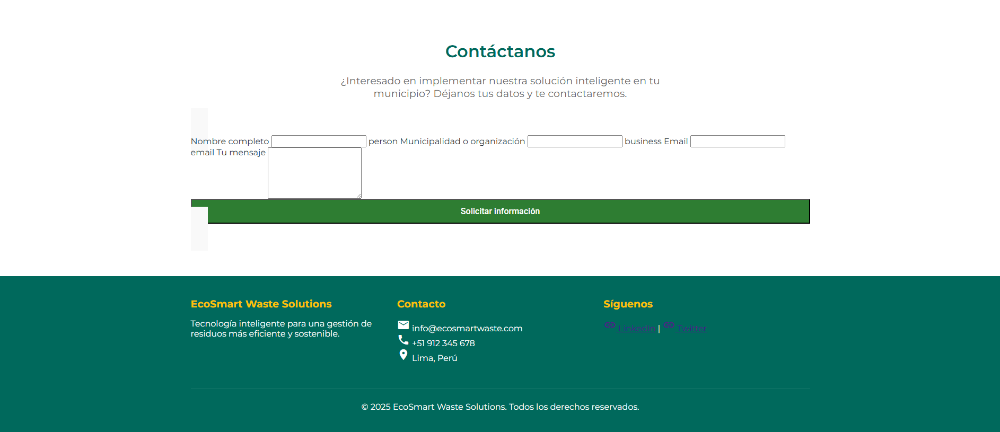

<h3 align="center"> Universidad Peruana de Ciencias Aplicadas </h3>

<h3 align="center"> Ingeniería de Software </h3>
<h3 align="center"> Ciclo 2025 - 2 </h3>

 

  

 

<h1 align="center"> TP1 Report </h1>

<h3 align="center"> Desarrollo de Aplicaciones Open Source - 7391 </h3>

<h3 align="center"> Docente: Mori Paiva, Hugo Allan </h3>

<h3> Startup: EcoClean </h3>

<h3> Product: EcoSmart</h3>

<h3> Team Members: </h3>

| Member                           |    Code    |
| :------------------------------- | :--------: |
| Mathias Andree Cardenas Huaman | U202316353 |
| Diego Andres Avalos Cordova    | U202313922 |
| Joaquin Enrique Carranza Tesén | U20191B935 |
| Piero Alberto Velarde Luyo | U20211A620 |

<h3 align="center">Septiembre, 2025</h3>

  

# Registro de Versiones del Informe

| Versión | Fecha | Autor | Descripción de modificación |
| :-----: | :---: | :---: | :-------------------------- |
| TB1 | 11/09/25 | Andree Cardenas | CapÍtulo I y su descripción |
| TB1 | 12/09/25 | Joaquin Carranza | Entrevistas, Diagrama de base de datos y Landing Page.  |
| TB1 | 14/09/25 | Andree Cardenas | Parte final del Capítulo II |
| TB1 | 15/09/25 | Andree Cardenas | Realización completa del Capítulo III |
| TB1 | 15/09/25 | Sebastian Zuniga | Modelado C4 Capitulo IV |
| TB1 | 15/09/25 | Sebastian Zuniga | Modelado Diagrama de clases Capitulo IV |
| TB1 | 11/09/25 | Diego Avalos | Capitulo I antecedentes y problematicas |
| TB1 | 11/09/25 | Diego Avalos | Capitulo II Competidores y entrevistas |
| TB1 | 11/09/25 | Diego Avalos | Capitulo IV Landing Page Wireframe |
| TB1 | 11/09/25 | Sebastian Zuniga | Sprint Backlog Capitulo V |
| TB1 | 15/09/25 | Piero Velarde | Capitulo II Needfinding |
| TB1 | 15/09/25 | Piero Velarde | Capitulo IV Landing Page Mock-Up |
| TP1 | 05/10/25 | Diego Avalos | Capitulo V Sprint 2 |
| TP1 | 08/10/25 | Diego Avalos | Capitulo V Sprint 2 Services Documentation Evidence |
| TP1 | 10/10/25 | Diego Avalos | Capitulo V Sprint 2 Execution Evidence|
| TP1 | 10/10/25 | Joaquin Caranza | Landing Page |
| TP1 | 10/10/25 | Andree Cardenas | Desarrollo del messages del fronted |
| TP1 | 09/10/25 | Andree Cardenas | Mejora del impact mapping y Mejora del Product Backlog |
| TP1 | 10/10/25 | Piero Velarde | Mejora del Lean UX Canvas |
| TP1 | 10/10/25 | Piero Velarde | Capitulo V Services Documentation Evidence for Sprint Review |
| TP1 | 10/10/25 | Piero Velarde | Capitulo V  Software Deployment Evidence for Sprint Review |
| TB2 | 15/11/25 | Andree Cardenas | Capitulo V Sprint 3 |
| TB2 | 12/11/25 | Andree Cardenas | Desarrollo del Backend |
| TB2 | 16/11/25 | Andree Cardenas | Actualización de las conclusiones | 
| TB2 | 10/11/25 | Piero Velarde | Despliegue de MySQL |
| TB2 | 13/11/25 | Piero Velarde | Despliegue de la nueva version del Frontend
| TB2 | 14/11/25 | Joaquin Carranza | Entrevistas |
| TB2 | 14/11/25 | Joaquin Carranza | Capitulo V Sprint 3 |
| TB2 | 12/11/25 | Diego Avalos | Desarrollo del Backend |
| TB2 | 12/11/25 | Diego Avalos | Despliegue del Backend |
| TB2 | 12/11/25 | Diego Avalos | Capitulo V Sprint 3 |

  

# Project Report Collaboration Insights

| URL de la organización del proyecto |
| ----------------------------------- |
| [https://github.com/UPC-PRE-202502-1ASI0729-7391-NOMBRE](https://github.com/UPC-PRE-202502-1ASI0729-7391-NOMBRE) |

| URL del repositorio del reporte |
| ------------------------------- |
| [https://github.com/UPC-PRE-202502-1ASI0729-7391-NOMBRE/EcoClean-Report](https://github.com/UPC-PRE-202502-1ASI0729-7391-NOMBRE/EcoClean-Report) |

| URL del repositorio de la landing page |
| -------------------------------------- |
| [https://github.com/UPC-PRE-202502-1ASI0729-7391-NOMBRE/Landing-page](https://github.com/UPC-PRE-202502-1ASI0729-7391-NOMBRE/Landing-page) |

| URL del repositorio del Frontend |
| -------------------------------------- |
| [https://github.com/UPC-PRE-202502-1ASI0729-7391-NOMBRE/EcoClean-Web-Frontend](https://github.com/UPC-PRE-202502-1ASI0729-7391-NOMBRE/EcoClean-Web-Frontend) |

| URL del repositorio del Backend |
| -------------------------------------- |
| [https://github.com/UPC-PRE-202502-1ASI0729-7391-NOMBRE/EcoClean-Platfom](https://github.com/UPC-PRE-202502-1ASI0729-7391-NOMBRE/EcoClean-Platfom) |

  

# Contenido

## Tabla de Contenidos

### [Registro de versiones del informe](#registro-de-versiones-del-informe)

### [Project Report Collaboration Insights](#project-report-collaboration-insights)

### [Contenido](#contenido)

### [Student Outcome](#student-outcome-1)

### [Capítulo I: Introducción](#capítulo-i-introducción-1)

- [1.1. Startup Profile](#11-startup-profile)
  - [1.1.1. Descripción de la Startup](#111-description-de-la-startup)
  - [1.1.2. Perfiles de integrantes del equipo](#112-perfiles-de-integrantes-del-equipo)
- [1.2. Solution Profile](#12-solution-profile)
  - [1.2.1 Antecedentes y problemática](#121-antecedentes-y-problemática)
  - [1.2.2 Lean UX Process](#122-lean-ux-process)
    - [1.2.2.1. Lean UX Problem Statements](#1221-lean-ux-problem-statements)
    - [1.2.2.2. Lean UX Assumptions](#1222-lean-ux-assumptions)
    - [1.2.2.3. Lean UX Hypothesis Statements](#1223-lean-ux-hypothesis-statements)
    - [1.2.2.4. Lean UX Canvas](#1224-lean-ux-canvas)
- [1.3. Segmentos objetivo](#13-segmentos-objetivo)

### [Capítulo II: Requirements Elicitation & Analysis](#capítulo-ii-requirements-elicitation--analysis-1)

- [2.1. Competidores](#21-competidores)
  - [2.1.1. Análisis competitivo](#211-análisis-competitivo)
  - [2.1.2. Estrategias y tácticas frente a competidores](#212-estrategias-y-tácticas-frente-a-competidores)
- [2.2. Entrevistas](#22-entrevistas)
  - [2.2.1. Diseño de entrevistas](#221-diseño-de-entrevistas)
  - [2.2.2. Registro de entrevistas](#222-registro-de-entrevistas)
  - [2.2.3. Análisis de entrevistas](#223-análisis-de-entrevistas)
- [2.3. Needfinding](#23-needfinding)
  - [2.3.1. User Personas](#231-user-personas)
  - [2.3.2. User Task Matrix](#232-user-task-matrix)
  - [2.3.3. User Journey Mapping](#233-user-journey-mapping)
  - [2.3.4. Empathy Mapping](#234-empathy-mapping)
- [2.4. Big Picture Event Storming.](#24-big-picture-event-storming)
- [2.5. Ubiquitous Language](#25-ubiquitous-language)
  
### [Capítulo III: Requirements Specification](#capítulo-iii-requirements-specification-1)

- [3.1. User Stories](#31-user-stories)
- [3.2. Impact Mapping](#32-impact-mapping)
- [3.3. Product Backlog](#33-product-backlog)

### [Capítulo IV: Product Design](#capítulo-iv-product-design-1)

- [4.1. Style Guidelines](#41-style-guidelines)
  - [4.1.1. General Style Guidelines](#411-general-style-guidelines)
  - [4.1.2. Web Style Guidelines](#412-web-style-guidelines)
- [4.2. Information Architecture](#42-information-architecture)
  - [4.2.1. Organization Systems](#421-organization-systems)
  - [4.2.2. Labeling Systems](#422-labeling-systems)
  - [4.2.3. SEO Tags and Meta Tags](#423-seo-tags-and-meta-tags)
  - [4.2.4. Searching Systems](#424-searching-systems)
  - [4.2.5. Navigation Systems](#425-navigation-systems)
- [4.3. Landing Page UI Design](#43-landing-page-ui-design)
  - [4.3.1. Landing Page Wireframe](#431-landing-page-wireframe)
  - [4.3.2. Landing Page Mock-up](#432-landing-page-mock-up)
- [4.4. Web Applications UX/UI Design](#44-web-applications-uxui-design)
  - [4.4.1. Web Applications Wireframes](#441-web-applications-wireframes)
  - [4.4.2. Web Applications Wireflow Diagrams](#442-web-applications-wireflow-diagrams)
  - [4.4.3. Web Applications Mock-ups](#443-web-applications-mock-ups)
  - [4.4.4. Web Applications User Flow Diagrams](#444-web-applications-user-flow-diagrams)
- [4.5. Web Applications Prototyping](#45-web-applications-prototyping)
- [4.6. Domain-Driven Software Architecture](#46-domain-driven-software-architecture)
  - [4.6.1. Design-Level Event Storming](#461-design-level-event-storming)
  - [4.6.2. Software Architecture Context Diagram](#462-software-architecture-context-diagram)
  - [4.6.3. Software Architecture Container Diagrams](#463-software-architecture-container-diagrams)
  - [4.6.4. Software Architecture Components Diagrams](#464-software-architecture-components-diagrams)
- [4.7. Software Object-Oriented Design](#47-software-object-oriented-design)
  - [4.7.1. Class Diagrams](#471-class-diagrams)
- [4.8. Database Design](#48-database-design)
  - [4.8.1. Database Diagram](#481-database-diagram)

### [Capítulo V: Product Implementation, Validation & Deployment](#capítulo-v-product-implementation-validation--deployment-1)

- [5.1. Software Configuration Management](#51-software-configuration-management)
  - [5.1.1. Software Development Environment Configuration](#511-software-development-environment-configuration)
  - [5.1.2. Source Code Management](#512-source-code-management)
  - [5.1.3. Source Code Style Guide & Conventions](#513-source-code-style-guide--conventions)
  - [5.1.4. Software Deployment Configuration](#514-software-deployment-configuration)
- [5.2. Landing Page, Services & Applications Implementation](#52-landing-page-services--applications-implementation)
  - [5.2.1. Sprint 1](#521-sprint-1)
    - [5.2.1.1. Sprint Planning 1](#5211-sprint-planning-1)
    - [5.2.1.2. Aspect Leaders and Collaborators.](#5212-aspect-leaders-and-collaborators)
    - [5.2.1.3. Sprint Backlog 1](#5213-sprint-backlog-1)
    - [5.2.1.4. Development Evidence for Sprint Review](#5214-development-evidence-for-sprint-review)
    - [5.2.1.5. Execution Evidence for Sprint Review](#5215-execution-evidence-for-sprint-review)
    - [5.2.1.6. Services Documentation Evidence for Sprint Review](#5216-services-documentation-evidence-for-sprint-review)
    - [5.2.1.7. Software Deployment Evidence for Sprint Review](#5217-software-deployment-evidence-for-sprint-review)
    - [5.2.1.8. Team Collaboration Insights during Sprint](#5218-team-collaboration-insights-during-sprint)
  - [5.2.2. Sprint 2](#522-sprint-2)
    - [5.2.2.1. Sprint Planning 2](#5221-sprint-planning-2)
    - [5.2.2.2. Aspect Leaders and Collaborators.](#5222-aspect-leaders-and-collaborators)
    - [5.2.2.3. Sprint Backlog 2](#5223-sprint-backlog-2)
    - [5.2.2.4. Development Evidence for Sprint Review](#5224-development-evidence-for-sprint-review)
    - [5.2.2.5. Execution Evidence for Sprint Review](#5225-execution-evidence-for-sprint-review)
    - [5.2.2.6. Services Documentation Evidence for Sprint Review](#5226-services-documentation-evidence-for-sprint-review)
    - [5.2.2.7. Software Deployment Evidence for Sprint Review](#5227-software-deployment-evidence-for-sprint-review)
    - [5.2.2.8. Team Collaboration Insights during Sprint](#5228-team-collaboration-insights-during-sprint)
  - [5.2.3. Sprint 3](#523-sprint-3)
    - [5.2.3.1. Sprint Planning 3](#5231-sprint-planning-3)
    - [5.2.3.2. Aspect Leaders and Collaborators.](#5232-aspect-leaders-and-collaborators)
    - [5.2.3.3. Sprint Backlog 3](#5233-sprint-backlog-3)
    - [5.2.3.4. Development Evidence for Sprint Review](#5234-development-evidence-for-sprint-review)
    - [5.2.3.5. Execution Evidence for Sprint Review](#5235-execution-evidence-for-sprint-review)
    - [5.2.3.6. Services Documentation Evidence for Sprint Review](#5236-services-documentation-evidence-for-sprint-review)
    - [5.2.3.7. Software Deployment Evidence for Sprint Review](#5237-software-deployment-evidence-for-sprint-review)
    - [5.2.3.8. Team Collaboration Insights during Sprint](#5238-team-collaboration-insights-during-sprint)
- [5.3. Validation Interviews](#53-validation-interviews)
  - [5.3.1. Diseño de entrevistas](#531-diseño-de-entrevistas)
  - [5.3.2. Registro de entrevistas](#532-registro-de-entrevistas)
  - [5.3.3. Evaluaciones según heurísticas](#533-evaluaciones-según-heurísticas)
- [5.4. Video About-The-Product](#54-video-about-the-product)

### [Conclusiones](#conclusiones-1)

- [Conclusiones y recomendaciones](#conclusiones-y-recomendaciones)

### [Bibliografía](#bibliografía-1)

### [Anexos](#anexos-1)

  

# Student Outcome

*ABET – EAC - Student Outcome 3*

| Criterio específico                                                                                                                                 | Acciones realizadas | Conclusiones |
| :-------------------------------------------------------------------------------------------------------------------------------------------------- | :------------------ | :----------- |
| Comunica oralmente con efectividad a diferentes rangos de audiencia. | **Mathias Andree Cardenas Huaman** TB1:Participé en la exposición del proyecto explicando objetivos, propuesta de valor y avances técnicos de manera clara y estructurada. Adapté mi lenguaje al público: técnico para docentes y más sencillo para compañeros y posibles usuarios. Además, realicé dos entrevistas al primer segmento objetivo, lo que me permitió practicar una comunicación directa, empática y comprensible con personas externas al equipo.   TP:Durante el desarrollo de EcoSmart Waste Solutions, expuse los avances del capítulo 3 y del módulo de mensajería con los municipios ante el equipo y representantes municipales. Se adaptó el lenguaje y el nivel técnico según la audiencia, usando recursos visuales y ejemplos prácticos para explicar la arquitectura del sistema y los beneficios de la solución.   **Joaquin Enrique Carranza Tesén** TB1: Durante el proyecto demostré mi capacidad de comunicarme oralmente de manera efectiva con distintos tipos de audiencia. En las entrevistas con usuarios, adapté mi lenguaje para que fuera claro y entendible, facilitando la obtención de información relevante. Al presentar el diagrama de base de datos, utilicé un lenguaje más técnico dirigido a mis compañeros y docentes, asegurándome de explicar la lógica detrás de las relaciones y estructuras planteadas. Finalmente, en la exposición de la landing page desarrollada y desplegada, empleé una comunicación enfocada en destacar las funcionalidades, el proceso de implementación y los beneficios de la solución, ajustando el nivel de detalle según el público. Esto me permitió transmitir ideas de manera clara, ordenada y efectiva en diferentes contextos.  TP1: Durante el desarrollo de la landing page, me aseguré de comunicar oralmente con efectividad a diferentes rangos de audiencia, tanto con mis compañeros del equipo técnico como con los docentes y posibles usuarios. Adapté mi lenguaje según el público: utilicé términos técnicos cuando conversaba con el equipo de desarrollo para coordinar mejoras y resolver problemas, y una explicación más clara y accesible cuando presenté los avances a los docentes o al público no especializado. Esto permitió que todos comprendieran el propósito de las mejoras y los resultados obtenidos.   **Diego Andrés Avalos Córdova** TB1: Durante esta primera entrega participé activamente en la exposición del proyecto, explicando los fundamentos de la arquitectura de información, los sistemas de navegación y la propuesta de interacción de la aplicación. En cada intervención busqué transmitir los conceptos de forma ordenada y sencilla para que tanto docentes como compañeros comprendieran la lógica detrás de nuestras decisiones de diseño. Además, al presentar apartados como el Web Style Guide, Information Architecture, Navigation Systems y entrevistas, adapté mi lenguaje según la audiencia, manteniendo un balance entre lo técnico y lo práctico. Esto me permitió reforzar mi capacidad de comunicarme oralmente con distintos grupos y demostrar claridad en la exposición de ideas. TP1: En Sprint 2 participé explicando la implementación y despliegue de la Landing Page y la Web Application, incluyendo funcionalidades como tendencias por distrito, mapa interactivo, mensajes directos, registro e inicio de sesión. También presenté la documentación de endpoints de la API y la integración con la Web App. Mostré capturas de pantalla y videos de navegación para evidenciar la interacción del usuario. Esto reforzó mi habilidad de comunicar de manera efectiva avances complejos y decisiones de diseño ante distintos públicos.   **Sebastian Gabriel Zuñiga Calle** TB1: Durante la exposición del proyecto presenté las secciones de Software Configuration Management (entorno de desarrollo, gestión del código fuente, convenciones de estilo y despliegue) y la implementación de la Landing Page y servicios en Sprint 1. Expliqué de manera clara los apartados de Sprint Planning, Sprint Backlog, evidencias de desarrollo y despliegue, así como los resultados de la colaboración del equipo. Adapté el lenguaje técnico al nivel de los docentes para resaltar la rigurosidad del proceso seguido, mientras que con mis compañeros utilicé un enfoque más práctico para que comprendieran cómo cada fase aportaba valor al avance del proyecto. Esto me permitió comunicar ideas de forma ordenada y efectiva, tanto en el plano técnico como organizativo.   **Piero Alberto Velarde Luyo** TB1: Mi responsabilidad en esta entrega fue la de crear diversos documentos visuales y representaciones de la experiencia de usuario, como User Personas, User Task Matrix, User Journey Map, Empathy Map, y los wireframes de la landing page. Comencé diseñando los User Personas, basándome en datos y entrevistas para representar a distintos segmentos de nuestra audiencia. Con esta información, elaboré una User Task Matrix que visualizaba las tareas principales de los usuarios y su relación con las funcionalidades de la plataforma. Además, desarrollé el User Journey Map, mapeando cada paso del usuario desde su primer contacto hasta la conversión, lo cual fue clave para tomar decisiones más centradas en el usuario.   TP1: Para el desarrollo de este sprint de EcoSmart Waste Solution realicé cambios necesarios con respecto al sprint anterior, todo esto para evidenciar una mejora contínua. A su vez ayudé con el despliegue de la aplicación web junto con el desarrollo y conexión con la fakeAPI| **Mathias Andree Cardenas Huaman** TB1:Logré transmitir ideas con claridad y adaptarme a distintos tipos de audiencia, fortaleciendo mis habilidades de expresión oral y empatía en la comunicación.   TP: La exposición permitió comunicar ideas con claridad y adaptar el mensaje a distintos públicos. Se fortalecieron habilidades para explicar aspectos técnicos de forma comprensible, favoreciendo la colaboración y validación del proyecto entre desarrolladores y autoridades.  **Joaquin Enrique Carranza Tesén** TB1: En síntesis, la elaboración de entrevistas, el diseño del diagrama de base de datos y el desarrollo de la landing page reflejaron la importancia de una comunicación oral clara y adaptada al contexto. La capacidad de ajustar el lenguaje según la audiencia permitió no solo transmitir información técnica, sino también garantizar la comprensión y la participación activa de los involucrados. De este modo, se evidencia que la comunicación efectiva constituye una competencia fundamental en el ámbito académico y profesional, al favorecer el intercambio de ideas y el cumplimiento exitoso de los objetivos del proyecto.  TP1: Mi capacidad de comunicación oral fue clave para transmitir ideas de manera clara y efectiva, facilitando el trabajo en equipo y asegurando que las decisiones sobre la landing page fueran comprendidas y validadas por todos los involucrados.   **Diego Andrés Avalos Córdova** TB1: La experiencia de explicar la arquitectura de información, los sistemas de navegación y la lógica de los prototipos reforzó la importancia de expresarse con claridad frente a distintos públicos. Adaptar el lenguaje a contextos técnicos y no técnicos me permitió transmitir de forma más efectiva nuestras ideas y decisiones. Este proceso evidenció que la comunicación oral no solo es necesaria para presentar resultados, sino también para generar confianza, asegurar comprensión y fomentar la colaboración dentro y fuera del equipo. TP1: La presentación de los avances del Sprint 1 y 2, incluyendo la implementación y despliegue de la Landing Page y Web App, la integración de funcionalidades como tendencias, mapas, mensajes y registro/inicio de sesión, así como la documentación de endpoints y videos de navegación, me permitió reforzar mis habilidades de comunicación oral en contextos técnicos y prácticos, demostrando que puedo explicar decisiones de diseño y funcionalidades complejas de forma clara y comprensible.   **Sebastián Gabriel Zúñiga Calle** TB1: Mi participación fortaleció mis habilidades de comunicación oral, al presentar contenidos técnicos y de gestión de manera clara, estructurada y comprensible para diferentes tipos de audiencia.   **Piero Alberto Velarde Luyo** TB1: Mi participación me permitió demostrar la capacidad de comunicar de manera efectiva mis ideas y hallazgos al resto de mis compañeros. Aprendí a adaptar mi estilo de comunicación y logré que cada parte del equipo comprendiera la importancia de los elementos desarrollados para la experiencia de usuario.  TP1: Mi participación durante este sprint permitió que pudiese mostrar una mejora en la capacidad de comunicar de manera efectiva mis ideas con mi equipo para las mejoras de este avance. Aprendí a hacerle entender a mi equipo la importancia de realizar las mejoras debidas a elementos desarrollados.   |
| Comunica por escrito con efectividad a diferentes rangos de audiencia. | **Mathias Andree Cardenas Huaman** TB1:Contribuí en la redacción del informe, presentando información técnica (backlog, user stories) y explicaciones accesibles para audiencias no especializadas. Usé un estilo claro y apoyado en tablas y ejemplos para facilitar la comprensión. Además, registramos versiones del informe para mantener orden y trazabilidad.   TP: Se elaboró y corrigió el capítulo 3 del documento técnico, incluyendo historias de usuario y requerimientos, además del apartado de mensajería. Se usó un lenguaje claro, estructurado y adaptable tanto para personal técnico como para gestores municipales.   **Joaquin Enrique Carranza Tesén** TB1: A lo largo del proyecto demostré mi capacidad de comunicarme por escrito de manera efectiva con distintos rangos de audiencia. Durante las entrevistas elaboré cuestionarios y resúmenes claros y comprensibles para los participantes, lo que facilitó obtener información relevante. En el diagrama de base de datos, empleé una redacción técnica precisa, dirigida a mis compañeros y docentes, con el fin de sustentar la lógica de las relaciones planteadas. Finalmente, en la documentación y el despliegue de la landing page utilicé un estilo más estructurado y formal, destacando procesos, funcionalidades y beneficios, lo que permitió transmitir el trabajo realizado de forma clara y ordenada.  TP1: Durante el desarrollo de la landing page, también me comuniqué por escrito de manera efectiva con diferentes rangos de audiencia. Elaboré documentos técnicos y reportes de avances dirigidos al equipo de desarrollo, donde utilicé un lenguaje más especializado para detallar los cambios y mejoras implementadas. Además, redacté mensajes y descripciones más simples y claras al presentar los resultados a los docentes o en la documentación final del proyecto, asegurando que cualquier persona, sin importar su nivel técnico, pudiera entender el proceso y los objetivos alcanzados.   **Diego Andrés Avalos Córdova** TB1: Mi aporte principal estuvo en la elaboración de gran parte del documento de entrega, donde redacté secciones como General Style Guidelines, Web Style Guide, Information Architecture, Labeling Systems, Navigation Systems y entrevistas. Procuré usar un estilo accesible y coherente, combinando explicaciones técnicas con un lenguaje sencillo para que cualquier lector, sin importar su nivel de conocimiento, pudiera comprender el contenido. También cuidé la estructura del informe para mantener un orden lógico y claro, reforzando la trazabilidad del trabajo realizado. TP1: Durante Sprint 2 amplié la documentación incorporando el despliegue de la Landing Page y Web Application, la integración con API fake, funcionalidades de tendencias, mapas, mensajes directos, registro e inicio de sesión, capturas de pantalla y videos de navegación. Redacté de manera clara y comprensible para públicos técnicos y no técnicos, asegurando la trazabilidad de avances y la comprensión de los entregables. Esto fortaleció mi capacidad de comunicación escrita y garantizó que el trabajo fuera útil y entendible para todos los involucrados.   **Sebastian Gabriel Zuñiga Calle** TB1: Contribuí activamente en la documentación técnica del proyecto, redactando apartados sobre los diagramas de arquitectura (contexto, contenedores, componentes y clases) y la sección de planificación ágil (Sprint Planning 1 y Sprint Backlog 1). Utilicé un estilo formal y estructurado, con explicaciones precisas para docentes y un lenguaje claro y accesible para que la documentación fuera comprensible y trazable.   **Piero Alberto Velarde Luyo** TB1: Fui responsable de documentar los entregables visuales como los User Personas, User Journey Map, User Task Matrix, y Empathy Map. Me aseguré de utilizar un lenguaje accesible para todos los niveles de conocimiento. Además, me encargué de plasmar los resúmenes y conclusiones de nuestras decisiones de diseño de manera estructurada y fácil de seguir, para garantizar que los puntos clave fueran comprendidos por todas las partes involucradas. TP1: Fui responsable de aplicar las mejoras necesarias de distintos puntos en nuestro informe, al igual de documentar la evidencia del despliegue de nuestra aplicación web y landing page, a su vez, aporté con respecto al despliegue de nuestra aplicación web al igual que nuestra FakeAPI, junto con la respectiva conexión de estps.   | **Mathias Andree Cardenas Huaman** TB1:El documento refleja precisión técnica y claridad, logrando un material comprensible tanto para un público especializado como para uno general. Fortalecí mi capacidad de comunicar ideas de manera efectiva en formato escrito.  TP: La redacción permitió transmitir información técnica de manera precisa y accesible. Se logró coherencia entre el contenido y los objetivos del proyecto, fortaleciendo la comunicación escrita como herramienta clave para documentar y coordinar el desarrollo del sistema.  **Joaquin Enrique Carranza Tesén** TB1: En conclusión, la redacción aplicada en las diferentes etapas del proyecto mostró la importancia de adaptar el lenguaje escrito al público objetivo. El uso de un estilo comprensible en las entrevistas, técnico en la documentación y formal en la exposición de resultados permitió comunicar información de manera clara y pertinente. Esto confirma que la comunicación escrita es una herramienta esencial para garantizar la coherencia del trabajo y la comprensión entre audiencias diversas en el ámbito académico y profesional.  TP1: La comunicación escrita efectiva me permitió mantener una coordinación clara dentro del equipo y presentar información comprensible para audiencias con distintos niveles de conocimiento, fortaleciendo la transparencia y la comprensión del trabajo realizado en la landing page.   **Diego Andrés Avalos Córdova** TB1: Haber redactado buena parte del informe me permitió mejorar mi capacidad de comunicación escrita, no solo para explicar conceptos técnicos, sino también para transmitirlos de manera comprensible y ordenada. Adaptar el nivel de detalle según la sección y el lector demostró que la escritura es clave para estructurar ideas, documentar avances y garantizar que el trabajo sea útil tanto para audiencias técnicas como generales. TP1: Incorporar en la documentación los avances del Sprint 2, incluyendo implementación, despliegue, funcionalidades de la app web, integración de API y evidencia visual, me permitió reforzar mi capacidad de comunicar de manera escrita información técnica compleja de forma clara, comprensible y organizada, asegurando que cualquier lector pueda entender los entregables y el progreso del proyecto.   **Sebastian Gabriel Zuñiga Calle** TB1: La elaboración de documentación técnica y de planificación fortaleció mi capacidad de comunicarme por escrito con diferentes niveles de audiencia, combinando precisión conceptual y claridad expositiva. Esto evidenció la importancia de la redacción estructurada para garantizar la comprensión, la coordinación del equipo y la calidad del proyecto.   **Piero Alberto Velarde Luyo** TB1: A través de este proceso, pude mejorar mis habilidades de comunicación escrita, adaptando el nivel de complejidad según el tipo de audiencia. Esto me permitió expresar las ideas de forma que fueran comprensibles, precisas y relevantes para todos los involucrados en el proyecto, favoreciendo la toma de decisiones informada y efectiva a lo largo del ciclo de desarrollo. TP1: Este proceso me permitió perfeccionar aún más la capacidad de adecuar la comunicación escrita al momento de evidenciar el proceso de despliegue de nuestra aplicación web y landing page , a su vez aseguré que la información de la mejora contínua realizada al informe fuera siempre clara, precisa y pertinente. Al lograr que todos los involucrados entendieran el mensaje, se promovió una toma de decisiones más efectiva a lo largo de este sprint. |

  

## Capítulo I: Introducción

## 1.1. StartUp Profile

### 1.1.1. Description de la StartUp

  <b>EcoSmart Waste Solutions</b> es una startup tecnológica enfocada en la 
  <b>gestión inteligente de residuos urbanos</b>. Su propósito es optimizar 
  el proceso de recolección de basura en distritos y municipios, mediante una app web en la cual los ciudadanos pueden enviar 
  información en tiempo real sobre el nivel de llenado de los contenedores.

  Gracias a esta información, el sistema aplica 
  <b>algoritmos de optimización de rutas</b> que permiten a los camiones recolectores 
  recorrer solo las zonas necesarias, reduciendo tiempos, costos operativos y emisiones de CO₂.

<h4>Visión:</h4>

  Convertirse en la principal solución tecnológica en Latinoamérica para la gestión eficiente 
  y sostenible de residuos, promoviendo ciudades inteligentes y amigables con el medio ambiente.

<h4>Misión:</h4>

  Ofrecer un sistema de gestión de residuos innovador que integre sensores inteligentes, 
  análisis de datos y rutas optimizadas, contribuyendo a que los distritos reduzcan 
  costos logísticos, mejoren la calidad del servicio y minimicen el impacto ambiental.

<h4>Propuesta de valor</h4>
<ul>
  <li>Reducción de hasta un <b>X%</b> en costos de combustible y horas-hombre en recolección.</li>
  <li>Mejora en la planificación de rutas de los camiones recolectores.</li>
  <li>Disminución significativa de emisiones contaminantes.</li>
  <li>Mayor limpieza y satisfacción ciudadana al evitar tachos desbordados.</li>
</ul>

<h4>Innovación</h4>

  Integramos <b>IoT, Big Data y algoritmos de optimización</b> en un solo ecosistema digital, 
  logrando un modelo escalable y adaptable a distintos distritos y ciudades.

### 1.1.2. Perfiles de integrantes del equipo

| Perfil | Descripción |
|--------|-------------|
|  |
 Hola, mi nombre es Diego Ávalos, soy estudiante de la carrera de Ingeniería de Software en la UPC y actualmente curso el sexto ciclo. Me apasiona el campo de la Ciberseguridad y mi objetivo es especializarme en esta área para convertirme en un profesional capaz de aportar soluciones innovadoras en la protección de la información. Tengo conocimientos en C++, JavaScript, HTML y Python, y me encuentro en constante aprendizaje de nuevos lenguajes y tecnologías que fortalezcan mis habilidades técnicas. Además, me interesa participar en proyectos que me permitan crecer tanto a nivel académico como profesional, desarrollando experiencia práctica y aportando valor en el ámbito tecnológico.
|
|  | Nombre: Mathias Andree Cárdenas Huaman  Actualmente estoy cursando el sexto ciclo de la carrera de Ingeniería de Software. Soy proactivo y comunicativo, trabajo en equipo y resolución de problemas, también me gusta colocarme objetivos desafiantes para mejorar. Me encanta el curso y mi meta es completarla con la máxima nota posible. |
|  | Hola, mi nombre es Sebastian Zuniga. Estudiante de la carrera de Ingeniería de Software. Me apasiona la resolucion de problemas aplicando logica de programacion. Me apasiona el desarrollo backend. Y me interesa el curso y espero poder aplicar todos los conocimientos adquiridos a lo largo de la carrera para aprobarlo. | 
|  | Hola, soy Piero Velarde, estudio la carrera de ingeniería de software en la Universidad Peruana de Ciencias Aplicadas. Escogí esta carrera por mi facilidad en el uso de las computadoras. Asímismo, por mi interés en el funcionamiento de las anteriores mencionadas y todo respecto a la programación y las tecnologías emergentes. Actualmente cuento con conocimientos en C++, Python, Javascript, Dart.  |
|  | Hola, soy Joaquín Carranza. Tengo 24 años y actualmente curso el sexto ciclo de la carrera de Ingeniería de Software. Me gusta la tecnología y la forma en que ayuda a las personas a resolver problemas de manera más rápida y eficiente. Me interesa especialmente el manejo de datos y la ciberseguridad. Siento que puedo aportar a mi equipo ideas desde otra perspectiva, ya que siempre me cuestiono cómo se podría mejorar el producto o hacia qué objetivo estamos apuntando. |

## 1.2. Solution Profile

### 1.2.1. Antecedentes y problemática

  En América Latina, la <b>gestión de residuos sólidos</b> representa un reto 
  creciente para las ciudades. El aumento poblacional, el crecimiento de zonas 
  urbanas y la falta de innovación en los procesos de recolección generan un 
  servicio costoso, ineficiente y poco sostenible.

  La mayoría de municipios continúa operando con un modelo tradicional basado en 
  <b>rutas fijas y horarios predeterminados</b>, lo que provoca recorridos innecesarios 
  en zonas con tachos vacíos y retrasos en áreas donde los contenedores ya se encuentran 
  desbordados. Esta situación incrementa los gastos de combustible, horas-hombre y 
  emisiones contaminantes, además de generar insatisfacción ciudadana.

<h4>What?</h4>

  El problema central se manifiesta en tres puntos críticos: 

<ul>
  <li><b>Ineficiencia en las rutas:</b> los camiones siguen trayectos sin datos en tiempo real, 
  lo que provoca recorridos redundantes.</li>
  <li><b>Acumulación de residuos:</b> en las zonas de mayor actividad, los tachos se saturan 
  rápidamente sin un monitoreo preventivo.</li>
  <li><b>Altos costos logísticos:</b> los municipios destinan más presupuesto de lo necesario 
  en combustible y personal operativo.</li>
</ul>

<h4>Why?</h4>

  El modelo de recolección responde a un esquema obsoleto que carece de 
  <b>sensores, datos confiables y análisis predictivo</b>. 
  Sin información precisa, los municipios no pueden optimizar su logística, 
  generando desperdicio de recursos y aumentando el impacto ambiental.

<h4>When?</h4>

  El problema se vuelve más evidente en:

<ul>
  <li><b>Épocas festivas o fines de semana</b>, cuando el volumen de basura puede crecer hasta en un 40%.</li>
  <li><b>Zonas comerciales y mercados</b>, donde los tachos alcanzan su capacidad mucho más rápido.</li>
  <li><b>Distritos periféricos</b>, con menor frecuencia de recolección y mayores riesgos sanitarios.</li>
</ul>

<h4>Where?</h4>

  El impacto es más crítico en <b>grandes urbes latinoamericanas</b> como Lima, Bogotá o 
  Ciudad de México, donde la extensión territorial y la densidad poblacional hacen que los 
  sistemas tradicionales resulten insostenibles. 

  Las brechas se observan especialmente en distritos con presupuestos limitados, 
  áreas comerciales de alta generación de residuos y zonas alejadas donde la recolección 
  no logra cubrir la demanda.

<h4>Who?</h4>
<ul>
  <li><b>Ciudadanos:</b> conviven con calles sucias, olores desagradables y riesgos de salubridad.</li>
  <li><b>Municipios:</b> soportan costos logísticos elevados sin lograr eficiencia operativa.</li>
  <li><b>Medio ambiente:</b> se ve impactado por el exceso de emisiones de CO₂ y residuos mal gestionados.</li>
</ul>

<h4>How?</h4>

  El modelo tradicional crea un ciclo de ineficiencia: 
  rutas mal diseñadas incrementan el gasto de combustible, 
  los tachos desbordados generan quejas ciudadanas 
  y la falta de datos limita la capacidad de planificación. 

  Con este esquema, los costos operativos pueden aumentar hasta un <b>30%</b> y las emisiones 
  de CO₂ se elevan significativamente, comprometiendo tanto el presupuesto municipal como la 
  sostenibilidad ambiental.

<h4>How much?</h4>

  Se estima que hasta un <b>40% de los recorridos</b> de camiones recolectores son innecesarios, 
  lo que representa millones en pérdidas anuales por consumo de combustible y horas-hombre. 

  Una solución digital basada en <b>IoT y optimización de rutas</b> podría reducir estos costos 
  en un 25-30%, mejorar la limpieza urbana y elevar la satisfacción ciudadana, a la vez que 
  disminuye la huella ambiental.

### 1.2.2. Lean UX Process

En EcoSmart Waste Solutions utilizamos el proceso Lean UX como un enfoque ágil para crear y validar soluciones en la gestión de residuos urbanos. Partimos de hipótesis sobre la eficiencia de recolección, desarrollamos prototipos mínimos con sensores IoT y algoritmos de optimización, y los probamos en escenarios reales con municipios. A partir de los resultados obtenidos, ajustamos e iteramos constantemente para asegurar un sistema que reduzca costos, mejore la limpieza urbana y contribuya a la sostenibilidad ambiental.  

#### 1.2.2.1. Lean UX Problem Statements
En Lima Metropolitana y en muchas ciudades de la región, la gestión de residuos sólidos es un problema persistente. Los camiones recolectores siguen rutas y horarios fijos, lo que genera vaciados innecesarios en contenedores semivacíos y, al mismo tiempo, acumulación excesiva en zonas críticas. Esta ineficiencia provoca sobrecostos, incrementa la contaminación y deteriora la calidad de vida urbana.  

EcoSmart Waste Solutions busca transformar este escenario mediante el uso de sensores IoT y algoritmos de optimización de rutas, ofreciendo a los municipios información en tiempo real para tomar decisiones más inteligentes. Con ello, reducimos recorridos innecesarios, optimizamos recursos logísticos y aportamos a un entorno más limpio y sostenible.  

Lo que distingue a nuestra propuesta es la capacidad de convertir datos en soluciones prácticas: no solo monitoreamos niveles de llenado, sino que entregamos rutas inteligentes y métricas ambientales que permiten a los gestores municipales actuar con eficiencia.  

Estudios preliminares revelan que cerca del **40% de los recorridos de recolección son evitables**, lo cual representa pérdidas significativas en combustible y tiempo. Este hallazgo nos plantea el siguiente desafío:  

**¿Cómo podemos diseñar una plataforma que no solo optimice la recolección en base a datos en tiempo real, sino que también motive a los municipios a adoptar prácticas sostenibles y mejorar la experiencia urbana?**

#### 1.2.2.2. Lean UX Assumptions

**Assumptions:**

Creemos que la recolección de residuos urbanos debería ser un proceso mucho más eficiente, sostenible y transparente. Los municipios necesitan herramientas simples pero potentes que les permitan planificar mejor sus rutas y reducir costos operativos sin complicar el trabajo de sus equipos. Los ciudadanos también son parte clave: esperan calles más limpias y tachos que no estén desbordados, ya que esto afecta directamente la calidad de vida en su distrito. Nuestra propuesta se centra en integrar sensores IoT, análisis de datos y algoritmos de optimización en un solo ecosistema. La confianza se genera a través de datos en tiempo real y reportes claros que ayuden a tomar decisiones rápidas. Los principales desafíos estarán en la adopción tecnológica por parte de los municipios y en demostrar que la inversión inicial en estos sistemas se traduce en ahorros y beneficios visibles a corto plazo.  

**¿Quién es el usuario?**  
Funcionarios municipales responsables de la gestión de residuos, operarios de limpieza y, de manera indirecta, los vecinos de cada distrito.  

**¿Dónde encaja nuestro producto en su vida?**  
En la planificación y ejecución diaria de la recolección de residuos, facilitando que los equipos de limpieza trabajen de forma más ordenada y que los ciudadanos perciban un entorno urbano más limpio.  

**¿Qué problemas tiene nuestro producto y cómo se pueden resolver?**  
- Problema 1: Rutas de recolección ineficientes que generan gastos innecesarios.  
  **Solución:** Algoritmos de optimización que reducen recorridos y consumo de combustible.  
- Problema 2: Falta de información en tiempo real sobre los tachos de basura.  
  **Solución:** Sensores IoT que envían datos actualizados al sistema central.  
- Problema 3: Dificultad de los municipios para justificar la inversión tecnológica.  
  **Solución:** Reportes con métricas claras de ahorro, reducción de emisiones y mejora en la satisfacción ciudadana.  

**¿Cuándo y cómo es usado nuestro producto?**  
El sistema se usa diariamente para monitorear tachos inteligentes, generar reportes automáticos y planificar rutas de camiones recolectores de manera más ágil.  

**¿Qué características son importantes?**  
Monitoreo en tiempo real, optimización de rutas, reportes automáticos, integración sencilla con sistemas municipales y paneles de control fáciles de usar.  

**¿Cómo debe verse nuestro producto y cómo debe comportarse?**  
Debe transmitir confianza, simplicidad y modernidad. El diseño tiene que ser intuitivo, visual y accesible, con datos claros que permitan tomar decisiones rápidas.  

**Business Outcomes:**  
- Reducir los costos operativos de recolección en al menos un 30% durante el primer año.  
- Optimizar hasta un 40% de las rutas de camiones recolectores.  
- Disminuir la huella de carbono asociada a la recolección en un 25%.  
- Incrementar la satisfacción ciudadana al reducir la presencia de tachos desbordados.  

**User Outcomes:**  
- Los municipios cuentan con información confiable y procesable.  
- Los operarios de limpieza trabajan con rutas más claras y menos tiempo perdido.  
- Los ciudadanos disfrutan de espacios públicos más limpios y ordenados.  
- Se fomenta la percepción de que la tecnología puede mejorar la calidad de vida urbana.  

#### 1.2.2.3. Lean UX Hypothesis Statements

- Creemos que al instalar sensores IoT en los tachos para enviar datos en tiempo real sobre el nivel de llenado, los municipios podrán tomar mejores decisiones de recolección. Sabremos que esto es cierto cuando al menos el 50% de las rutas se optimicen en los primeros tres meses de uso.  

- Creemos que ofrecer a los gestores municipales un panel de control con métricas claras (rutas, costos y niveles de residuos) aumentará la confianza en el sistema. Sabremos que hemos tenido éxito cuando al menos el 70% de los funcionarios consulten los reportes de manera semanal.  

- Creemos que mostrar indicadores ambientales como reducción de emisiones de CO₂ ayudará a los municipios a justificar la inversión tecnológica. Sabremos que hemos logrado el objetivo cuando al menos el 40% de los reportes presentados incluyan estos indicadores como argumento de gestión.  

- Creemos que la integración de notificaciones automáticas para los operarios (alertas de tachos llenos o rutas actualizadas) facilitará la coordinación diaria. Sabremos que esto funciona cuando al menos el 60% de las alertas generen una acción registrada en menos de 24 horas.  

- Creemos que si los ciudadanos perciben menos tachos desbordados en sus distritos, aumentará la satisfacción con el servicio de limpieza. Sabremos que esto es cierto cuando encuestas municipales reflejen un aumento del 20% en la percepción positiva en los primeros seis meses.  

#### 1.2.2.4. Lean UX Canvas

  

# 1.3. Segmentos Objetivo

### Segmento Objetivo 1: Ciudadanos urbanos  

**Aspectos demográficos:**  
- Personas entre 18 y 60 años.  
- Incluye estudiantes, trabajadores y familias que generan residuos diariamente.  
- Nivel educativo medio a superior, con acceso a internet y dispositivos móviles.  

**Aspectos geográficos:**  
- Distritos de Lima Metropolitana con alta densidad poblacional.  
- Proyección de expansión hacia ciudades intermedias con problemas de acumulación de residuos.  

**Aspectos psicográficos:**  
- Personas preocupadas por la limpieza de su entorno y el impacto ambiental.  
- Buscan soluciones prácticas para separar y disponer correctamente sus residuos.  
- Familiarizados con el uso de aplicaciones móviles y redes sociales.  
- Valoran iniciativas que promuevan la sostenibilidad y el bienestar comunitario.  

---

### Segmento Objetivo 2: Municipios y gobiernos locales  

**Aspectos demográficos:**  
- Instituciones públicas responsables de la gestión de residuos sólidos.  
- Funcionarios entre 30 y 55 años que toman decisiones operativas y presupuestarias.  

**Aspectos geográficos:**  
- Municipios urbanos y semiurbanos.  
- Mayor concentración en Lima Metropolitana, con interés de expansión a provincias con alta generación de residuos.  

**Aspectos psicográficos:**  
- Autoridades interesadas en modernizar la gestión de residuos mediante soluciones tecnológicas.  
- Necesitan herramientas que reduzcan costos y aumenten la eficiencia de los servicios públicos.  
- Están bajo presión social de los vecinos que demandan una ciudad más limpia.  
- Prefieren soluciones fáciles de implementar y con resultados visibles en el corto plazo.

  

# Capítulo II: Requirements Elicitation & Analysis

## 2.1. Competidores

Dentro del mercado de soluciones tecnológicas para la gestión de residuos existen varias iniciativas que, de manera directa o indirecta, compiten con la propuesta de EcoSmart. Analizar a estos actores nos ayuda a entender qué están haciendo bien, dónde se quedan cortos y qué oportunidades podemos aprovechar para diferenciarnos.  

**SmartBin (Internacional)**  
SmartBin es una empresa que ofrece sensores para medir el nivel de llenado de contenedores de basura. Su modelo se centra en la recolección de datos y el envío de alertas para optimizar rutas de recolección.  
- **Fortalezas:** Tiene experiencia en varios países y una tecnología probada en campo. Su producto es altamente especializado y cuenta con casos de éxito en ciudades grandes.  
- **Debilidades:** Su implementación suele ser costosa y está pensada más para grandes municipios con presupuestos amplios, lo que limita su alcance en contextos como el peruano.  

**EcoRuta (Latinoamérica)**  
EcoRuta es una startup emergente que desarrolla software para la optimización de rutas de camiones recolectores. Su propuesta está más orientada al análisis de recorridos y consumo de combustible que al monitoreo en tiempo real de los contenedores.  
- **Fortalezas:** Ofrece una plataforma intuitiva que ayuda a reducir gastos operativos en transporte y mantenimiento de flota.  
- **Debilidades:** Al no contar con sensores IoT propios, depende de información cargada manualmente o de sistemas externos, lo que reduce la precisión en la toma de decisiones.  

Con este análisis, vemos que existe un espacio importante para EcoSmart: integrar el monitoreo en tiempo real con algoritmos de optimización accesibles y adaptados a la realidad de municipios medianos y pequeños, que suelen ser los más afectados por la mala gestión de residuos.  

### 2.1.1. Análisis competitivo

Para entender mejor el mercado y cómo posicionar a **EcoSmart**, analizamos a dos competidores relevantes y a nuestra propia propuesta. Esto nos permite identificar qué hacen bien, dónde presentan limitaciones y cómo podemos diferenciarnos con una solución más accesible y pensada para ciudades de Latinoamérica.  

| Perfil / Categoría | EcoSmart (Nosotros) | EcoRuta | SmartBin |
|--------------------|----------------------|---------|----------|
| **Overview** | Startup tecnológica que combina sensores IoT y algoritmos de optimización para gestión de residuos urbanos. | Startup latinoamericana enfocada en software de optimización de rutas para transporte y logística. | Empresa internacional con amplia trayectoria en gestión inteligente de residuos mediante sensores y sistemas digitales. |
| **Ventaja Competitiva** | Ecosistema completo: hardware (sensores IoT) + software (optimización de rutas) + datos en tiempo real. | Bajo costo y simplicidad de uso, ideal para operadores privados y municipios pequeños. | Experiencia global, tecnología validada y casos de éxito en ciudades grandes. |
| **Mercado Objetivo** | Municipios medianos y pequeños en Latinoamérica que buscan eficiencia a costos accesibles. | Empresas privadas de logística y algunos municipios con recursos limitados. | Gobiernos locales y municipales de grandes ciudades con presupuesto amplio. |
| **Estrategias de Marketing** | Posicionamiento como solución integral, precios escalables y cercanía con municipios. | Enfoque en precios bajos y facilidad de adopción. | Uso de credenciales internacionales, casos de éxito y marketing institucional. |
| **Productos y Servicios** | Sensores IoT en contenedores, plataforma de monitoreo en tiempo real, optimización de rutas. | Software de optimización de rutas basado en datos ingresados por el usuario. | Sensores inteligentes, sistemas centralizados de gestión de residuos, consultoría. |
| **Precios y Costos** | Modelo escalable: costos accesibles con planes adaptados al tamaño del municipio. | Bajos costos por licencia de software, sin hardware incluido. | Costos altos, orientados a gobiernos con gran capacidad de inversión. |
| **Canales de Distribución** | Directo a municipios y distritos, alianzas con proveedores locales. | Venta online y acuerdos con empresas privadas. | Contratos con gobiernos municipales y asociaciones internacionales. |
| **Fortalezas** | Innovación local, accesibilidad en costos, integración completa. | Simplicidad y bajo costo. | Experiencia internacional y tecnología probada. |
| **Debilidades** | Startup nueva, menor reconocimiento de marca. | No ofrece hardware, depende de datos externos. | Alto costo y complejidad de implementación. |
| **Oportunidades** | Creciente demanda de soluciones “smart city” en municipios pequeños y medianos. | Ampliar hacia hardware propio para fortalecer su propuesta. | Expandirse en mercados emergentes si ajusta precios. |
| **Amenazas** | Competidores internacionales con mayor trayectoria. | Ser desplazados por soluciones más completas como EcoSmart. | Ser percibidos como inaccesibles en mercados con bajo presupuesto. |

EcoSmart se diferencia de sus competidores al combinar sensores IoT y rutas optimizadas, lo que genera un sistema más eficiente y sostenible para la gestión de residuos. Aunque todavía se encuentra en etapa temprana de desarrollo, su propuesta representa una alternativa innovadora para modernizar la recolección de basura en ciudades de Latinoamérica y avanzar hacia entornos urbanos más inteligentes.  

### 2.1.2. Estrategias y tácticas frente a competidores

Para competir en el sector de gestión de residuos, EcoSmart apostará por un enfoque basado en innovación y cercanía con los municipios. Nuestra principal estrategia será la diferenciación tecnológica, aplicando sensores IoT y algoritmos de optimización que reduzcan costos y tiempos en la recolección de basura, algo que nuestros competidores aún no explotan a fondo.  

También buscamos impulsar **alianzas estratégicas** con gobiernos locales y empresas privadas, lo que permitirá integrar nuestra solución dentro de los planes de ciudades sostenibles. A nivel de marketing, emplearemos **campañas de sensibilización ambiental**, resaltando la importancia de la reducción de CO₂ y el uso eficiente de recursos.  

Finalmente, como táctica clave, implementaremos pilotos en distritos específicos, lo que nos dará datos reales para ajustar la plataforma y demostrar el impacto económico y ambiental de nuestra propuesta. Con ello, podremos posicionarnos como una alternativa confiable y de alto valor frente a los competidores actuales.  

## 2.2. Entrevistas

En esta parte del informe se presentará el diseño, la aplicación y el análisis de las entrevistas realizadas a nuestros segmentos objetivos, con el fin de obtener información valiosa que respalde la propuesta de la startup.  

### 2.2.1. Diseño de entrevistas

## Segmento 1: Municipios y Funcionarios Públicos

## Datos generales:
- Nombre y cargo  
- Edad  
- Distrito o municipio  
- Tiempo de experiencia en gestión ambiental  

## Preguntas:

1. ¿Cómo funciona actualmente el proceso de recolección de residuos en su distrito (planificación de rutas, horarios, monitoreo)?  
2. ¿Cuáles son los principales problemas operativos o logísticos que enfrentan con el sistema actual?  
3. ¿De qué manera afectan estas ineficiencias al presupuesto municipal y a la calidad del servicio?  
4. ¿Qué indicadores utilizan actualmente para evaluar la eficiencia y efectividad del servicio de limpieza pública?
5. ¿Han implementado previamente soluciones tecnológicas o sistemas de monitoreo para mejorar la gestión de residuos? Si es así, ¿qué resultados obtuvieron?  
6. ¿Qué tan abiertos cree que estarían los equipos municipales (operarios, choferes, gestores) a usar herramientas tecnológicas en su trabajo diario?  
7. ¿Qué tipo de datos o reportes en tiempo real serían más útiles para la toma de decisiones (por ejemplo, nivel de llenado, consumo de combustible, emisiones, etc.)?
8. Si tuvieran acceso a una plataforma como EcoSmart, que muestra el nivel de llenado de los tachos en tiempo real y sugiere rutas óptimas, ¿cómo cree que cambiaría la gestión del servicio?  
9. ¿Qué funcionalidades considera prioritarias en una herramienta de este tipo (alertas automáticas, reportes, panel de control, métricas ambientales, etc.)?  
10. ¿Qué beneficios específicos esperaría obtener a corto y mediano plazo al implementar un sistema como EcoSmart?  
11. ¿Cuáles cree que serían las principales barreras para adoptar esta solución (presupuesto, capacitación, resistencia al cambio, etc.)?  
12. ¿Qué tipo de soporte o acompañamiento (capacitación, mantenimiento, asistencia técnica) necesitarían para implementar exitosamente esta herramienta?
13. ¿Cómo cree que reaccionaría la ciudadanía ante la implementación de un sistema de gestión inteligente de residuos?  
14. ¿Qué estrategias de comunicación o participación ciudadana considera necesarias para asegurar el éxito de la solución?

## Segmento 2: Ciudadanos Urbanos

## Datos generales:
- Nombre  
- Edad  
- Distrito de residencia  
- Ocupación  
- Tipo de vivienda (casa, departamento, condominio)  

## Preguntas:

1. ¿Cómo suele manejar los residuos en su hogar (separación, reciclaje, frecuencia de disposición)?  
2. ¿Qué problemas ha experimentado con el servicio de recolección en su zona (horarios, frecuencia, limpieza)?  
3. ¿Con qué frecuencia observa tachos públicos llenos, rebalsados o en mal estado?  
4. ¿Ha participado alguna vez en programas municipales de reciclaje o gestión de residuos?
5. ¿Qué mejoras considera prioritarias en el servicio de recolección de basura en su distrito?  
6. ¿Qué tipo de información le gustaría recibir sobre la gestión de residuos (horarios de recolección, puntos limpios, campañas de reciclaje, etc.)?  
7. ¿Qué tan útil le parecería una aplicación que le informe en tiempo real sobre rutas de recolección, nivel de llenado de tachos o puntos cercanos de reciclaje?
8. Si existiera una aplicación como EcoSmart, ¿qué funciones le parecerían más valiosas? (por ejemplo: alertas de recolección, reporte de incidencias, mapa de tachos inteligentes, estadísticas ambientales)  
9. ¿Qué características le generarían mayor confianza para usar la aplicación (interfaz sencilla, respaldo municipal, seguridad de datos, etc.)?  
10. ¿Estaría dispuesto a colaborar reportando incidencias como tachos llenos o puntos con basura acumulada desde la aplicación?  
11. ¿Qué lo motivaría a descargar y usar una aplicación de gestión inteligente de residuos de forma frecuente?  
12. ¿Qué aspectos mejorarían su experiencia como ciudadano en relación con el manejo de residuos si existiera una solución digital como esta?
    
### 2.2.2. Registro de entrevistas

### Entrevistas del Segmento N°1: Municipalidades
|  |
|--------|
| Entrevistado: Jorge Chumpitaz |
| Género: Masculino |
| Edad: 23 años |
| Link de la entrevista (YouTube): [https://youtu.be/qL3hUyrXn1c](https://youtu.be/qL3hUyrXn1c) |
| Jorge Chumpitaz, un empleado de la municipalidad de comas, responde algunas preguntas relacionado al manejo de recolección de basura en las calles, parques, etc de su distrito, comenta que no hay un sistema donde les avise cuando un lugar está lleno de basura o avise cuánta basura recolectaron en una ronda. Comenta que a la municipalidad le gustaría tener una app donde les avise cuando un tacho de basura se encuentra lleno para poder mandar al personal de limpieza a ese punto fijo, y que están abiertos a hacer pruebas con proyectos como EcoSmart para facilitar y mejorar el manejo de recolección de basura. Y esperan tener las calles, avenidas, parques, centros de salud, etc, más limpias y seguras para la vida de los pobladores en el distrito de comas. |

| |
|--------|
| Entrevistado: Emmnuel Ñahuiña |
| Género: Masculino |
| Edad: 26 años |
| Link de la entrevista: [[URL de la entrevista]](https://upcedupe-my.sharepoint.com/:v:/g/personal/u20191b935_upc_edu_pe/EeSlP6nob51Llwue_1tPJ28BQlYmhgU-_zl5vJz-TdMClw?nav=eyJyZWZlcnJhbEluZm8iOnsicmVmZXJyYWxBcHAiOiJTdHJlYW1XZWJBcHAiLCJyZWZlcnJhbFZpZXciOiJTaGFyZURpYWxvZy1MaW5rIiwicmVmZXJyYWxBcHBQbGF0Zm9ybSI6IldlYiIsInJlZmVycmFsTW9kZSI6InZpZXcifX0%3D&e=S631l7) |
| Emmanuel Ñahuiña señaló que la recolección de residuos se realiza con rutas programadas en turnos de mañana y noche, aunque enfrentan retrasos por fallas mecánicas, tráfico y disposición inadecuada de basura por parte de vecinos. Estas ineficiencias aumentan costos, generan quejas y afectan la imagen municipal. Destacó pilotos con geolocalización y campañas digitales, señalando que los trabajadores muestran resistencia inicial y los vecinos aceptan cambios cuando ven beneficios inmediatos. Los principales indicadores de eficiencia son puntualidad, toneladas recolectadas, reportes ciudadanos y satisfacción vecinal. Considera que una herramienta como EcoSmart optimizaría rutas, reduciría costos, daría transparencia y fomentaría reciclaje, aunque las barreras serían el presupuesto, la resistencia al cambio y la brecha tecnológica. Recalcó la necesidad de capacitación, soporte técnico y educación ciudadana para su implementación. |

### Entrevistas del Segmento N°2: Ciudadanos urbanos 
|  |
|--------|
| Entrevistado: Alessandro Bravo |
| Género: Masculino |
| Edad: 20 años |
| Link de la entrevista (YouTube): [https://youtu.be/36lqm5R-UhA](https://youtu.be/36lqm5R-UhA) |
| Alessandro Bravo, un joven de 20 años que reside en San Martin de Porres, actualmente está estudiando en la Universidad Peruana de Ciencias Aplicadas (UPC) y vive en un departamento. Maneja los residuos en casa con tachos en cocina, baños y escritorio, aunque reconoce que el servicio de recolección presenta problemas de horarios y en ocasiones no pasa, lo que provoca acumulación de basura. No ha participado en iniciativas de reciclaje, pero sugiere mejorar las rutas de recolección y considera útil una aplicación con horarios y alertas para organizarse mejor. Está dispuesto a reportar incidencias y se motivaría a participar en una gestión inteligente de residuos si introduce innovación y eficiencia en el sistema actual. |

|  |
|------|
| Entrevistado: Andrea Santur |
| Género: Feminino |
| Edad: 19 años |
| Link de la entrevista (YouTube): [https://youtu.be/nZILFH9AJQY](https://youtu.be/nZILFH9AJQY) |
| Andrea Santur, de 19 años y estudiante de Ingeniería de Software, actualmente recidiendo en una casa, y explicó que en su hogar manejan los residuos de manera organizada con horarios definidos y separación en bolsas comunes y de reciclaje; sin embargo, ha observado problemas en espacios públicos como tachos mal gestionados y bolsas rotas por recicladores. Aunque no ha participado en iniciativas de reciclaje, está interesada en hacerlo y considera importante generar mayor conciencia social. Señaló que le gustaría ver mejoras en el servicio de recolección, como calles más limpias, recolección en todos los puntos y sectores exclusivos para desechar basura. |

|  |
|------|
| Entrevistado: Andre Bernaola |
| Género: Masculino |
| Edad: 21 años |
| Link de la entrevista (YouTube): (https://drive.google.com/file/d/1JbdaEvg0dT-YWBs-Ws36s-8sRLnnS3L3/view?usp=drive_link) | 
| Andre Bernaola de 21 años es estudiante de la carrera de Ingeniería de Software, nos comentó que reside en una casa en el distrito de San Miguel. Mencionó que en su hogar tratan de manejar de manera organizada todos los residuos sólidos, no obstante, al momento de llevarlos a los puntos de recolección de los camiones de basura, en ciertos días de la semana, estos estaban abarrotados de bolsas debido, presumiblemente. a una gestión ineficiente de las rutas de los camiones de basura. Nos compartió que sí le interesaría una propuesta de software que mejore dicho proceso, al igual que detalle la ruta de los camiones y alertas de los mismos.|

### 2.2.3. Análisis de entrevistas

A partir de las entrevistas realizadas a los segmentos de **municipalidades** y **ciudadanos urbanos**, se identificaron puntos en común que permiten entender mejor sus necesidades y expectativas frente al manejo de residuos. A continuación, presentamos el análisis segmentado con porcentajes de coincidencia según la muestra.  

#### Segmento 1: Municipalidades  

Las entrevistas con Jorge Chumpitaz (Municipalidad de Comas) y Emmanuel Ñahuiña (Municipalidad de Lima) nos dejaron ver lo siguiente:  

- **Falta de sistemas tecnológicos:** El 100% mencionó que no cuentan con alertas en tiempo real sobre tachos llenos o incidencias.  
- **Interés en innovación:** Ambos entrevistados (100%) mostraron apertura a proyectos como EcoSmart, siempre que se acompañen de capacitación y soporte.  
- **Problemas operativos:** El 50% señaló retrasos frecuentes por tráfico o fallas mecánicas, mientras que el otro 50% resaltó la falta de información inmediata sobre puntos críticos.  
- **Indicadores de gestión:** El 100% coincidió en que los principales son puntualidad en el recojo, toneladas recolectadas y satisfacción ciudadana.  
- **Barreras de implementación:** El 50% habló de resistencia inicial al cambio por parte del personal, y el otro 50% mencionó el presupuesto como principal limitante.  

#### Segmento 2: Ciudadanos Urbanos  

Con las entrevistas a Alessandro Bravo, Andrea Santur y Andre Bernaola se identificaron estos patrones:  

- **Manejo en el hogar:** El 67% organiza la basura en casa, aunque el 100% señaló que el verdadero problema está en la gestión municipal y los espacios públicos.  
- **Problemas de recolección:** Todos (100%) coincidieron en que hay deficiencias: horarios incumplidos, acumulación en los puntos de recojo y tachos mal gestionados.  
- **Reciclaje:** El 100% dijo no haber participado en iniciativas de reciclaje, pero el 67% expresó interés en hacerlo si existieran sistemas claros y accesibles.  
- **Uso de tecnología:** El 100% consideró útil una aplicación con horarios, rutas y alertas.  
- **Participación ciudadana:** El 67% estaría dispuesto a reportar incidencias, siempre que la herramienta sea fácil de usar y tenga resultados visibles.  
- **Expectativas:** El 100% espera mejoras en limpieza pública, mayor organización y transparencia en el servicio.  

#### Conclusiones Generales  

- Tanto municipalidades como ciudadanos coinciden en que el mayor problema está en la **ineficiencia del sistema de recolección actual**, más que en la disposición final de los residuos.  
- Existe una **alta disposición hacia soluciones digitales** en ambos segmentos (100%), aunque con diferentes motivaciones: las municipalidades buscan eficiencia y reducción de costos, mientras que los ciudadanos valoran limpieza y transparencia.  
- Las principales barreras detectadas son la **resistencia al cambio en las municipalidades** y la **escasa costumbre de participación ciudadana organizada** en el caso de los vecinos.
  
## 2.3. Needfinding

### 2.3.1. User Personas

User Persona - Funcionario Municipal

User Persona - Ciudadano

### 2.3.2. User Task Matrix

**Funcionario Municipal (Carlos)**

| Tarea | Importancia | Frecuencia |
|:------|:------|:----------|
|Supervisar rutas de recolección de residuos|Alta|Alta|
|Responder a quejas ciudadanas sobre basura acumulada|Alta|Alta|
|Revisar reportes de limpieza y recolección|Alta|Media|
|Coordinar con trabajadores de limpieza y supervisores|Alta|Alta|
|Justificar presupuesto y recursos para el área de limpieza|Alta|Baja|
|Evaluar propuestas tecnológicas para optimizar el servicio|Media|Baja|
|Monitorear indicadores de eficiencia del servicio|Media|Baja|
|Impulsar campañas de sensibilización ciudadana sobre residuos|Baja|Baja|

**Ciudadano (Diego)**

| Tarea | Importancia | Frecuencia |
|:------|:------|:----------|
|Separar residuos en casa (orgánico / reciclable)|Media|Alta|
|Sacar la basura en horarios de recojo|Alta|Alta|
|Revisar si los tachos públicos de su barrio están llenos|Media|Media|
|Usar apps o grupos vecinales para informarse sobre recolección|Media|Media|
|Reportar incidencias (tacho lleno, basura acumulada) al municipio o apps|Media|Baja|
|Participar en actividades de reciclaje universitarias o comunitarias|Baja|Baja|
|Comentar en redes sociales sobre la gestión de residuos|Baja|Baja|
| Conversar con familia o amigos sobre hábitos de manejo de basura | Baja | Baja

### 2.3.3. User Journey Mapping

Funcionario Municipal

Ciudadano

### 2.3.4. Empathy Mapping

Funcionario Municipal

Ciudadano

## 2.4. Big Picture Event Storming.

Para nuestra startup, el EventStorming se utiliza para entender cómo interactúan los diferentes actores (ciudadanos, sensores IoT, sistema central, operarios y municipalidades) en el proceso de gestión inteligente de residuos. A través de la identificación de eventos clave, podemos visualizar el recorrido completo desde el depósito de residuos hasta la generación de reportes de eficiencia.

**Eventos principales identificados**
| Evento                                               | Actor principal      | Resultado esperado                                                                          |
| ---------------------------------------------------- | -------------------- | ------------------------------------------------------------------------------------------- |
| Ciudadano deposita residuos en el tacho inteligente  | Ciudadano            | El sensor IoT registra el nuevo nivel de llenado.                                           |
| Sensor IoT detecta nivel de llenado crítico          | Sensor IoT           | Envío de datos al sistema central en tiempo real.                                           |
| Sistema central procesa información recibida         | Plataforma EcoSmart  | Cálculo automático del estado de los tachos y predicción de próximos llenados.              |
| Algoritmo de optimización genera ruta de recolección | Sistema EcoSmart     | Creación de rutas eficientes para camiones recolectores.                                    |
| Notificación de recolección enviada a operarios      | Sistema EcoSmart     | Operarios reciben las instrucciones en su aplicación móvil.                                 |
| Camión recolector ejecuta ruta y recolecta residuos  | Operario de limpieza | El nivel del tacho se reinicia tras la recolección.                                         |
| Sistema genera reporte de eficiencia                 | Plataforma EcoSmart  | Se consolidan métricas de ahorro de costos, reducción de emisiones y cumplimiento de rutas. |

Este flujo permite identificar cuellos de botella, oportunidades de mejora y puntos críticos en los que la tecnología aporta valor directo al proceso de gestión de residuos.

## 2.5. Ubiquitous Language.

El Lenguaje Ubicuo (Ubiquitous Language) es un conjunto de términos compartidos entre todos los miembros del proyecto (equipo técnico, stakeholders y usuarios finales) que busca evitar malentendidos y asegurar que la comunicación sea clara y consistente. Se construye a partir del dominio del negocio y sirve de referencia tanto en la documentación como en la implementación técnica.

En el marco de nuestro proyecto, hemos definido un glosario de términos clave que serán utilizados de manera uniforme en todo el proceso de desarrollo:

| Término                      | Definición                                                                                                                              |
| ---------------------------- | --------------------------------------------------------------------------------------------------------------------------------------- |
| **Tacho inteligente**        | Contenedor de residuos equipado con sensores IoT que permiten medir en tiempo real el nivel de llenado.                                 |
| **Sensor IoT**               | Dispositivo que recolecta datos del estado de los tachos (nivel de llenado, temperatura, ubicación) y los transmite al sistema central. |
| **Sistema central EcoSmart** | Plataforma tecnológica que recibe, procesa y analiza los datos enviados por los tachos inteligentes.                                    |
| **Ruta optimizada**          | Itinerario generado por el algoritmo para maximizar la eficiencia en la recolección de residuos, reduciendo tiempos y costos.           |
| **Operario de limpieza**     | Persona encargada de ejecutar las rutas asignadas y realizar la recolección física de los residuos.                                     |
| **Panel de control**         | Interfaz utilizada por municipalidades u operadores para monitorear en tiempo real el estado de los tachos, las rutas y los reportes.   |
| **Alerta automática**        | Notificación generada por el sistema cuando un tacho alcanza un nivel crítico de llenado.                                               |
| **Reporte de eficiencia**    | Documento con métricas de desempeño relacionadas al ahorro económico, reducción de emisiones de CO₂ y efectividad del servicio.         |

Este glosario será la base de nuestra comunicación durante el desarrollo, evitando confusiones entre términos técnicos y de negocio.

  

# Capítulo III: Requirements Specification

## 3.1. User Stories

Lás Épicas:

| Epic ID | Título                          | Descripción                                                                                                                                                                                         |
| ------- | ------------------------------- | --------------------------------------------------------------------------------------------------------------------------------------------------------------------------------------------------- |
| EP01    | Gestión de residuos urbanos     | Como ciudadano, quiero depositar mis residuos en tachos inteligentes para contribuir a una gestión más eficiente y sostenible.                                                                      |
| EP02    | Monitoreo y control municipal   | Como municipalidad, quiero supervisar en tiempo real el estado de los tachos inteligentes para tomar decisiones oportunas y reducir desbordes.                                                      |
| EP03    | Optimización de recolección     | Como operario de limpieza, quiero recibir rutas optimizadas en mi aplicación móvil para ahorrar tiempo y combustible en el proceso de recolección.                                                  |
| EP04    | Transparencia y sostenibilidad  | Como autoridad municipal, quiero generar reportes de eficiencia para evaluar el impacto económico y ambiental de la solución.                                                                       |
| EP05    | Administración de la Plataforma | Como Administrador de EcoSmart, quiero tener las herramientas para gestionar los usuarios, roles y entidades (como municipios) de la plataforma para asegurar su correcto funcionamiento y control. |

Las Historias de Usuario:

| ID   | Épica | User Story                              | Historia                                                                                                                                                        | Criterios de Aceptación                                                                                                                                                                                                                                                                                                                                                                                                                              |
| ---- | ----- | --------------------------------------- | --------------------------------------------------------------------------------------------------------------------------------------------------------------- | ---------------------------------------------------------------------------------------------------------------------------------------------------------------------------------------------------------------------------------------------------------------------------------------------------------------------------------------------------------------------------------------------------------------------------------------------------- |
| US01 | EP01  | Depositar residuos en tacho inteligente | Como ciudadano, quiero depositar mis residuos en un tacho inteligente para contribuir a una gestión eficiente.                                                  | **Escenario Positivo – Registro correcto del llenado:** Dado que un ciudadano deposita residuos en el tacho, cuando el sensor detecta el llenado, entonces el sistema actualiza el nivel en tiempo real.  **Escenario Negativo – Falla del sensor:** Dado que el sensor presenta una falla, cuando el ciudadano deposita residuos, entonces el sistema no refleja el llenado correctamente.                                                       |
| US02 | EP01  | Recibir alerta de tacho lleno           | Como ciudadano, quiero recibir alertas de tachos llenos para evitar acumular basura en espacios desbordados.                                                    | **Escenario Positivo – Alerta activada:** Dado que un tacho alcanza el 90% de su capacidad, cuando un ciudadano abre la app, entonces aparece una alerta con ícono rojo y mensaje “Tacho lleno – buscar alternativo”.  **Escenario Negativo – Alerta no enviada:** Dado que el sistema no registra el llenado, cuando el ciudadano llega al tacho lleno, entonces no recibe ninguna alerta.                                                       |
| US03 | EP01  | Sugerencia de tacho alternativo         | Como ciudadano, quiero recibir la ubicación de un tacho alternativo para evitar desbordes y ahorrar tiempo.                                                     | **Escenario Positivo – Sugerencia correcta:** Dado que un tacho está lleno, cuando el ciudadano consulta la app, entonces el sistema sugiere el tacho vacío más cercano.  **Escenario Negativo – Información desactualizada:** Dado que el sistema no tiene datos actualizados, cuando el ciudadano busca un tacho alternativo, entonces recibe información incorrecta.                                                                           |
| US04 | EP02  | Visualización de tachos en mapa         | Como municipalidad, quiero visualizar en un mapa todos los tachos inteligentes para monitorear su estado en tiempo real.                                        | **Escenario Positivo – Visualización correcta:** Dado que los sensores envían datos, cuando la municipalidad consulta el mapa, entonces se muestran los tachos con colores (verde, amarillo, rojo).  **Escenario Negativo – Fallo en sensores:** Dado que los sensores fallan, cuando la municipalidad consulta el mapa, entonces los tachos aparecen sin datos.                                                                                  |
| US05 | EP02  | Acceso a panel de control               | Como municipalidad, quiero acceder a un panel de control para tomar decisiones sobre la recolección de residuos.                                                | **Escenario Positivo – Acceso autorizado:** Dado que la municipalidad ingresa al sistema, cuando accede al panel, entonces puede visualizar estadísticas de llenado y rutas generadas.  **Escenario Negativo – Acceso denegado:** Dado que la municipalidad no tiene permisos, cuando intenta acceder al panel, entonces recibe un mensaje de acceso denegado.                                                                                    |
| US06 | EP02  | Generar alertas automáticas a operarios | Como municipalidad, quiero que el sistema envíe alertas a los operarios cuando un tacho llegue a su capacidad máxima para garantizar una recolección inmediata. | **Escenario Positivo – Alerta enviada:** Dado que un tacho llega al 100% de llenado, cuando se procesa la información, entonces el sistema envía una notificación automática a los operarios.  **Escenario Negativo – Falla del sistema:** Dado que el sistema presenta una caída, cuando un tacho llega al 100%, entonces no se genera ninguna alerta.                                                                                           |
| US07 | EP03  | Generación de rutas optimizadas         | Como operario de limpieza, quiero recibir rutas optimizadas para reducir costos y tiempo de recolección.                                                        | **Escenario Positivo – Ruta eficiente:** Dado que hay más de 3 tachos en nivel rojo, cuando el sistema calcula las rutas, entonces la app muestra un trayecto que incluye todos los tachos críticos con un tiempo de recolección menor al 20% respecto a la ruta estándar.  **Escenario Negativo – Ruta ineficiente:** Dado que el algoritmo falla, cuando se generan rutas, entonces la app muestra un trayecto vacío o incorrecto.              |
| US08 | EP03  | Notificaciones de cambios en ruta       | Como operario de limpieza, quiero recibir notificaciones de cambios en la ruta para adaptarme a imprevistos.                                                    | **Escenario Positivo – Notificación recibida:** Dado que un nuevo tacho llega al límite, cuando el sistema actualiza la ruta, entonces el operario recibe la notificación en tiempo real.  **Escenario Negativo – Notificación no recibida:** Dado que el sistema no notifica, cuando la ruta cambia, entonces el operario sigue la ruta antigua.                                                                                                 |
| US09 | EP03  | Confirmación de recolección             | Como operario de limpieza, quiero confirmar la recolección de un tacho para actualizar el estado en el sistema.                                                 | **Escenario Positivo – Confirmación registrada:** Dado que un operario recolecta residuos, cuando confirma en la app, entonces el estado del tacho pasa a “vacío”.  **Escenario Negativo – Sin conexión:** Dado que el operario no tiene conexión, cuando intenta confirmar la recolección, entonces el sistema no actualiza el estado.                                                                                                           |
| US10 | EP04  | Generar reportes de eficiencia          | Como autoridad municipal, quiero generar reportes de eficiencia para evaluar ahorros y reducción de CO₂.                                                        | **Escenario Positivo – Reporte generado:** Dado que el sistema tiene datos recolectados, cuando la municipalidad genera un reporte, entonces se incluyen métricas de costos y emisiones.  **Escenario Negativo – Sin datos:** Dado que no hay datos suficientes, cuando se intenta generar un reporte, entonces el sistema muestra un error.                                                                                                      |
| US11 | EP04  | Descargar reportes en PDF               | Como autoridad municipal, quiero descargar reportes en PDF para presentarlos en reuniones y auditorías.                                                         | **Escenario Positivo – Descarga exitosa:** Dado que el reporte está listo, cuando la municipalidad selecciona “descargar”, entonces obtiene un archivo en PDF correctamente formateado.  **Escenario Negativo – Descarga fallida:** Dado que el sistema falla, cuando se descarga el reporte, entonces se obtiene un archivo vacío o corrupto.                                                                                                    |
| US12 | EP04  | Comparar métricas históricas            | Como autoridad municipal, quiero comparar métricas históricas de recolección para identificar mejoras a lo largo del tiempo.                                    | **Escenario Positivo – Comparación disponible:** Dado que el sistema almacena datos históricos, cuando se consulta un periodo anterior, entonces se muestran métricas comparativas.  **Escenario Negativo – Sin registros antiguos:** Dado que el sistema no tiene registros antiguos, cuando se intenta comparar, entonces muestra un mensaje de “datos no disponibles”.                                                                         |
| US13 | EP05 | Asignación de roles                      | Como Administrador EcoSmart, quiero poder asignar roles a los diferentes usuarios para controlar sus permisos en el panel.                                      | **Escenario Positivo - Asignación exitosa:** Dado que el Administrador está en el panel de "Asignación de roles", cuando selecciona un usuario y un nuevo rol 'ADMIN', entonces el sistema actualiza el permiso del usuario.  **Escenario Negativo - Usuario no encontrado:** Dado que el Administrador busca un usuario, cuando ingresa un correo que no existe, entonces el sistema muestra un mensaje de "Usuario no encontrado".           |
| US14 | EP05 | Gestión de municipios                    | Como Administrador EcoSmart, quiero poder registrar, ver y gestionar los municipios que usarán la plataforma.                                                   | **Escenario Positivo - Registro exitoso:** Dado que el Administrador está en la sección "Municipios" y llena los campos 'Nombre' y 'Departamento', cuando hace clic en "Registrar municipio", entonces el nuevo municipio aparece en la lista.  **Escenario Negativo - Datos incompletos:** Dado que el Administrador intenta registrar un municipio, cuando deja el campo 'Nombre' vacío, entonces el sistema muestra un error de validación. |

## 3.2. Impact Mapping

| Objetivo                                           | Actores                 | Impactos esperados                                                                 | Funcionalidades asociadas                                                                                              |
| -------------------------------------------------- | ----------------------- | ---------------------------------------------------------------------------------- | ---------------------------------------------------------------------------------------------------------------------- |
| **Reducir costos operativos de recolección**       | Municipalidad           | - Menor gasto en combustible.   - Reducción de horas de trabajo en recolección. | - Algoritmo de optimización de rutas.   - Panel de control con métricas de eficiencia.                              |
| **Evitar desbordes de residuos en la vía pública** | Ciudadanos              | - Mayor limpieza en calles.   - Mejor experiencia en el uso de tachos.          | - Notificaciones de tacho lleno.   - Sugerencia de tacho alternativo en la app.                                     |
| **Mejorar la eficiencia de los operarios**         | Operarios de limpieza   | - Rutas claras y en tiempo real.   - Menos desplazamientos innecesarios.        | - App móvil con rutas optimizadas.   - Confirmación digital de recolección.                                         |
| **Fomentar la sostenibilidad y transparencia**     | Autoridades municipales | - Acceso a reportes de impacto ambiental.   - Mayor confianza ciudadana.        | - Generación de reportes de eficiencia.   - Descarga de métricas en PDF.   - Comparación de métricas históricas. |

## 3.3. Product Backlog

| Orden | Épica | Título                                           | Relación con User Story | Prioridad | Story Points  (1/2/3/5/8) |
| ----- | ----- | ------------------------------------------------ | ----------------------- | --------- | ------------ |
| 1     | EP01  | Implementación de sensores IoT en tachos         | US01                    | Alta      | 8            |
| 2     | EP01  | Sistema de alertas de tacho lleno                | US02                    | Alta      | 5            |
| 3     | EP01  | Módulo de sugerencia de tacho alternativo        | US03                    | Media     | 3            |
| 4     | EP02  | Mapa de tachos con indicadores de llenado        | US04                    | Alta      | 5            |
| 5     | EP02  | Panel de control municipal                       | US05                    | Alta      | 8            |
| 6     | EP02  | Sistema de alertas automáticas a operarios       | US06                    | Alta      | 5            |
| 7     | EP03  | Algoritmo de optimización de rutas               | US07                    | Alta      | 8            |
| 8     | EP03  | App móvil con rutas optimizadas                  | US07                    | Alta      | 8            |
| 9     | EP03  | Notificaciones en tiempo real de cambios en ruta | US08                    | Media     | 3            |
| 10    | EP03  | Confirmación digital de recolección              | US09                    | Media     | 2            |
| 11    | EP04  | Generación automática de reportes de eficiencia  | US10                    | Media     | 5            |
| 12    | EP04  | Descarga de reportes en PDF                      | US11                    | Baja      | 2            |
| 13    | EP04  | Comparación de métricas históricas               | US12                    | Baja      | 3            |
| 14    | EP05  | Asignación de roles                              | US13                    | Alta      | 5            |
| 15    | EP05  | Gestión de municipios                            | US14                    | Alta      | 3            |

  

# Capítulo IV: Product Design

## 4.1. Style Guidelines.

### 4.1.1. General Style Guidelines

#### Overview: 
La identidad visual de **EcoSmart** busca transmitir confianza, sostenibilidad y profesionalismo. Queremos que nuestra marca refleje innovación en la gestión de residuos, pero al mismo tiempo sea cercana y clara para quienes la usan.  

  
#### Brand Name: 
- **EcoSmart Waste Solutions**  

#### Typography: 
Decidimos usar Open Sans en todo el sitio porque ofrece una lectura sencilla y moderna, adaptándose muy bien a cualquier pantalla.  
Su diseño equilibrado y agradable genera una experiencia fluida, accesible y coherente con la identidad de EcoSmart, que busca transmitir confianza y cercanía en cada interacción.  

#### Buttons:  
- Bordes redondeados para mantener un estilo amigable.  
- Colores principales de la paleta (verde para acciones primarias, negro o gris oscuro para secundarias).  
- Texto siempre en **mayúsculas**, con un tamaño legible y contraste adecuado.  
- Ejemplo: Botón principal verde con texto en blanco.  

#### Paleta de Colores:  
- Verde (#2E7D32): representa sostenibilidad y acción ecológica.  
- Negro (#000000): aporta profesionalismo y seriedad.  
- Gris oscuro (#424242): ideal para fondos y textos secundarios.  
- Blanco (#FFFFFF): transmite limpieza, claridad y orden.  

### 4.1.2. Web Style Guidelines

El estilo web de EcoSmart está pensado para adaptarse a cualquier dispositivo, manteniendo una estructura en cuadrícula que facilita la navegación. Usamos la tipografía Open Sans por su claridad y buena lectura, junto con una paleta de colores basada en verde (#2E7D32), negro, gris y blanco que refuerza nuestra identidad. Los botones principales son verdes con texto blanco, mientras que los secundarios usan blanco con borde negro. En las interacciones añadimos efectos sutiles como hover con sombra para dar dinamismo sin perder simplicidad. Todo el diseño busca ser claro, accesible y coherente con la propuesta de EcoSmart.  

  
## 4.2. Information Architecture

### 4.2.1. Organization Systems

En EcoSmart decidimos organizar el contenido de forma que sea fácil de entender y que cada usuario pueda llegar rápido a lo que busca. Para la página web vamos a usar una **estructura jerárquica**, colocando primero lo más importante como la propuesta de valor y los beneficios, y luego los detalles secundarios como testimonios y contacto. En la aplicación, en cambio, optamos por una **organización secuencial**, especialmente en procesos como el registro o la creación de rutas, donde es clave seguir pasos claros y ordenados. Además, en la parte de reportes aplicaremos una **organización matricial**, que permite cruzar información según variables como fechas, zonas o tipos de residuos.  

Respecto a la categorización del contenido, usaremos distintos enfoques según el caso: de manera cronológica para reportes e historiales, por tópicos para explicar funcionalidades y beneficios en la web, y por audiencia para diferenciar entre municipios y empresas privadas dentro de la app. El orden alfabético lo reservamos solo para listados largos en los que realmente ayude a encontrar algo más rápido.  

Con estas decisiones buscamos que tanto la web como la aplicación transmitan claridad y que los usuarios puedan adaptarse sin esfuerzo a las funcionalidades de EcoSmart. 

### 4.2.2. Labeling Systems

Apostamos por un sistema de etiquetas que sea directo y fácil de entender, evitando tecnicismos innecesarios que puedan generar confusión. Usaremos palabras cortas y concretas para identificar cada sección o conjunto de datos. Por ejemplo, en la aplicación se emplearán etiquetas como “Rutas”, "Reportes”, “Alertas” y “Configuración”, mientras que en la página web priorizaremos términos como “Inicio”, “Beneficios”, “Funcionalidades”, “Planes” y “Contacto”.  

Además, las etiquetas estarán organizadas de manera coherente con la experiencia de cada usuario: los municipios verán opciones relacionadas con gestión de residuos y eficiencia operativa, mientras que las empresas privadas tendrán accesos más claros a costos, métricas y optimización de rutas.  

La idea es mantener siempre un lenguaje sencillo y consistente, de modo que el usuario pueda asociar rápidamente cada palabra con la acción o información que representa, sin necesidad de explicaciones adicionales.  

### 4.2.3. SEO Tags and Meta Tags

Los SEO y meta tags se definieron pensando en dos segmentos principales: las **municipalidades**, que buscan optimizar la gestión de residuos, y los **ciudadanos**, que requieren información clara y herramientas accesibles para colaborar en el cuidado del entorno.  

### Landing Page  
- **Title:** EcoSmart | Tecnología para una ciudad más limpia  
- **Meta Description:** Plataforma que conecta a municipalidades y ciudadanos para mejorar la gestión de residuos, optimizar rutas de recolección y fomentar hábitos sostenibles.  
- **Meta Keywords:** EcoSmart, gestión de residuos, municipalidades, ciudadanos, rutas inteligentes, sostenibilidad urbana.  
- **Author:** Equipo EcoSmart  

### Web Application  
- **Title:** EcoSmart App | Gestión eficiente de residuos para municipalidades y ciudadanos  
- **Meta Description:** Aplicación web diseñada para municipalidades y ciudadanos que permite monitorear la recolección de residuos, reducir costos y mejorar la limpieza urbana.  
- **Meta Keywords:** EcoSmart App, gestión municipal, participación ciudadana, residuos sólidos, eficiencia operativa, limpieza pública.  
- **Author:** Equipo EcoSmart  

### 4.2.4. Searching Systems

Nuestro sistema de búsqueda está diseñado para ser sencillo, útil y adaptado a las necesidades reales de los usuarios. La idea es ofrecer herramientas básicas que permitan a los ciudadanos y a las municipalidades interactuar de forma clara y práctica.  

**Opciones principales de búsqueda y consulta**  

- **Barra de búsqueda por distrito:** En la parte superior de la página se podrá ingresar el nombre del distrito para acceder rápidamente a la información disponible.  
- **Mapa interactivo sencillo:** Un mapa mostrará los distritos y señalará los puntos donde se encuentran tachos de basura públicos. Los usuarios podrán marcar si detectan exceso de residuos en alguno de ellos.  
- **Sección de comentarios ciudadanos:** Un espacio donde las personas podrán leer experiencias de otros usuarios y compartir sus propias quejas o sugerencias.  
- **Envío de reportes a la municipalidad:** Además del mapa, los usuarios podrán enviar un mensaje directo a la municipalidad para notificar problemas o brindar recomendaciones.  

Con estas opciones, buscamos que los ciudadanos encuentren lo que necesitan sin dificultad y que las municipalidades reciban información útil para mejorar la gestión de residuos.

### 4.2.5. Navigation Systems

El sistema de navegación de EcoSmart busca que tanto los ciudadanos como las municipalidades puedan moverse por la página de forma simple e intuitiva, sin necesidad de pasos complicados. La estructura está pensada para que el usuario encuentre lo que necesita en pocos clics y pueda cumplir su objetivo con rapidez.  

**Principales elementos de navegación**  

- **Menú principal fijo:** Incluye accesos directos a las secciones más importantes como Inicio, Información del distrito, Reportes ciudadanos* y *Mapa de tachos.  
- **Mapa interactivo:** Permite recorrer visualmente los distritos, ubicar tachos de basura y marcar reportes de exceso de residuos.  
- **Acceso rápido a comentarios:** Un botón llevará directamente a la sección donde los ciudadanos pueden leer y dejar sus opiniones.  
- **Enlace directo a municipalidades:** Sección clara para que los usuarios envíen mensajes o reportes directamente a su distrito correspondiente.  
- **Navegación responsive:** Todo el sistema de menús y accesos se adapta a móviles, tablets y pantallas más grandes, garantizando facilidad de uso en cualquier dispositivo.  

La idea central es que el recorrido dentro de la web sea fluido: el usuario entra, encuentra lo que busca sin perder tiempo y puede interactuar con las funciones principales de manera natural.

## 4.3. Landing Page UI Design

### 4.3.1. Landing Page Wireframe

En esta sección mostramos los wireframes del Landing Page, diseñados tanto para Desktop Web Browser como para Mobile Web Browser.

El objetivo del wireframe es organizar el contenido de forma clara y coherente, aplicando principios de diseño inclusivo y accesibilidad, asegurando que cualquier usuario pueda navegar y entender la información sin dificultad.

### Desktop Web Browser

### Mobile Web Browser

### 4.3.2. Landing Page Mock-up

Los mock-ups del Landing Page muestran la propuesta visual final, aplicando los principios de diseño definidos en el Design System de EcoSmart.  

### Desktop Web Browser

### Mobile Web Browser

## 4.4. Web Applications UX/UI Design

### 4.4.1. Web Applications Wireframes

- Tenemos la pantalla de Bienvenida, en donde si ya tenemos una cuenta, podremos acceder con los datos que ya tenemos. 

- Si no tenemos cuenta, podemos creanos una en el apartado de "Crear una nueva" donde ingresaremos los datos que nos piden.

- tenemos el apartado de "Buscar tendencia" donde podemos ver las tendencias de cada distrito y con su cantidad de reacciones.

- Podemos entrar a cada publicación que haga un ciudadano, y dentro de ella podemos ver su información y podremos dar nuestras opiniones sobre aquella publicación.

- Tenemos el apartado de "Mapa" en este apartado tendremos el mapa de los distritos y los puntos que marcan los tachos de basura que hay en cada lugar. 

- Tenemos el apartado de "Mensaje directo" en este apartado podremos mandar mensajes directos a las municipalidades, reportando alguna queja o alguna sugerencia. 

- El apartado "Tu perfil" donde puedes crear tu perfil para que las otras personas puedan saber quien eres y de donde eres.

### 4.4.2. Web Applications Wireflow Diagrams

En esta sección presentamos la propuesta de Wireflows que describen los recorridos de los usuarios dentro de la aplicación. Cada Wireflow parte de un User Goal específico, definido a partir de nuestros User Persona (ciudadanos y municipalidades).  

El objetivo es mostrar cómo se conectan los distintos pasos dentro de la aplicación, y cómo la interacción en cada pantalla produce cambios visuales o nuevas opciones. Para construirlos, partimos primero de los Task Flows, lo que nos permitió consensuar las rutas más comunes antes de diseñar el detalle de cada flujo.

#### User Goal 1: Leer y publicar comentarios: 

El usuario entra a la web, si tiene cuenta puede acceder a la pagina, si no, entonces se tiene que crear una cuenta nueva, una vez dentro puede leer comentarios pero si quiere comentar tiene que verificar si tiene creado su perfil para poder comentar una publicacion, si tiene creado su perfil puede comentar y si no entonces debe ir al apartado de perfil, y crearse un perfil, luego volver al aparato de tendencias y comentar.  

#### User Goal 2: Mandar mensaje directo a Municipalidad: 

El usuario entra a la web, si tiene cuenta puede acceder a la pagina, si no, entonces se tiene que crear una cuenta nueva, una vez dentro puede ir al apartado de Mensaje directo, en donde podra enviar un mensaje directamente a la municipalidad de su distrito solo si tiene un perfil creado, si no entonces va al apartado mi perfi y se crea uno, luego vuelve al apartado de Mensaje directo y podra mandar un mensaje a la Municipalidad. 

### 4.4.3. Web Applications Mock-ups

### 4.4.4. Web Applications User Flow Diagrams

#### Goal: El usuario quiere enviar un reporte de un tacho lleno

#### Goal: El usuario quiere mandar un mensaje directo a la Municipalidad

## 4.5. Web Applications Prototyping

En esta sección presentamos los prototipos de la aplicación web. El objetivo es mostrar cómo se verán y cómo se comportarán las interfaces en escenarios de navegación reales, basándonos en los User Flow Diagrams definidos anteriormente.

## 4.6. Domain-Driven Software Architecture

### 4.6.1. Design-Level Event Storming

### 4.6.2. Software Architecture Context Diagram

El esquema de contexto es un recurso de análisis que ayuda a visualizar cómo se relaciona ECOSMART con su entorno, lo que permite detectar oportunidades de integración y áreas de mejora.

  

### 4.6.3. Software Architecture Container Diagrams

El diagrama de contenedores es un recurso clave para entender la arquitectura de ECOSMART y reconocer posibles limitaciones o dependencias que no aportan valor.

  

### 4.6.4. Software Architecture Components Diagrams

Los diagramas de componentes proporcionan una visión precisa de la arquitectura del software, mostrando su división en módulos y la manera en que estos interactúan para conformar un sistema integrado.

*Recolection Request Manager Bounded Context*

  

*Recolection Request Manager Bounded Context*

  

*Route Management and Recolection Status Bounded Context*

  

*Recollection Request and Schedule Bounded Context*

  

## 4.7. Software Object-Oriented Design

### 4.7.1. Class Diagrams

  

## 4.8. Database Design

### 4.8.1. Database Diagram

  

  

# Capítulo V: Product Implementation, Validation & Deployment

## 5.1. Software Configuration Management
A continuación, se describe el proceso por el cual organizamos, gestionamos y controlamos los cambios de desarrollo de EcoSmart.

### 5.1.1. Software Development Environment Configuration

El equipo configuró un entorno de desarrollo colaborativo utilizando diversas herramientas:

- Project Management:
  * Canva:  Elaboración de presentaciones visuales y material de apoyo para la comunicación de avances.
  * Zoom:  Coordinación y reuniones virtules del equipo, utilizada también para realizar y grabar la exposición final.
  * Uxpressia:  Herramienta en línea que ayuda en el proceso de mapeo (user personas).
    
- Requirements Management:
  * Miro:  Desarrollo de sesiones de brainstorming, modelado de EventStorming y gestión de requerimientos funcionales.

- Product UX/UI Design:
  * Figma:  Diseño de interfaces gráficas, prototipos interactivos y mockups de la solución.

- Software Development:
  * HTML:  Sirve para definir la estructura del contenido de una página web.
  * CSS:  Se utiliza para dar estilo y diseño visual a las páginas web.
  * JavaScript:  Es un lenguaje de programación que añade interactividad y dinamismo al sitio web.

-  Software Documentation:
  * GitHub:  Almacenamiento y control de versiones de la documentación, garantizando trazabilidad y colaboración entre los miembros del equipo.

### 5.1.2. Source Code Management

Para la gestión del código fuente, se empleó GitHub como repositorio central. Se adoptaron ramas específicas para cada funcionalidad (feature branches) y se utilizó la técnica de pull requests para integrar cambios al repositorio principal. Esto permitió asegurar calidad en el código, revisiones colaborativas y trazabilidad de cada contribución.

### 5.1.3. Source Code Style Guide & Conventions

* HTML

  - Uso de indentación de 2 espacios por nivel de anidamiento.

  - Etiquetas y atributos escritos en minúsculas.

  - Cierre correcto de todas las etiquetas, incluso las opcionales.

  - Inclusión de comentarios en secciones clave (<!-- -->) para identificar bloques de contenido.

  - Uso semántico de etiquetas (header, nav, main, section, footer) para mejorar la accesibilidad y el SEO.

* CSS

  - Organización del código en bloques por componente o sección de la interfaz.

  - Uso de clases en lugar de IDs para la mayoría de estilos, siguiendo buenas prácticas de escalabilidad.

  - Nombres de clases en kebab-case (ejemplo: .main-container).

  - Inclusión de comentarios para separar secciones de estilos.

  - Aplicación de diseño responsive con media queries para compatibilidad en distintos dispositivos.

* JavaScript

  - Uso de camelCase para variables y funciones (ejemplo: getUserData).

  - Declaración de variables con const y let, evitando var.

  - Inclusión de comentarios descriptivos (//) en funciones críticas.

  - Modularización del código para separar funciones por responsabilidad.

  - Manejo de errores con bloques try...catch en operaciones sensibles.

  - Nombrado en inglés de todas las variables y funciones para mantener consistencia.

### 5.1.4. Software Deployment Configuration

En esta fase inicial, el despliegue se simuló de forma local, aprovechando las capacidades de los navegadores para ejecutar HTML, CSS y JavaScript sin necesidad de un servidor dedicado. La documentación de configuración y evidencias de ejecución fueron almacenadas en GitHub, lo que asegura que el proyecto pueda ser replicado por cualquier miembro del equipo.
 
 

## 5.2. Landing Page, Services & Applications Implementation

### 5.2.1. Sprint 1

#### 5.2.1.1. Sprint Planning 1

<table>
  <tr>
    <th> Sprint # </th>
    <th> Sprint 1 </th>
  </tr>
  <tr>
    <td style="font-weight: bold;" colspan="2"> Sprint Planning Background </td>
  </tr>
  <tr>
    <td style="font-weight: bold;"> Date </td>
    <td> 05/09/2025 </td>
  </tr>
  <tr>
    <td style="font-weight: bold;"> Time </td>
    <td> 19:00 horas (GMT-5) </td>
  </tr>
  <tr>
    <td style="font-weight: bold;"> Location </td>
    <td> Virtual (Google Meet) </td>
  </tr>
  <tr>
    <td style="font-weight: bold;"> Prepared By </td>
    <td> Avalos Cordova, Diego Andres </td>
  </tr>
  <tr>
    <td style="font-weight: bold;"> Attendees (to planning meeting) </td>
    <td>
      Cardenas Huaman, Mathias Andree 
      Velarde Luyo, Piero Alberto 
      Carranza Tesén, Joaquin Enrique 
      Avalos Cordova, Diego Andres 
      Zuniga Calle, Sebastian Gabriel
    </td>
  </tr>
  <tr>
    <td style="font-weight: bold;"> Sprint 1 Review Summary </td>
    <td> Al este ser nuestro primer sprint de desarrollo no existe un review summary del sprint </td>
  </tr>
  <tr>
    <td style="font-weight: bold;"> Sprint 1 Retrospective Summary </td>
    <td> Ya que es nuestro primer sprint aún no identificamos ningun plan de mejora. </td>
  </tr>
  <tr>
    <td style="font-weight: bold;" colspan="2"> Sprint Goal & User Stories </td>
  </tr>
  <tr>
    <td style="font-weight: bold;"> Sprint 1 Goal </td>
    <td> Desarrollar e implementar las secciones clave de la Landing Page para que los usuarios puedan ver y analizar las características principales de EcoSmart y entender los beneficios del servicio. </td>
  </tr>
  <tr>
    <td style="font-weight: bold;"> Sprint 1 Velocity </td>
    <td> El equipo ha establecido una capacidad de 8 Story Points para este Sprint, basada en la experiencia y la carga de trabajo estimada. </td>
  </tr>
  <tr>
    <td style="font-weight: bold;"> Sum of Story Points </td>
    <td> 8 </td>
  </tr>
</table>

#### 5.2.1.2. Aspect Leaders and Collaborators.

En este Sprint se trabajaron los principales aspectos relacionados con el desarrollo de la solución: **Landing Page**, **Web Applications** y **Web Services**. Con el fin de asegurar una comunicación clara y una adecuada distribución de responsabilidades, se elaboró la matriz de Liderazgo y Colaboración (LACX).  

Este artefacto permite identificar a los miembros del equipo que lideran cada aspecto y aquellos que colaboran en su implementación, asegurando que las tareas del Sprint estén alineadas con las fortalezas y responsabilidades de cada integrante.  

---

## Leadership-and-Collaboration Matrix (LACX)

| Team Member (Last Name, First Name) | GitHub Username      | Landing Page | Web Applications | Web Services |
|-------------------------------------|----------------------|--------------|------------------|--------------|
| Cardenas Huaman, Mathias Andree     | AndS56               | **L**        | C                | C            |
| Zuniga Calle, Sebastian Gabriel     | sezunii              | C            | **L**            | C            |
| Avalos Cordova, Diego Andres        | DiegoAndresAvalos    | C            | C                | **L**        |
| Carranza Tesen, Joaquin Enrique     | thepima              | C            | C                | C            |
| Velarde Luyo, Piero Alberto         | P1er0VL              | C            | C                | C            |

---

### Notas sobre la organización
- Cada aspecto cuenta con **un líder principal (L)**, responsable de la planificación, coordinación y toma de decisiones.  
- Los demás miembros se registran como **colaboradores (C)**, apoyando en tareas específicas.  
- Esta organización guarda coherencia con la asignación de **tasks en el Sprint**, garantizando que cada aspecto del alcance esté cubierto y gestionado eficientemente.  

#### 5.2.1.3. Sprint Backlog 1

| id   | Title                  | Id  | Title                                                    | Description                                                                                                   | Estimations(Hours) | Assigned To   | Status(To-do /InProcess/ToReview/Done) |
| ---- | ---------------------- | --- | -------------------------------------------------------- | ------------------------------------------------------------------------------------------------------------- | ------------------ | ------------- | -------------------------------------- |
| US14 | Barra de navegación en la Landing Page     | TS01 |Barra de navegación en la Landing Page (HTML, CSS y JS).| Implementación del header y la barra de navegación, desarrollados en HTML, CSS y JS con diseño responsive. | 8                  | Joaquin | Done                                   |
| US15 | Sección "Lo que dicen nuestros clientes"    | TS02 | Sección "Lo que dicen nuestros clientes" (HTML, CSS y JS).|Implementación de la sección "Lo que dicen nuestros clientes", con diseño responsive y optimización en HTML, CSS y JS. | 6                | Diego/Andree | Done                                   |
| US16 | Sección de soluciones       | TS03 | Sección de soluciones (HTML, CSS y JS).| Desarrollo de la sección de soluciones, con integración de una previsualizacion a los futuros features, en HTML, CSS y JS.           | 4                 | Piero   | Done                                   |
| US17 | Descripcion de equipo de expertos | TS04 | Descripcion del equipo de expertos (HTML, CSS y JS).| Implementación de la sección de expertos, con diseño responsive en HTML, CSS y JS.| 4 | Gabriel | Done

Este enfoque asegura que el equipo se concentre en las partes esenciales de la Landing Page, permitiendo que los usuarios exploren la plataforma de manera efectiva.

#### 5.2.1.4. Development Evidence for Sprint Review

En esta sección se presentan los avances en la implementación con relación a los productos de la solución según el alcance del Sprint: **Landing Page, Web Applications y Web Services**.  
La tabla siguiente muestra la evidencia de los commits realizados, incluyendo repositorio, branch, commit ID, mensaje y fecha.  

| Repository         | Branch              | Commit Id | Commit Message                  | Commit Message Body                                                                 | Committed on (Date) |
|--------------------|---------------------|-----------|---------------------------------|--------------------------------------------------------------------------------------|---------------------|
| user/repositoryname | feature/landingpage | a1b2c3d   | feat: add landing page structure | Se creó la estructura inicial del Landing Page con HTML y CSS básicos.              | 15/09/2025          |
| user/repositoryname | feature/navigation  | b2c3d4e   | feat: add navigation system      | Se implementó la barra de navegación con links a secciones principales del sitio.   | 17/09/2025          |
| user/repositoryname | feature/comments    | c3d4e5f   | feat: comments section           | Se agregó la sección de comentarios para que los usuarios puedan opinar.            | 19/09/2025          |
| user/repositoryname | feature/map         | d4e5f6g   | feat: district map integration   | Se integró un mapa interactivo para mostrar tachos de basura y reportes ciudadanos. | 21/09/2025          |
| user/repositoryname | feature/api         | e5f6g7h   | feat: basic API setup            | Configuración inicial de servicios web para conexión con municipalidades.           | 21/09/2025          |

#### 5.2.1.5. Execution Evidence for Sprint Review

En este Sprint logramos avances importantes en la implementación de la plataforma, cumpliendo con los objetivos planteados en relación a la Landing Page, la aplicación web y los servicios básicos de interacción. Se desarrollaron las vistas principales que permiten a los usuarios navegar de forma sencilla, acceder a la información de su distrito, visualizar en el mapa los tachos de basura disponibles, leer y publicar comentarios, y enviar reportes directamente a la municipalidad.  

A continuación, se presentan algunas capturas de pantalla que evidencian los avances logrados:  

### Screenshots de las Vistas Implementadas  

- **Landing Page (versión desktop):**  
    

- **Landing Page (versión mobile):**  
    

- **Mapa Interactivo con tachos de basura:**  
    

- **Sección de Comentarios y Reportes:**  
  
  
    

#### 5.2.1.6. Services Documentation Evidence for Sprint Review
En este Sprint, el enfoque principal ha sido el desarrollo completo de la Landing Page para EcoSmart Waste Solutions, con especial atención en la interfaz de usuario y la experiencia visual. Dado que aún no se ha implementado un backend ni servicios web, la prioridad fue crear una presentación atractiva y funcional que comunique efectivamente los servicios de gestión inteligente de residuos mediante componentes de Angular Material y un diseño responsive. No se cuenta con endpoints documentados ni documentación OpenAPI en esta fase, ya que toda la información de equipo, servicios y testimonios está integrada directamente en el frontend.

La prioridad fue lograr una experiencia de usuario cohesiva desde el cliente, con secciones bien estructuradas que incluyen: presentación de servicios, beneficios, equipo de trabajo, testimonios y formularios de contacto. En futuras iteraciones, se documentarán las rutas REST necesarias para la gestión de datos de sensores IoT y optimización de rutas de recolección, utilizando OpenAPI como herramienta de especificación para conectar la Landing Page con servicios backend y APIs de municipalidades.

---
#### GitHub - Proyecto Frontend Web (planeado para Sprint 2)

> URL estimada del repositorio de backend:  
> `[https://github.com/UPC-PRE-202502-1ASI0729-7391-NOMBRE/](https://github.com/UPC-PRE-202502-1ASI0729-7391-NOMBRE/FrontEnd)`

---
#### Resumen de Acciones del Equipo

| Integrante    | Acciones Realizadas                                                                               |
|---------------|---------------------------------------------------------------------------------------------------|
| Joaquin Carranza   | Desarrollo completo de la Landing Page. |

---
> Nota: No se han generado commits relacionados a endpoints o servicios, ya que no fueron parte del alcance del Sprint 1.

#### 5.2.1.7. Software Deployment Evidence for Sprint Review

En este Sprint, se realizó el despliegue de la Landing Page y vistas de usuario de EcoSmart utilizando GitHub Pages como herramienta para ello. Esto permitió hacer accesible el producto (landing page) desde cualquier navegador, facilitando las pruebas funcionales, demostraciones al equipo y feedback en tiempo real.

#### Proceso del despligue realizado
- Se creó un repositorio GitHub para el proyecto: [https://github.com/EcoClean-EcoSmart/LandingPage](https://github.com/UPC-PRE-202502-1ASI0729-7391-NOMBRE/Landing-page)
  

- Se verificó el acceso público y funcionamiento responsive
  

#### URL de Despliegue
https://upc-pre-202502-1asi0729-7391-nombre.github.io/Landing-page/

#### Capturas de Evidencia del Despliegue

### Responsable
- Joaquin Carranza: configuración del repositorio, estructura del proyecto.

#### 5.2.1.8. Team Collaboration Insights during Sprint
Durante el Sprint 1, el landing page en su totalidad fue implementado por **Joaquin Carranza**, quien asumió todas las funciones de diseño, codificación, validación y despliegue de la solución.

| Integrante   | Acciones realizadas durante el Sprint 1 |
|--------------|------------------------------------------|
| Joaquín Carranza  | - Desarrollo de toda la interfaz HTML y maquetado CSS - Implementación de validaciones en JavaScript - Estructura de carpetas y componentes - Subida al repositorio y despliegue |

#### Evidencia de colaboración en GitHub (Sprint 1)

### 5.2.2. Sprint 2
#### 5.2.2.1. Sprint Planning 2.

| Sprint # | Sprint 2 |
|----------|----------|
| **Date** | 08/10/2025 |
| **Time** | 19:00 horas (GMT-5) |
| **Location** | Virtual (Google Meet) |
| **Prepared By** | Avalos Cordova, Diego Andres |
| **Attendees (to planning meeting)** | Cardenas Huaman, Mathias Andree Velarde Luyo, Piero Alberto Carranza Tesén, Joaquin Enrique Avalos Cordova, Diego Andres Zuniga Calle, Sebastian Gabriel |
| **Sprint 2 Review Summary** | Durante este sprint se logró desarrollar la aplicación web usando una API simulada, desplegar la aplicación web en un entorno de prueba, desplegar la Landing Page y conectarla correctamente con la app web, asegurando la navegación y funcionalidad básicas. |
| **Sprint 2 Retrospective Summary** | El equipo identificó la importancia de mejorar la coordinación entre el desarrollo de la app y el despliegue de la Landing Page, así como la necesidad de documentar los endpoints de la API fake para futuros sprints. |
| **Sprint Goal & User Stories** | |
| **Sprint 2 Goal** | Desarrollar, desplegar e integrar la aplicación web con una API simulada, así como desplegar la Landing Page y conectar ambas plataformas, permitiendo a los usuarios interactuar con las funcionalidades básicas de EcoSmart desde la web. |
| **Sprint 2 Velocity** | El equipo ha establecido una capacidad de 10 Story Points para este Sprint, considerando la complejidad del despliegue y la integración de la app web y la Landing Page. |
| **Sum of Story Points** | 10 |

#### 5.2.2.2. Aspect Leaders and Collaborators.

En el Sprint 2, el equipo trabajó en los principales aspectos relacionados con el desarrollo de la solución: **Landing Page**, **Web Application** y **API Integration & Deployment**. Para asegurar una coordinación eficiente y una distribución clara de responsabilidades, se elaboró la matriz de Liderazgo y Colaboración (LACX).  

Esta matriz permite identificar quién lidera cada aspecto y quiénes colaboran, promoviendo una comunicación efectiva y una ejecución organizada de las tareas del sprint.

---

##### Leadership-and-Collaboration Matrix (LACX) – Sprint 2

| Team Member (Last Name, First Name) | GitHub Username      | Landing Page | Web Application | API Integration & Deployment |
|-------------------------------------|--------------------|--------------|----------------|-----------------------------|
| Carranza Tesen, Joaquin Enrique     | thepima            | **L**        | C              | C                           |
| Avalos Cordova, Diego Andres        | DiegoAndresAvalos  | C            | **L**          | C                           |
| Velarde Luyo, Piero Alberto         | P1er0VL            | C            | C              | **L**                       |
| Cardenas Huaman, Mathias Andree     | AndS56             | C            | C              | C                           |
| Zuniga Calle, Sebastian Gabriel     | sezunii            | C            | C              | C                           |

---
### Notas sobre la organización
- Cada aspecto tiene asignado un **líder (L)** responsable de la coordinación y supervisión.  
- Los demás miembros son **colaboradores (C)**, apoyando en la implementación y pruebas según sus habilidades.  
- La matriz asegura que cada aspecto crítico del Sprint 2 esté cubierto de manera eficiente y que la comunicación dentro del equipo sea clara.

#### 5.2.2.3. Sprint Backlog 2.

En el Sprint 2, el objetivo principal fue **desarrollar, desplegar e integrar la aplicación web con una API simulada**, así como desplegar la **Landing Page** y conectar ambas plataformas, asegurando la navegación y funcionalidad básicas.  
El Sprint incluyó tareas de desarrollo frontend, integración con la API fake, pruebas y despliegue en un entorno de prueba.  

| id   | Title                                    | Id  | Title                                                    | Description                                                                                                   | Estimations(Hours) | Assigned To      | Status(To-do / InProcess / ToReview / Done) |
| ---- | ---------------------------------------- | --- | -------------------------------------------------------- | ------------------------------------------------------------------------------------------------------------- | ----------------- | ---------------- | ------------------------------------------ |
| US18 | Despliegue de la Landing Page             | TS05 | Despliegue en servidor de la Landing Page               | Subir la Landing Page al servidor de prueba y verificar que se visualice correctamente en diferentes navegadores. | 1                 | Joaquin     | Done                                       |
| US19 | Desarrollo de formulario de contacto      | TS06 | Formulario de contacto en Landing Page (HTML, CSS, JS)  | Implementación de formulario funcional que envíe datos de prueba a la API fake.                              | 4                 | Joaquin          | Done                                       |
| US20 | Integración de la API fake                | TS07 | Conectar la Web App con la API simulada                 | Configuración de endpoints y simulación de datos para la integración con la app web.                          | 2                 | Piero        | Done                                       |
| US20 | Integración de la API fake                | TS08 | Pruebas de integración con la API                        | Realizar pruebas de consumo de endpoints, validando respuestas y errores.                                     | 2                 | Piero            | InProcess                                  |
| US21 | Sección de features dinámicos             | TS09 | Mostrar datos de la API en la Web App                   | Conectar secciones de la app para mostrar información dinámica obtenida de la API simulada.                  | 3                 | Andree           | InProcess                                  |
| US22 | Navegación entre Landing Page y Web App   | TS10 | Configuración de enlaces y rutas                         | Asegurar la correcta navegación desde la Landing Page a la Web App y viceversa.                               | 1                 | Joaquin            | ToReview                                   |
| US23 | Deploy final de la Web Application       | TS11 | Subir la Web App al servidor de prueba                  | Desplegar la Web Application con la API integrada, probando funcionalidad completa.                           | 2                 | Piero/Diego | To-do                                     |
| US24 | Revisión de responsive y compatibilidad  | TS12 | Optimización de UI                                      | Ajustar diseño responsive en Landing Page y Web App, verificando compatibilidad en dispositivos y navegadores. | 5                 | Piero/Gabriel    | To-do                                     |

#### 5.2.2.4. Development Evidence for Sprint Review.

En esta sección se presentan los avances en la implementación con relación a los productos de la solución según el alcance del Sprint 2: **Landing Page, Web Application y API Integration & Deployment**.  
Se evidencia el trabajo realizado mediante los commits asociados a cada repositorio, indicando branch, commit ID, mensaje y fecha de commit.

| Repository             | Branch                      | Commit Id | Commit Message                        | Commit Message Body                                                                                      | Committed on (Date) |
|------------------------|-----------------------------|-----------|--------------------------------------|--------------------------------------------------------------------------------------------------------|--------------------|
| eco-smart/landing-page  | feature/landingpage-deploy  | f1a2b3c   | feat: deploy landing page             | Se desplegó la Landing Page en el servidor de prueba y se verificó visualización correcta.            | 05/10/2025         |
| eco-smart/landing-page  | feature/contact-form        | g2b3c4d   | feat: add contact form                | Se implementó formulario de contacto funcional, integrado con la API fake.                             | 05/10/2025         |
| eco-smart/web-app       | feature/api-integration     | h3c4d5e   | feat: integrate fake API              | Se configuraron los endpoints de la API fake y se conectaron a la Web App para mostrar datos dinámicos. | 06/10/2025         |
| eco-smart/web-app       | feature/api-testing         | i4d5e6f   | test: API endpoints                   | Pruebas de integración de la API simulada, validando respuestas y manejo de errores.                    | 06/10/2025         |
| eco-smart/web-app       | feature/features-section    | j5e6f7g   | feat: dynamic features section        | Se desarrolló la sección de features dinámicos que muestra datos obtenidos de la API.                   | 07/10/2025         |
| eco-smart/web-app       | feature/navigation          | k6f7g8h   | feat: navigation landing-app          | Configuración de enlaces entre la Landing Page y la Web App, asegurando navegación fluida.             | 08/10/2025         |
| eco-smart/web-app       | feature/deploy-final        | l7g8h9i   | chore: final deployment web app       | Despliegue final de la Web Application con API integrada, pruebas completas de funcionalidad.           | 09/10/2025         |
| eco-smart/web-app       | feature/responsive-fixes    | m8h9i0j   | fix: responsive UI adjustments        | Ajustes de diseño responsive en la Landing Page y Web App, verificación en distintos dispositivos.      | 10/10/2025         |

#### 5.2.2.5. Execution Evidence for Sprint Review.

En el Sprint 2, el equipo logró avanzar significativamente en la implementación de la solución. Se desarrollaron y desplegaron las principales funcionalidades de la **Web Application** y se integraron con la **Landing Page** y la **API fake**.  
Entre los logros destacan:

#### Screenshots de la aplicación

#### 1. Pantalla de Inicio de Sesión
  

#### 2. Pantalla de Registro de Usuario
  

#### 3. Vista de Tendencias por Distrito
  

#### 4. Mapa 
  

#### 5. Mensaje Directo entre Usuarios
  

#### 5.2.2.6. Services Documentation Evidence for Sprint Review.

Para este sprint logrado desplegar una aplicación web, la cual consume un servicio Json-Server para, de esta manera, simular un servicio de Backend. A continuación se muestra la documentación de la API.

| **Endpoint Name** | **Implemented Actions** | **Call Syntax**                          | **Parameters Specification** | **Call Example**                                                   | **Response Explanation**                              |
|-------------------|-------------------------|------------------------------------------|------------------------------|--------------------------------------------------------------------|-------------------------------------------------------|
| /user          | GET, POST               | `return http.get(this.resourceEndpoint)` | id, firstName, lastName, email, document, phone, password               | `getAll() { return http.get('http://localhost:3000/user'); }`   | Devuelve un array con todos los usuarios.             |
| /posts        | GET, POST, PUT, DELETE  | `return http.get(this.resourceEndpoint)` | id, author, district, message, rating, imageURL, createdAt       | `getAll() { return http.get('http://localhost:3000/posts'); }` | Devuelve un array con todos los posts. |
| /municipalities        | GET, POST               | `return http.get(this.resourceEndpoint)` | id, name, district, representatives, avatar         | `getAll() { return http.get('http://localhost:3000/municipalities'); }` | Devuelve un array con todas las municipalidades.            |
| /conversations        | GET, POST               | `return http.get(this.resourceEndpoint)` | id, municipalityId, citizenName, subject, lastMessagePreview, lastMessageAt         | `getAll() { return http.get('http://localhost:3000/conversations'); }` | Devuelve un array con todas las conversaciones.            |
| /messages        | GET, POST               | `return http.get(this.resourceEndpoint)` | id, conversationId, sender, text, timestamp         | `getAll() { return http.get('http://localhost:3000/messages'); }` | Devuelve un array con todas las conversaciones.            |

#### 5.2.2.7. Software Deployment Evidence for Sprint Review.

En esta sección presentaremos la evidencia de los despliegues realizados para los distintos productos que hemos desarrollado para este sprint. En el presente sprint se incluye el despliegue de nuestra landing page al igual que la primera versión de nuestra aplicación web.

**Landing Page Deployment**

Para el despliegue de nuestra landing page se utilizó GitHub Pages y se logró siguiendo los siguientes pasos:

Paso 1: 
Primero creamos un nuevo repositorio en GitHub con el nombre `Landing-page` dentro del directorio de nuestro proyecto, luego agregamos todo el contenido de nuestra landing page en el repositorio.

Paso 2:
Después ingresamos a la pestaña de `Settings` y posteriormente a la sección de `Pages`, procederemos a seleccionar la rama que deseamos desplegar, en este caso es la rama `main`, para el despliegue de la landing page.

Paso 3:
Luego procederemos a verificar que el despliegue realizado haya sido exitoso, esto lo visualizaremos en la sección de `Deployments` y se nos proporciona un enlace para acceder a la landing page.

Paso 4:
Finalmente accederemos a nuestra landing page mediante el enlace proporcionado por Github Pages.

**Web App Deployment**

Para el despliegue de nuestra aplicación web se utilizó el servicio Vercel y se logró siguiendo los siguientes pasos:

Paso 1: 
Primero creamos un nuevo repositorio en GitHub con el nombre `EcoClean-Web-Frontend` dentro del directorio de nuestro proyecto, luego agregamos todo el contenido de nuestra aplicación web en el repositorio.

Paso 2:
Después ingresamos al servicio de Vercel para poder ingresar con nuestra cuenta.

Paso 3:
Luego procederemos a iniciar sesión, para este caso iniciamos sesión con nuestra cuenta de GitHub.

Paso 4:
Una vez dentro del servicio, creamos un nuevo proyecto dentro de Vercel y lo conectamos con nuestro repositorio preveiamente mencionado.

Paso 5:
Al finalizar de configurar nuestro proyecto dentro de Vercel, el servicio nos informará cuando se hara realizado satisfactoriamente el despliegue de nuestra aplicación web, a su vez, no proporcionará los enlaces del despliegue.

Paso 6:
Finalmente accederemos a nuestra aplicación web mediante el enlace proporcionado por Vercel.

#### 5.2.2.8. Team Collaboration Insights during Sprint.

A continuación podremos visualizar la evidencia de colaboración de los integrantes mediante el insight proporcionado por GitHub.

## 5.2.3. Sprint 3

### 5.2.3.1. Sprint Planning 3

| Sprint # | Sprint 3 |
|--------- |----------|
| Date | 13/10/2025 |
| Time | 19:00 horas (GMT-5) |
| Location | Virtual (Google Meet) |
| Prepared By | Avalos Cordova, Diego Andres |
| Attendees (to planning meeting) | Cardenas Huaman, Mathias Andree Avalos Cordova, Diego Andres Carranza Tesen, Joaquin Enrique Velarde Luyo, Piero Alberto |
| **Sprint 2 Review Summary** | Durante el Sprint 2 se logró desplegar la aplicación web y la landing page con una API simulada. Se cumplió con la navegación básica y la presentación de datos. |
| **Sprint 2 Retrospective Summary** | El equipo identificó que la API simulada (fake API) fue una limitante para avanzar en funcionalidades clave de gestión. Se decide priorizar el desarrollo del backend real para desbloquear el trabajo del panel administrativo. |
| **Sprint Goal & User Stories** | |
| **Sprint 3 Goal** | Desarrollar y desplegar la primera versión de los Web Services (backend) e implementar el panel administrativo para la gestión de usuarios (roles) y municipios. |
| **Sprint 3 Velocity** | El equipo ha establecido una capacidad de **16 Story Points** para este Sprint. |
| **Sum of Story Points** | **16** |

### 5.2.3.2. Aspect Leaders and Collaborators

Para el Sprint 3, el equipo se enfocó en dos aspectos principales: el desarrollo del panel de administrador (Web Application) y la creación del backend (API Integration & Deployment). El equipo se ha reorganizado de la siguiente manera:

| Team Member (Last Name, First Name) | GitHub Username | Web Application (Admin) | API Integration & Deployment |
| :--- | :--- | :--- | :--- |
| Carranza Tesen, Joaquin Enrique | thepima | C | C |
| Avalos Cordova, Diego Andres | DiegoAndresAvalos | C | **L** |
| Velarde Luyo, Piero Alberto | P1er0VL | C | C |
| Cardenas Huaman, Mathias Andree | AndS56 | **L** | C |

### Notas sobre la organización
- Cada aspecto tiene asignado un líder (L) responsable de la coordinación y supervisión.
- Los demás miembros son colaboradores (C), apoyando en la implementación y pruebas según sus habilidades.
- La matriz asegura que cada aspecto crítico del Sprint 2 esté cubierto de manera eficiente y que la comunicación dentro del equipo sea clara.

### 5.2.3.3. Sprint Backlog 3
| Sprint # | Sprint 3 | | | | | | |
| :--- | :--- | :--- | :--- | :--- | :--- | :--- | :--- |
| **User Story** | | **Work-Item / Task** | | | | | **Status** |
| Id | Title | Id | Title | Description | Estimation (Hours) | Assigned To | (To-do / In-Process / To-Review / Done) |
| US05 | Panel de control municipal | TS13 | Implementar Login de administrador | Crear la vista de inicio de sesión para el panel administrativo. | 4 | Mathias Cardenas | Done |
| US05 | Panel de control municipal | TS14 | Crear navegación y sidebar del panel | Estructurar el layout principal del dashboard administrativo con su menú lateral. | 6 | Mathias Cardenas | Done |
| US-Admin1 | Gestión de Roles | TS15 | Crear endpoint `POST /api/auth/login` | Desarrollar el endpoint de autenticación que retorna un token. | 5 | Diego Avalos | Done |
| US-Admin1 | Gestión de Roles | TS16 | Crear endpoints `GET /api/users` y `PUT /api/users/{id}/role` | Desarrollar los servicios para listar usuarios y actualizar sus roles. | 8 | Diego Avalos | Done |
| US-Admin1 | Gestión de Roles | TS17 | Implementar vista "Asignación de roles" | Desarrollar el frontend que consume los endpoints de usuarios y permite cambiar roles. | 6 | Mathias Cardenas | Done |
| US-Admin2 | Gestión de Municipios | TS18 | Crear endpoints CRUD para `/api/municipalities` | Desarrollar los servicios para Registrar, Listar y Actualizar municipios. | 8 | Diego Avalos | Done |
| US-Admin2 | Gestión de Municipios | TS19 | Implementar vista "Gestión de Municipios" | Desarrollar el frontend para listar y registrar nuevos municipios en la plataforma. | 6 | Piero Velarde | Done |

### 5.2.3.4. Development Evidence for Sprint Review

Durante el tercer sprint del proyecto *EcoClean*, se desarrollaron funcionalidades esenciales en los módulos de **Backend Platform**, **WebApp Frontend** y **Reportes**. 
Entre los avances se incluyen la creación de servicios y entidades del backend, la documentación del sprint y mejoras visuales en el frontend. 
Además, el equipo realizó actividades de diseño, entrevistas a usuarios y validación funcional del sistema para asegurar coherencia entre requerimientos y la implementación técnica.

A continuación se presenta la evidencia unificada de commits realizados:

| Repository                 | Branch | Commit Id | Author             | Type     | Commit Message                                                                  | Committed on (Date) |
|----------------------------|--------|-----------|--------------------|----------|----------------------------------------------------------------------------------|----------------------|
| EcoClean-Platform          | main   | bcabc2c   | DiegoAndresAvalos | authored | Update application.properties                                                    | 2024-11-09           |
| EcoClean-Platform          | main   | 682156d   | DiegoAndresAvalos | authored | Update Dockerfile                                                                | 2024-11-09           |
| EcoClean-Platform          | main   | 787a15b   | Thepima | authored | Update pom.xml                                                                              | 2024-11-10           |
| EcoClean-Platform          | main   | c29e912   | AndS56             | authored | Create BoundedContextResponse.java                                               | 2024-11-12           |
| EcoClean-Platform          | main   | 95612cb   | AndS56             | authored | Create RoleApplicationService.java                                               | 2024-11-12           |
| EcoClean-Report            | main   | e3decfc   | DiegoAndresAvalos | authored | Update 5.3.3. Evaluaciones según heurísticas                                     | 2024-11-16           |
| EcoClean-Report            | main   | fafcfb3   | DiegoAndresAvalos | authored | Update README.md                                                                 | 2024-11-16           |
| EcoClean-Report            | main   | 331dc2c   | Thepima            | authored | Add Aspect Leaders and Collaborators AND Sprint Backlog 3                        | 2024-11-15           |
| EcoClean-Report            | main   | da306a4   | AndS56             | authored | Add Sprint Planning 3                                                            | 2024-11-15           |
| EcoClean-WebApp-Frontend   | main   | a5b2f47   | DiegoAndresAvalos | authored | Update UI components                                                             | 2024-11-10           |
| EcoClean-WebApp-Frontend   | main   | a5b2f47   | Thepima | authored | UI review, design validation and integration support                                       | 2024-11-10           |

### 5.2.3.5. Execution Evidence for Sprint Review

En este Sprint se avanzó en la construcción inicial del sistema EcoClean, logrando implementar las primeras vistas funcionales del frontend y los endpoints base del backend. Estos avances permiten mostrar el flujo inicial del sistema y validar la estructura técnica que se utilizará en los próximos sprints.

A continuación, se presentan los screenshots correspondientes a las principales vistas del sistema implementadas durante el Sprint 3:

### **Frontend – Vista 1: Pantalla Inicial / Login**

### **Frontend – Vista 2: Dashboard / Navegación Principal**

---

### **Backend – Documentación Swagger**
En esta vista se muestran los endpoints creados en el backend utilizando Spring Boot, documentados mediante Swagger:

---

### 5.2.3.6. Services Documentation Evidence for Sprint Review

Durante el Sprint 3 se documentaron los endpoints iniciales del módulo **EcoSmart Backend**, utilizando OpenAPI/Swagger como herramienta principal para la especificación y visualización de los servicios. La documentación generada permite validar las acciones soportadas por cada endpoint, incluyendo métodos HTTP, sintaxis de llamada, parámetros y formato de respuesta.

Los avances realizados en este Sprint incluyen la creación de los primeros bounded contexts del backend en los módulos:

- `admin`
- `iam`
- `monitoring`
- `operations`
- `profile`
- `reporting`
- `shared`
- `smartbins`

Estos módulos componen la estructura inicial del dominio del sistema EcoClean.

### Endpoints documentados en Sprint 3

A continuación, se presenta la relación de endpoints creados y documentados durante este sprint, junto con su método HTTP, descripción de la acción implementada y ejemplos de request/response:

| Endpoint | Método | Acción Implementada | Sintaxis de Llamada | Ejemplo de Response |
|---------|--------|---------------------|---------------------|---------------------|
| `/api/v1/profile` | GET | Obtener lista de perfiles registrados | `GET /api/v1/profile` | `{ "id": 1, "name": "Admin", "email": "admin@ecoclean.com" }` |
| `/api/v1/profile` | POST | Crear un nuevo perfil | `POST /api/v1/profile` | `{ "message": "Profile created successfully" }` |
| `/api/v1/roles` | GET | Listado de roles del sistema | `GET /api/v1/roles` | `[ { "id": 1, "name": "USER" } ]` |
| `/api/v1/roles/apply` | POST | Asignación de rol a usuario | `POST /api/v1/roles/apply` | `{ "message": "Role assigned" }` |
| `/api/v1/route` | GET | Listado de rutas de recojo configuradas | `GET /api/v1/route` | `[ { "id": 1, "district": "Miraflores" } ]` |

> *Nota:* Los endpoints listados corresponden a los módulos `profile`, `iam`, `operations` y `shared`. Cada endpoint incluye las funciones mínimas construidas en este Sprint.

---

### Capturas de Documentación Swagger

A continuación, se presenta la captura de la documentación generada con Swagger/OpenAPI para los endpoints desarrollados en este Sprint:

---

### URL del repositorio de Web Services

Repositorio Backend:  
**https://github.com/UPC-PRE-202502-1ASI0729-7391-NOMBRE/EcoClean-Platform**

---

### Commits relacionados con la documentación de servicios

| Commit ID | Autor | Mensaje |
|-----------|--------|---------|
| `a71d257` | And556 | Create ProfileInitializerImpl.java |
| `96612cb` | And556 | Create ProfileApplicationService.java |
| `c29e912` | DiegoAndresAvalos | Delete application directory (limpieza previa de Swagger) |
| `4dd0115` | And556 | Create UpdateProfileRequest.java |
| `1751a53` | Thepima | Create ProfileResponse.java |
| `f95877f` | DiegoAndresAvalos | update edit admin |
| `c5bbcd3` | DiegoAndresAvalos | Delete admin/application (reestructuración del API) |

Estos commits incluyen la creación de servicios, controladores, requests y responses que forman la base de la documentación de Web Services en este Sprint.

---

### Resumen General del Avance en Documentación

- Se habilitó Swagger para visualizar endpoints.  
- Se documentó la estructura base del backend.  
- Se confirmaron las rutas principales para perfiles, roles y rutas del sistema.  
- Se verificó la correcta respuesta de ejemplos desde Postman.  
- Se preparó la base para la ampliación del API en próximos sprints.

### 5.2.3.7. Software Deployment Evidence for Sprint Review

Durante el Sprint 3 se completó el despliegue funcional de los tres componentes principales del ecosistema **EcoClean**: **Web Application (Frontend)**, **Web Services (Backend)** y **Base de Datos**, asegurando un entorno completamente operativo para pruebas, validaciones y revisión del producto.

El despliegue se realizó utilizando servicios cloud gratuitos y optimizados para desarrollo ágil:

- **Frontend** desplegado en **Vercel**
- **Backend (API en Spring Boot)** desplegado en **Render**
- **Base de datos MySQL** desplegada en **Railway**

Estos despliegues permiten que cualquier miembro del equipo pueda acceder a la aplicación en un entorno público y funcional, replicando el comportamiento productivo.

## Entorno de Despliegue

### **Frontend**
- **Plataforma:** Vercel  
- **Framework:** React / TypeScript   
- **Tipo de despliegue:** Automático desde la rama principal  
- **Integración:** Conexión directa hacia el backend desplegado en Render
- **Evicencia del despliegue**

### **Backend**
- **Plataforma:** Render.com  
- **Tecnología:** Spring Boot + Java  
- **Modo:** Web Service  
- **URL pública de API:** *(coloca tu URL de Render aquí)*  
- **Documentación:** Swagger habilitado  
- **Despliegue:** Auto-build desde la rama `main`  
- **Evicencia del despliegue** 

### **Base de Datos**
- **Proveedor:** Railway  
- **Motor:** MySQL  
- **Conexión externa:** Vía JDBC  
- **Uso:** Persistencia de entidades del dominio EcoClean  
- **Acceso:** Conexión segura mediante credenciales autogeneradas
- **Evicencia**  

---

## Verificación del Despliegue

Se realizaron pruebas internas utilizando:

- **Postman** para validar endpoints del backend  
- **Swagger UI** para inspección de documentación  
- **Railway Dashboard** para monitorear tablas y persistencia  
- **Vercel Preview** para verificar la carga y navegación del frontend  

Los resultados confirmaron:

- Conectividad correcta entre Vercel ↔ Render ↔ Railway  
- Persistencia real de datos en MySQL remota  
- Funcionamiento estable del backend en entorno Render  
- Frontend renderizando datos dinámicos del backend  

### 5.2.3.8. Team Collaboration Insights during Sprint

Durante el Sprint 3, el equipo de EcoClean trabajó de manera colaborativa para avanzar en el desarrollo del **Frontend**, **Backend** y **Reportes**, asegurando que cada integrante aporte a uno o más componentes del proyecto. A continuación, se presenta un resumen de las actividades realizadas por cada miembro del equipo.

---

### Actividades realizadas por cada integrante

| Integrante | Acciones realizadas durante el Sprint 3 |
|-----------|------------------------------------------|
| **Diego Avalos** | Desarrollo y ajustes del backend en los bounded contexts de **Admin**, **IAM**, **Role Management**, **Municipalities**, **Profiles** y **Shared**. Actualización de múltiples endpoints y configuración del `pom.xml`, `Dockerfile` y `application.properties`. |
| **Andree Cardenas** | Creación de clases clave del backend como **Controllers**, **Requests**, **Services**, **Repositories**, además de estructuración inicial del proyecto Spring Boot para EcoClean. |
| **Joaquin Carranza** | Participación en pruebas, estructura de reportes y apoyo documental del Sprint 3. (*Se reemplazará por los commits reales cuando los suba al repositorio*). |

---

### Contribución en los repositorios del proyecto

A continuación, se muestra la evidencia de colaboración utilizando **GitHub Insights**, donde se refleja la actividad del equipo durante el Sprint 3.

## 5.3. Validation Interviews

### 5.3.1. Diseño de entrevistas

### 5.3.2. Registro de entrevistas

### 5.3.3. Evaluaciones según heurísticas

Esta sección contiene el proceso de evaluación de las sesiones de validación basado en heurísticas, considerando principios de usabilidad, diseño inclusivo y arquitectura de información. La evaluación se realizó siguiendo el formato establecido en el Anexo D: *Formato para Evaluación de User Experience según Heurísticas*.

---

### **UX Heuristics & Principles Evaluation**  
**Usability – Inclusive Design – Information Architecture**  

- **CARRERA:** Ingeniería de Software  
- **CURSO:** Desarrollo de Aplicaciones Open Source  
- **SECCIÓN:** 7391  
- **PROFESORES:** Hugo Allan Mori Paiva  
- **AUDITOR:** Grupo 3 - Chronicaree  
- **CLIENTE(S):** Alejandro Nicolas Barturen Guzman, Sebastian Martin Beingolea Montalvo, Schneider Carlos Delgado Carrasco, Andreow Jomark Santiago Peña, Calors Alberto Lopez Goitia  

> **Nota:** El contenido de esta evaluación ha sido desarrollado por los miembros del **Grupo 3 - Chronicaree**, quienes participaron activamente en la sesión de evaluación. A continuación, se detallan los hallazgos identificados durante el análisis de la aplicación web de EcoSmart.

---

### **SITE o APP A EVALUAR:**  
**EcoSmart Waste Solutions**

---

### **TAREAS A EVALUAR:**  
El alcance de esta evaluación incluye la revisión de la usabilidad de las siguientes tareas:  
1. Registro de un nuevo usuario  
2. Inicio de sesión en la plataforma  
3. Visualización de tendencias por distrito  
4. Navegación al mapa interactivo de tachos de basura  
5. Envío de mensaje directo a la municipalidad  
6. Consulta de reportes ciudadanos  
7. Acceso al perfil de usuario  

**No están incluidas en esta versión de la evaluación las siguientes tareas:**  
1. Integración con sensores IoT en tiempo real  
2. Generación automática de rutas optimizadas  
3. Recepción de alertas push para operarios  
4. Funcionalidades administrativas avanzadas (gestión de municipios, roles, etc.)

---

### **ESCALA DE SEVERIDAD:**  
Los errores fueron puntuados tomando en cuenta la siguiente escala de severidad:

| **Nivel** | **Descripción** |
|----------|----------------|
| **1** | Problema superficial: puede ser fácilmente superado por el usuario o ocurre con muy poca frecuencia. No necesita ser arreglado a no ser que exista disponibilidad de tiempo. |
| **2** | Problema menor: puede ocurrir con más frecuencia o es un poco más difícil de superar. Se le debería asignar una prioridad baja para corregirse en el próximo release. |
| **3** | Problema mayor: ocurre frecuentemente o los usuarios no son capaces de resolverlo. Es importante que sean corregidos y se les debe asignar una prioridad alta. |
| **4** | Problema muy grave: un error de gran impacto que impide al usuario continuar con el uso de la herramienta. Es imperativo que sea corregido antes del lanzamiento. |

---

### **TABLA RESUMEN:**

| # | Problema | Escala de Severidad | Heurística/Principio violada(o) |
|---|---------|---------------------|-------------------------------|
| 1 | No existe un botón claro para regresar al inicio desde otras secciones | 2 | Usability: Libertad y control del usuario |
| 2 | El formulario de registro no muestra mensajes de error claros al ingresar datos inválidos | 3 | Usability: Prevención de errores |
| 3 | Imágenes del mapa no tienen atributos `alt` para accesibilidad | 3 | Inclusive Design: Proporciona experiencias comparables |
| 4 | La navegación entre "Mensaje Directo" y otras secciones no es intuitiva | 2 | Information Architecture: Is it usable? |
| 5 | No se indica visualmente cuál es la sección actual en el menú principal | 2 | Usability: Visibilidad del estado del sistema |
| 6 | Falta un mecanismo de recuperación de contraseña en el login | 3 | Usability: Ayuda al usuario a reconocer, diagnosticar y recuperarse de errores |
| 7 | El botón “Crear perfil” no está destacado cuando es requerido para ciertas acciones | 2 | Information Architecture: Is it findable? |

---

### **DESCRIPCIÓN DE PROBLEMAS:**

#### **PROBLEMA #1: No existe un botón claro para regresar al inicio desde otras secciones**  
- **Severidad:** 2  
- **Heurística violada:** Usabilidad - Libertad y control del usuario  
- **Problema:**  
  Al navegar hacia secciones como "Mapa" o "Mensajes", no hay un botón visible que permita al usuario volver al inicio sin tener que usar el botón del navegador. Esto limita la libertad de navegación y puede generar frustración.  
- **Recomendación:**  
  Agregar un ícono de "Inicio" fijo en la barra de navegación superior, junto con una animación sutil al pasar el cursor para mejorar la retroalimentación visual.

---

#### **PROBLEMA #2: El formulario de registro no muestra mensajes de error claros al ingresar datos inválidos**  
- **Severidad:** 3  
- **Heurística violada:** Usabilidad - Prevención de errores  
- **Problema:**  
  Cuando el usuario ingresa un correo duplicado o una contraseña débil, el sistema no muestra un mensaje claro sobre qué campo falló ni cómo corregirlo. Solo aparece un mensaje genérico de error.  
- **Recomendación:**  
  Mostrar mensajes específicos debajo de cada campo erróneo (ej. "Este correo ya está registrado", "La contraseña debe tener al menos 8 caracteres"). Incluir validación en tiempo real con iconos visuales.

---

#### **PROBLEMA #3: Imágenes del mapa no tienen atributos `alt` para accesibilidad**  
- **Severidad:** 3  
- **Heurística violada:** Inclusive Design - Proporciona experiencias comparables  
- **Problema:**  
  Las imágenes del mapa interactivo carecen de descripciones alternativas (`alt`), lo que dificulta su comprensión para personas que utilizan lectores de pantalla.  
- **Recomendación:**  
  Agregar atributos `alt` descriptivos a todas las imágenes (ej. `alt="Mapa interactivo mostrando tachos llenos en San Martín de Porres"`). Considerar también etiquetas ARIA para elementos interactivos.

---

#### **PROBLEMA #4: La navegación entre "Mensaje Directo" y otras secciones no es intuitiva**  
- **Severidad:** 2  
- **Heurística violada:** Information Architecture - Is it usable?  
- **Problema:**  
  El flujo para enviar un mensaje requiere varios pasos no evidentes (crear perfil → ir a mensajes → seleccionar distrito), sin indicadores de progreso.  
- **Recomendación:**  
  Implementar un asistente paso a paso con indicador de progreso (ej. "Paso 1 de 3") y permitir saltar entre secciones si ya se completaron previamente.

---

#### **PROBLEMA #5: No se indica visualmente cuál es la sección actual en el menú principal**  
- **Severidad:** 2  
- **Heurística violada:** Usabilidad - Visibilidad del estado del sistema  
- **Problema:**  
  El usuario no puede distinguir fácilmente en qué sección se encuentra actualmente, ya que todos los elementos del menú tienen el mismo estilo.  
- **Recomendación:**  
  Resaltar la sección activa con color diferente, subrayado o ícono especial. Por ejemplo, cambiar el texto a negrita y aplicar fondo ligeramente más oscuro.

---

#### **PROBLEMA #6: Falta un mecanismo de recuperación de contraseña en el login**  
- **Severidad:** 3  
- **Heurística violada:** Usabilidad - Ayuda al usuario a reconocer, diagnosticar y recuperarse de errores  
- **Problema:**  
  En la pantalla de inicio de sesión, no existe un enlace para "¿Olvidaste tu contraseña?" ni ninguna opción para recuperarla.  
- **Recomendación:**  
  Agregar un enlace bajo el formulario de login que redirija a una página de recuperación por correo electrónico, con confirmación en dos pasos.

---

#### **PROBLEMA #7: El botón “Crear perfil” no está destacado cuando es requerido para ciertas acciones**  
- **Severidad:** 2  
- **Heurística violada:** Information Architecture - Is it findable?  
- **Problema:**  
  Cuando el usuario intenta comentar o enviar un mensaje sin tener perfil, se le solicita crear uno, pero no se proporciona un enlace directo ni se resalta dónde hacerlo.  
- **Recomendación:**  
  Mostrar un modal con un botón prominente que diga "Crear perfil ahora" y redirija directamente a esa sección. Incluir una notificación tipo toast tras la creación exitosa.

---

## 5.4. Video About-The-Product

## Conclusiones y recomendaciones

A lo largo de los tres primeros sprints del proyecto **EcoClean**, hemos podido consolidar una base sólida tanto a nivel técnico como conceptual. El trabajo progresivo nos permitió pasar de la validación inicial de ideas y problemas, hacia la construcción de un ecosistema funcional con frontend, backend y base de datos desplegados en la nube.

### Conclusiones

1. **Resultados frente a los Problem Statements**
   Desde el Sprint 1 identificamos los principales problemas relacionados con la gestión municipal de residuos, como la falta de digitalización, la baja visibilidad de datos y la poca participación ciudadana.  
   - En el Sprint 2 logramos validar estas necesidades con la creación de prototipos y primeras vistas navegables.  
   - Para el Sprint 3, ya contamos con un backend real que comienza a responder a estos problemas mediante módulos organizados por roles, perfiles, municipios, monitoreo y rutas.

2. **Validación de los Assumptions del proyecto**
   - Asumimos que los usuarios necesitan herramientas simples y accesibles: los prototipos y las primeras pruebas del frontend confirmaron esta idea.  
   - También asumimos que la nube sería un entorno viable para todo el sistema. Con Vercel, Render y Railway funcionando de manera estable, la suposición se valida completamente.  
   - Finalmente, asumimos que usar bounded contexts nos permitiría escalar mejor el backend, lo cual se comprobó con el trabajo del Sprint 3, ya que cada módulo quedó bien separado y más fácil de mantener.

3. **Resultados frente a los Hypotheses Statements**
   - La hipótesis principal (“los municipios podrán mejorar la gestión con un sistema unificado”) empezó a demostrarse al contar con endpoints funcionales y datos persistentes.  
   - También validamos la hipótesis sobre los ciudadanos: una interfaz clara y la posibilidad de visualizar información relevante genera mayor interés y facilidad de uso.

4. **Criterios de éxito hasta el momento**
   - Landing Page funcional desde el Sprint 1.  
   - Web Application con vistas iniciales y navegación básica desde el Sprint 2.  
   - Backend real, documentado con Swagger y desplegado en la nube en el Sprint 3.  
   - Base de datos activa y conectada a los servicios.  
   - Evidencia completa del trabajo: commits, despliegues, pruebas y documentación.  
   En conjunto, estos criterios demuestran un avance consistente acorde con el roadmap planificado.

### Recomendaciones

- **Integrar completamente el Frontend con el Backend**, priorizando los flujos más importantes del producto.
- **Agregar pruebas automatizadas** para asegurar calidad en los siguientes sprints.
- **Mejorar la experiencia de usuario**, especialmente en navegación e interacción.
- **Optimizar la arquitectura backend**, aprovechando lo ya construido para mantener el orden a medida que agreguemos más módulos.
- **Avanzar con funcionalidades clave** como rutas inteligentes, monitoreo en tiempo real y dashboards.
- **Mantener documentación y roadmap al día**, para facilitar el trabajo del equipo y la revisión en los siguientes sprints.

  

# Bibliografía

- INEI. (2022). *Estadísticas ambientales: Residuos sólidos municipales*. Instituto Nacional de Estadística e Informática. Recuperado de https://www.inei.gob.pe/media/MenuRecursivo/publicaciones_digitales/Est/Lib1832/libro.pdf  

- MINAM. (2021). *Plan Nacional de Gestión Integral de Residuos Sólidos 2016-2024*. Ministerio del Ambiente del Perú. Recuperado de https://www.gob.pe/institucion/minam/normas-legales/1711917-189-2021-minam  

- Naciones Unidas. (2020). *Agenda 2030 y los Objetivos de Desarrollo Sostenible*. Organización de las Naciones Unidas. Recuperado de https://www.un.org/sustainabledevelopment/es  

- Nielsen, J. (1994). *Usability Engineering*. Morgan Kaufmann. Recuperado de https://www.nngroup.com/books/usability-engineering/  

- Norman, D. A. (2013). *The Design of Everyday Things: Revised and Expanded Edition*. Basic Books. Recuperado de https://jnd.org/the-design-of-everyday-things-revised-and-expanded-edition/  

- W3C. (2018). *Web Content Accessibility Guidelines (WCAG) 2.1*. World Wide Web Consortium (W3C). Recuperado de https://www.w3.org/TR/WCAG21/  

- Brown, T. (2009). *Change by design: How design thinking creates new alternatives for business and society*. Harper Business. Recuperado de https://www.harpercollins.com/products/change-by-design-tim-brown  

- Gothelf, J., & Seiden, J. (2013). *Lean UX: Applying lean principles to improve user experience*. O’Reilly Media. Recuperado de https://www.oreilly.com/library/view/lean-ux/9781449366834/  
  

# Anexos

Organización: [`https://github.com/UPC-PRE-202502-1ASI0729-7391-NOMBRE`](https://github.com/UPC-PRE-202502-1ASI0729-7391-NOMBRE)

Reporte: [`https://github.com/UPC-PRE-202502-1ASI0729-7391-NOMBRE/Nombre-Report`](https://github.com/UPC-PRE-202502-1ASI0729-7391-NOMBRE/Nombre-Report)

Entrevistas: 

Segmento Municipalidad

[`Entrevista 1`](https://youtu.be/qL3hUyrXn1c)
/ [`Entrevista 2`](https://upcedupe-my.sharepoint.com/:v:/g/personal/u20191b935_upc_edu_pe/EeSlP6nob51Llwue_1tPJ28BQlYmhgU-_zl5vJz-TdMClw?)

Segmento Ciudadanos

[`Entrevista 1`](https://youtu.be/36lqm5R-UhA)
/ [`Entrevista 2`](https://youtu.be/nZILFH9AJQY)
/ [`Entrevista 3`](https://drive.google.com/file/d/1JbdaEvg0dT-YWBs-Ws36s-8sRLnnS3L3/view?usp=drive_link)

Wireframes y Mock-Ups: [`https://www.figma.com/design/Wv1NTnR06A4ZERLNnyBYW0/EcoSmart-figma-guia?node-id=5001-5730`](https://www.figma.com/design/Wv1NTnR06A4ZERLNnyBYW0/EcoSmart-figma-guia?node-id=5001-5730)

Modelo C4: [`https://miro.com/app/board/uXjVJGdP3aU=/?inviteKey=Z2duRnRITHMxUnNWWkh5S3ZtVEY0c0VaUGc4bVRGTTJuRjhuNWRQL3FHazNuMjJ5M0xjaU1XS0dLWFRGWmd1L2VnalNYUVJ5emJmTHJzbWNQaWhUZWl1Si90aTgyZVI5UWs0NDRlUTlqZm1xUkcxbDYzTnhXNDMrcmg5WGkxOUJBS2NFMDFkcUNFSnM0d3FEN050ekl3PT0hdjE=`](https://miro.com/app/board/uXjVJGdP3aU=/?inviteKey=Z2duRnRITHMxUnNWWkh5S3ZtVEY0c0VaUGc4bVRGTTJuRjhuNWRQL3FHazNuMjJ5M0xjaU1XS0dLWFRGWmd1L2VnalNYUVJ5emJmTHJzbWNQaWhUZWl1Si90aTgyZVI5UWs0NDRlUTlqZm1xUkcxbDYzTnhXNDMrcmg5WGkxOUJBS2NFMDFkcUNFSnM0d3FEN050ekl3PT0hdjE=)

Landing Page desplegada: [`https://upc-pre-202502-1asi0729-7391-nombre.github.io/Landing-page/`](https://upc-pre-202502-1asi0729-7391-nombre.github.io/Landing-page/)

